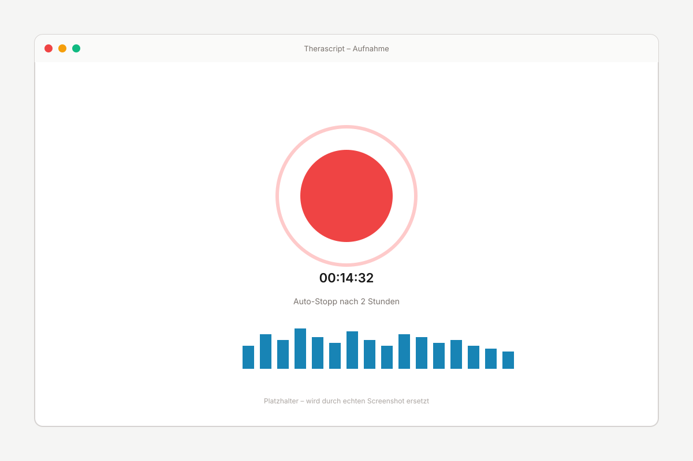

# Screenshot-Produktion für die Landing Page

Anleitung für die Erstellung der fünf Feature-Screenshots, des Hero-Bilds und des OG-Images. Die SVG-Platzhalter unter `assets/` werden durch echte App-Screenshots ersetzt.

## Demo-Daten vorbereiten

**Wichtig: keine echten oder pseudonymisierten Patientendaten verwenden, auch nicht zu Testzwecken.** Die Demo-Inhalte müssen vollständig erfunden sein.

### Beispiel-Sitzung (für Hero, Review, Sessions)

- **Datum:** 4. Mai 2026, 14:30
- **Dauer:** 42 Min
- **Audio:** Ein 5-10-minütiger Demo-Mitschnitt mit klar artikuliertem Hochdeutsch. Inhalt frei erfunden, mit Therapie-typischem Vokabular. Beispiel-Skript:

> „Frau Müller, schön dass Sie wieder da sind. Wie ging es Ihnen seit unserer letzten Sitzung? — Es war eine schwierige Woche. Die Reise nach Zürich hat mich mehr erschöpft als gedacht. — Erzählen Sie mir mehr darüber. — …"

### Sperrliste-Einträge (frei erfunden)

| Typ | Begriffe |
|---|---|
| PERSON | Müller Maria; Weber Thomas; Dr. Schmidt; Frau Keller |
| ORT | Praxis Bern; Bahnhof Zürich; Spital Aarau |
| DIAGNOSE | Burnout-Syndrom; Angststörung |

### Mehrere Sitzungen (für Sessions-Übersicht)

Mindestens vier Sitzungen mit unterschiedlichen Daten und Status:

- Sitzung 04.05.2026 14:30 (42 Min) – bereit zur Überprüfung
- Sitzung 02.05.2026 09:00 (38 Min) – Verarbeitung läuft
- Sitzung 28.04.2026 16:15 (35 Min) – überprüft, wird in 26 Tagen gelöscht
- Sitzung 21.04.2026 11:00 (52 Min) – überprüft, wird in 19 Tagen gelöscht

## Capture-Setup

- **Display:** Retina-Display, App auf 2880×1800 oder grösser. Auf einem Standard-MacBook Pro reicht die native Auflösung.
- **macOS Appearance:** Light-Mode (`Systemeinstellungen → Erscheinungsbild → Hell`). Dark-Mode-Variante ist nicht nötig – `<picture>` für theme-spezifische Bilder ist Out-of-Scope.
- **Wallpaper:** Egal – wird durch Fenster-Capture nicht erfasst.
- **Cursor:** Nicht im Bild (per `Bildschirmfoto.app → Optionen → Mauszeiger anzeigen` deaktivieren oder kurz zur Seite bewegen).

## Aufnahme-Methode

```
Cmd + Shift + 4 → Leertaste → Klick auf Therascript-Fenster
```

Das nimmt das aktive Fenster mit Schatten auf und speichert auf den Desktop.

## Liste der benötigten Screenshots

| Datei (PNG-Original) | Zeigt | App-State |
|---|---|---|
| `hero.png` | Review-Editor, prominent | Geöffnete Sitzung 04.05.2026, mehrere Pseudonymisierungs-Chips sichtbar |
| `screenshot-recording.png` | Aufnahme-Ansicht | Aktive Aufnahme, Timer ~ 00:14:32, Mikrofon-Pegel sichtbar |
| `screenshot-review.png` | Review-Editor (alternative Perspektive) | Geöffnete Sitzung mit Chips |
| `screenshot-sessions.png` | Sessions-Übersicht | Liste mit allen vier Demo-Sitzungen |
| `screenshot-blocklist.png` | Sperrliste-Verwaltung | Settings → Sperrliste mit den oben genannten Einträgen |
| `screenshot-models.png` | Modell-Auswahl | Settings → Modelle, Whisper aktiv, Schweizerdeutsch-Modell verfügbar, Gemma optional |

**Hero und Review:** Können visuell ähnlich aussehen, aber zeigen unterschiedliche Bildausschnitte oder Sitzungs-Stellen.

## Konvertierung zu Web-Formaten

Auf macOS via Homebrew installieren:

```bash
brew install webp libavif imagemagick
```

Dann im Repo-Root:

```bash
# Originale liegen in tmp/screenshots-raw/
# Ergebnisse landen in website/assets/

mkdir -p website/assets

for f in tmp/screenshots-raw/*.png; do
  base=$(basename "$f" .png)
  out="website/assets/$base"

  # AVIF (beste Kompression, kleinste Dateien)
  avifenc --min 30 --max 50 -s 4 "$f" "$out.avif"

  # WebP-Fallback
  cwebp -q 75 -m 6 "$f" -o "$out.webp"

  # JPEG-Fallback für ältere Browser
  magick "$f" -strip -resize "1600x>" -quality 80 "$out.jpg"

  echo "→ $base: $(du -h "$out.avif" "$out.webp" "$out.jpg" | cut -f1 | tr '\n' '/')"
done
```

### Zielgrössen

| Datei | AVIF | WebP | JPEG |
|---|---|---|---|
| `hero.*` | < 80 KB | < 150 KB | < 250 KB |
| `screenshot-*.*` | < 60 KB | < 100 KB | < 180 KB |

Falls AVIF zu gross: `--min 40 --max 60` versuchen. Falls Qualität zu schlecht: `--min 25 --max 40`.

## HTML-Anpassung von SVG-Platzhalter zu echten Bildern

Aktuell sind die Bilder als `` eingebunden. Nach der Konvertierung wandelt der folgende Diff alle relevanten Stellen in `<picture>`-Elemente um:

```html
<!-- Vorher (Platzhalter) -->


<!-- Nachher (echte Screenshots) -->
<picture>
  <source srcset="assets/screenshot-recording.avif" type="image/avif" />
  <source srcset="assets/screenshot-recording.webp" type="image/webp" />
  
</picture>
```

**Hero-Bild abweichend:** dort `fetchpriority="high"` und kein `loading="lazy"` (es ist das LCP-Element):

```html
<picture>
  <source srcset="assets/hero.avif" type="image/avif" />
  <source srcset="assets/hero.webp" type="image/webp" />
  
</picture>
```

**SVG-Platzhalter danach löschen** (`assets/hero.svg`, `assets/screenshot-*.svg`).

## OG-Image (1200×630 PNG)

Aktuell: solider Teal-Platzhalter. Für Social-Sharing-Vorschauen muss das echte Asset rein.

**Option A – Figma/Sketch:**
1. Neues Frame 1200×630.
2. Hintergrund Teal `#0f766e`, Gradient zu `#134e4a`.
3. Therascript-Logo oben links (28-px-Mark + „Therascript" als 28-px Bold).
4. Hero-Headline „Transkription, die Ihre Praxis nicht verlässt." als 64-px Bold, weiss, drei Zeilen.
5. Sub-Caption „Lokale Transkription & Pseudonymisierung für Mac · Open Source" als 22-px Regular, Teal-200.
6. Export als PNG @ 1× → `website/assets/og-image.png`.

**Option B – aus dem SVG-Platzhalter:**
1. `assets/og-image.svg` in einem Browser öffnen.
2. DevTools → Cmd+Shift+P → „Capture full size screenshot".
3. Resultat auf 1200×630 zuschneiden, als PNG speichern.

**Verifikation nach Upload:**
- [Twitter Card Validator](https://cards-dev.twitter.com/validator)
- [LinkedIn Post Inspector](https://www.linkedin.com/post-inspector/)

Beide Tools cachen das alte Bild – nach Update einmal „Re-scrape" anstossen.

## Favicon

Aus `src/renderer/src/components/AppLogo.tsx` als SVG-Snippet exportieren. Einbettung in `assets/favicon.svg` ersetzen, falls die App-Marke sich ändert. Aktuell: schlichtes T-Monogramm in Teal.

## Pflege bei zukünftigen Releases

In `scripts/release.sh` als Checklisten-Punkt aufnehmen:

> - [ ] UI-Änderungen seit letztem Release? Falls ja: Screenshots in `website/assets/` aktualisieren und im selben Commit pushen.
