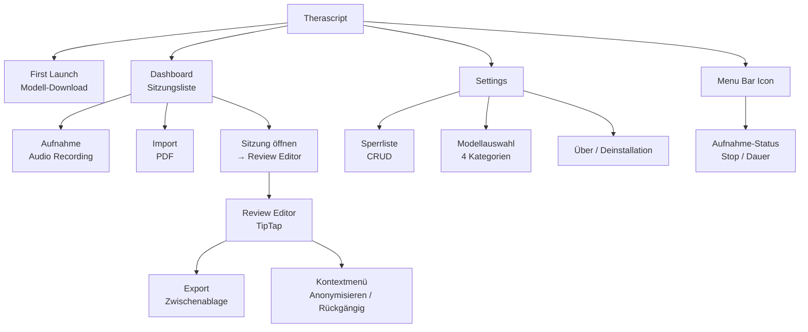
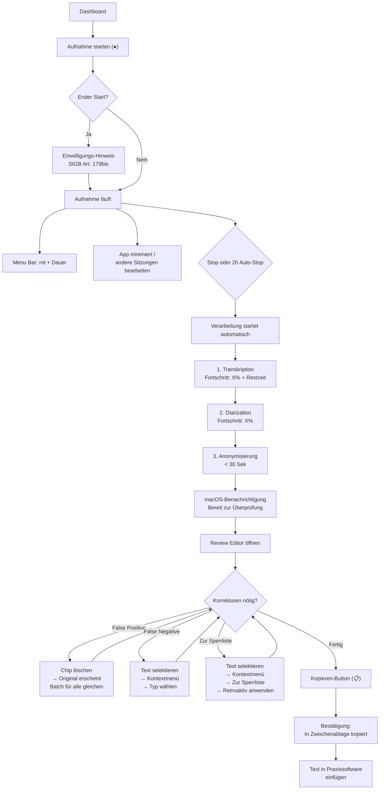
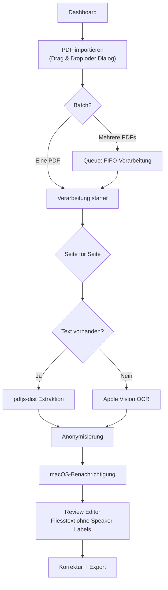
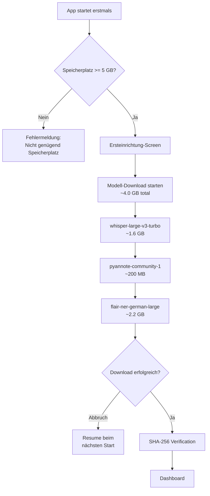

# Therascript — UX/UI Wireframes & Design

> Wireframes und UX-Dokumentation basierend auf [requirements.md](requirements.md) und [specification.md](specification.md)

---

## 1. Understanding / Problemverständnis

**Problem:** Psychotherapeut/innen müssen Therapiegespräche dokumentieren und dabei die Patientenvertraulichkeit wahren. Es fehlt eine integrierte, lokale Lösung für Aufnahme, Transkription mit Sprechererkennung und umfassende Anonymisierung.

**Lösung:** Therascript — eine macOS Desktop-App (Electron), die komplett lokal arbeitet (NFR-1). Sie nimmt Gespräche auf, transkribiert sie mit Sprechererkennung, anonymisiert automatisch identifizierende Informationen und ermöglicht den Export per Zwischenablage.

**Designprinzipien:**
- **Einfachheit** — Nicht-technische Nutzer (NFR-4), minimale kognitive Belastung
- **Vertrauen** — Lokale Verarbeitung visuell kommunizieren, Datenschutz-Transparenz
- **Non-Blocking** — Verarbeitung im Hintergrund, App bleibt nutzbar
- **Konsistenz** — Audio- und PDF-Workflows folgen dem gleichen Muster

---

## 2. User Persona

**Name:** Dr. Sarah Lehmann
**Rolle:** Psychotherapeutin (Praxis, Einzel- & Paartherapie)
**Alter:** 38-55
**Tech-Level:** Durchschnittlich — nutzt macOS, Praxissoftware, E-Mail

**Bio:**
Sarah führt täglich 4-6 Therapiesitzungen durch (45-60 Min). Sie muss Gespräche für Supervision/Intervision anonymisiert dokumentieren. Aktuell tippt sie Protokolle manuell oder nutzt unsichere Online-Tools.

**Ziele:**
- Therapiegespräche schnell und datenschutzkonform dokumentieren
- Anonymisierte Texte für Supervision/Intervision vorbereiten
- PDFs (Arztberichte, Gutachten) anonymisieren

**Pain Points:**
- Manuelle Transkription ist zeitaufwändig
- Angst vor Datenschutzverletzungen bei Cloud-Tools
- Namen/Orte in langen Texten manuell zu schwärzen ist fehleranfällig

**Verhaltensweisen:**
- Startet Aufnahme zu Beginn der Sitzung, minimiert App
- Prüft Ergebnisse zwischen Sitzungen oder am Abend
- Exportiert Text per Zwischenablage in Praxissoftware

**Zitat:**
"Ich brauche ein Tool, dem ich vertrauen kann — meine Patienten vertrauen mir."

---

## 3. User Journey Map

**Journey:** Therapiesitzung aufnehmen, transkribieren und anonymisiert exportieren
**Persona:** Dr. Sarah Lehmann

| Phase | Aktion | Denkt | Fühlt | Chancen |
|-------|--------|-------|-------|---------|
| **Aufnahme** | Öffnet App, drückt Aufnahme, minimiert | "Hoffentlich funktioniert das zuverlässig im Hintergrund" | Leicht nervös | Klares visuelles Feedback (Menu Bar rot), Vertrauen aufbauen |
| **Warten** | Sitzung beendet, Stop gedrückt, Verarbeitung läuft | "Wie lange dauert das?" | Ungeduldig | Fortschrittsanzeige mit Restzeit, App nutzbar für andere Sitzungen |
| **Review** | Prüft anonymisierten Text, korrigiert False Positives | "Hat es alle Namen erwischt?" | Konzentriert, prüfend | Farbige Chips machen Platzhalter sofort sichtbar |
| **Export** | Kopiert Text in Zwischenablage, fügt in Praxissoftware ein | "Fertig!" | Erleichtert, zufrieden | Ein-Klick-Export, Bestätigung |
| **Aufräumen** | Sitzung wird nach 30 Tagen automatisch gelöscht | "Gut, dass ich mich nicht darum kümmern muss" | Beruhigt | Auto-Löschung als Datenschutz-Feature kommunizieren |

---

## 4. Informationsarchitektur



---

## 5. User Flows

### 5.1 Hauptflow: Audio-Aufnahme → Export



### 5.2 PDF-Import Flow



### 5.3 First Launch Flow



---

## 6. Wireframes

### 6.1 First Launch — Modell-Download

```
┌─────────────────────────────────────────────────────────────┐
│  ⬤ ⬤ ⬤                    Therascript                      │
├─────────────────────────────────────────────────────────────┤
│                                                             │
│                                                             │
│                      🔒  Therascript                        │
│                                                             │
│               Willkommen bei Therascript                    │
│                                                             │
│      Alle Verarbeitung findet komplett lokal auf             │
│      Ihrem Mac statt — keine Daten verlassen Ihr Gerät.     │
│                                                             │
│      Für die erste Einrichtung werden ML-Modelle            │
│      heruntergeladen (~4.0 GB). Dies ist der einzige        │
│      Zeitpunkt, an dem eine Internetverbindung nötig ist.   │
│                                                             │
│  ┌─────────────────────────────────────────────────────┐    │
│  │                                                     │    │
│  │  Spracherkennung (whisper-large-v3-turbo)           │    │
│  │  ████████████████████░░░░░░░░░░  1.2 / 1.6 GB      │    │
│  │                                                     │    │
│  │  ○ Sprechererkennung (pyannote-community-1)  200 MB │    │
│  │  ○ Anonymisierung (flair-ner-german-large)   2.2 GB │    │
│  │                                                     │    │
│  │  ─────────────────────────────────────────────      │    │
│  │  Gesamt: ████████████░░░░░░░░░░  1.2 / 4.0 GB      │    │
│  │  Geschätzte Restzeit: ~8 Minuten                    │    │
│  │                                                     │    │
│  └─────────────────────────────────────────────────────┘    │
│                                                             │
│                                                             │
│     Hinweis: Bei Abbruch wird der Download beim             │
│     nächsten Start automatisch fortgesetzt.                 │
│                                                             │
└─────────────────────────────────────────────────────────────┘
```

### 6.2 Dashboard — Sitzungsliste (Hauptansicht)

```
┌─────────────────────────────────────────────────────────────┐
│  ⬤ ⬤ ⬤                    Therascript                      │
├────────────────┬────────────────────────────────────────────┤
│                │                                            │
│   THERASCRIPT  │     Sitzungen                    ⚙️       │
│                │                                            │
│                │  ┌──────────┐  ┌──────────┐               │
│   Sitzungen    │  │ ● Aufnahme│  │ + PDF    │               │
│   ─────────    │  │  starten │  │ importieren│              │
│                │  └──────────┘  └──────────┘               │
│   ⚙ Settings   │                                            │
│                │  HEUTE                                     │
│                │  ┌────────────────────────────────────┐    │
│                │  │ 🎙 Sitzung 13.02.2026 14:30       │    │
│                │  │    Status: Review                   │    │
│                │  │    ●●●●●●●●●●                      │    │
│                │  └────────────────────────────────────┘    │
│                │  ┌────────────────────────────────────┐    │
│                │  │ 📄 Arztbericht Dr. Weber            │    │
│                │  │    Status: Review                   │    │
│                │  │    ●●●●●●●●●●                      │    │
│                │  └────────────────────────────────────┘    │
│                │                                            │
│                │  GESTERN                                   │
│                │  ┌────────────────────────────────────┐    │
│                │  │ 🎙 Sitzung 12.02.2026 09:00       │    │
│                │  │    Status: Review                   │    │
│                │  │    ●●●●●●●●●●                      │    │
│                │  └────────────────────────────────────┘    │
│                │                                            │
│                │  DIESE WOCHE                               │
│                │  ┌────────────────────────────────────┐    │
│                │  │ 🎙 Sitzung 10.02.2026 15:45       │    │
│                │  │    Status: Transkription 67%  ~4 Min│    │
│                │  │    ████████████░░░░░░               │    │
│                │  └────────────────────────────────────┘    │
│                │  ┌────────────────────────────────────┐    │
│                │  │ 🎙 Paartherapie Montag              │    │
│                │  │    Status: Review                   │    │
│                │  │    ●●●●●●●●●●                      │    │
│                │  └────────────────────────────────────┘    │
│                │                                            │
│                │  LETZTE WOCHE                              │
│                │  ┌────────────────────────────────────┐    │
│                │  │ 📄 Versicherungsformular            │    │
│                │  │    Status: Review                   │    │
│                │  │    ●●●●●●●●●●                      │    │
│                │  └────────────────────────────────────┘    │
│                │                                            │
│  🔒 Lokal     │                                            │
└────────────────┴────────────────────────────────────────────┘
```

**Elemente der Sitzungskarte:**

```
┌─────────────────────────────────────────────────────┐
│                                                     │
│  🎙  Sitzung 13.02.2026 14:30            ···       │
│      ↑ Typ-Icon                           ↑ Menü   │
│      (🎙 Audio / 📄 PDF)             (Umbenennen,  │
│                                       Löschen)      │
│      Status: Review     ← Aktueller Status          │
│                                                     │
│      Mögliche Status:                               │
│      ● Aufnahme läuft  (rot pulsierend)             │
│      ● Transkription   67% ~4 Min (Fortschritt)     │
│      ● Diarization     (Fortschritt)                │
│      ● Textextraktion  (PDF)                        │
│      ● Anonymisierung  (kurz, < 30 Sek)            │
│      ● Review          (grün, bereit)               │
│      ● Fehler          (rot, mit Meldung)           │
│                                                     │
└─────────────────────────────────────────────────────┘
```

### 6.3 Dashboard — Leerer Zustand

```
┌─────────────────────────────────────────────────────────────┐
│  ⬤ ⬤ ⬤                    Therascript                      │
├────────────────┬────────────────────────────────────────────┤
│                │                                            │
│   THERASCRIPT  │     Sitzungen                    ⚙️       │
│                │                                            │
│   Sitzungen    │                                            │
│   ─────────    │                                            │
│                │                                            │
│   ⚙ Settings   │       ┌─────────────────────────┐          │
│                │       │                         │          │
│                │       │    Keine Sitzungen       │          │
│                │       │                         │          │
│                │       │    Starten Sie eine      │          │
│                │       │    Aufnahme oder         │          │
│                │       │    importieren Sie       │          │
│                │       │    ein PDF-Dokument.     │          │
│                │       │                         │          │
│                │       │  [● Aufnahme starten]   │          │
│                │       │  [+ PDF importieren]    │          │
│                │       │                         │          │
│                │       └─────────────────────────┘          │
│                │                                            │
│  🔒 Lokal     │                                            │
└────────────────┴────────────────────────────────────────────┘
```

### 6.4 Aufnahme-Ansicht (aktive Aufnahme)

```
┌─────────────────────────────────────────────────────────────┐
│  ⬤ ⬤ ⬤                    Therascript                      │
├────────────────┬────────────────────────────────────────────┤
│                │                                            │
│   THERASCRIPT  │     Aufnahme läuft                        │
│                │                                            │
│   Sitzungen    │                                            │
│   ─────────    │     ┌───────────────────────────────┐      │
│                │     │                               │      │
│   ⚙ Settings   │     │          ● REC                │      │
│                │     │                               │      │
│                │     │        01:23:45               │      │
│                │     │                               │      │
│                │     │    ▁▃▅▇▅▃▁▃▅▇█▇▅▃▁           │      │
│                │     │      Audiopegel                │      │
│                │     │                               │      │
│                │     │     ┌──────────────┐          │      │
│                │     │     │ ■ Aufnahme   │          │      │
│                │     │     │   stoppen    │          │      │
│                │     │     └──────────────┘          │      │
│                │     │                               │      │
│                │     │  Auto-Stop nach 2:00:00       │      │
│                │     │                               │      │
│                │     └───────────────────────────────┘      │
│                │                                            │
│                │  ⚠ Hinweis: Die App kann minimiert         │
│                │    werden — die Aufnahme läuft im          │
│                │    Hintergrund weiter.                     │
│                │                                            │
│  🔒 Lokal     │  Tipp: Nutzen Sie das Menu-Bar-Icon        │
│                │  zum Stoppen ohne die App zu öffnen.       │
└────────────────┴────────────────────────────────────────────┘
```

### 6.5 Menu Bar Icon (macOS Menüleiste)

```
macOS Menüleiste:
┌──────────────────────────────────────────────────────┐
│  ◉  File  Edit  ...          🔴 01:23:45    🔋 Wi-Fi│
│                               ↑                      │
│                          Therascript                 │
│                          Menu Bar Icon               │
└──────────────────────┬───────────────────────────────┘
                       │
                       ▼
               ┌──────────────────┐
               │  ● Aufnahme läuft │
               │  Dauer: 01:23:45 │
               │  ─────────────── │
               │  ■ Stoppen       │
               │  ─────────────── │
               │  Therascript     │
               │  öffnen          │
               └──────────────────┘


Zustände des Menu Bar Icons:
┌────────────────────────────────────┐
│  Leerlauf:      ○  (Standard-Icon) │
│  Aufnahme:      🔴  01:23:45       │
│  Verarbeitung:  ◐  (animiert)      │
└────────────────────────────────────┘
```

### 6.6 Verarbeitungs-Ansicht (Transkription läuft)

```
┌─────────────────────────────────────────────────────────────┐
│  ⬤ ⬤ ⬤                    Therascript                      │
├────────────────┬────────────────────────────────────────────┤
│                │                                            │
│   THERASCRIPT  │  ← Zurück    Sitzung 13.02.2026 14:30    │
│                │                                            │
│   Sitzungen    │                                            │
│   ─────────    │     ┌───────────────────────────────┐      │
│                │     │                               │      │
│   ⚙ Settings   │     │   Verarbeitung läuft...       │      │
│                │     │                               │      │
│                │     │   ✓ Transkription       fertig │      │
│                │     │   ◐ Sprechererkennung          │      │
│                │     │     ████████████░░░░░  67%     │      │
│                │     │     Geschätzte Restzeit: ~4 Min│      │
│                │     │   ○ Anonymisierung    wartend  │      │
│                │     │                               │      │
│                │     │                               │      │
│                │     │   Alle Verarbeitung findet     │      │
│                │     │   lokal auf Ihrem Mac statt.   │      │
│                │     │                               │      │
│                │     └───────────────────────────────┘      │
│                │                                            │
│                │  Sie können die App für andere             │
│                │  Sitzungen nutzen — eine Benachrichtigung  │
│                │  informiert Sie, wenn die Verarbeitung     │
│                │  abgeschlossen ist.                        │
│                │                                            │
│  🔒 Lokal     │                                            │
└────────────────┴────────────────────────────────────────────┘
```

### 6.7 Review Editor — Audio-Sitzung (Hauptansicht)

```
┌─────────────────────────────────────────────────────────────────────┐
│  ⬤ ⬤ ⬤                    Therascript                              │
├────────────────┬────────────────────────────────────────────────────┤
│                │                                                    │
│   THERASCRIPT  │  ← Zurück   Sitzung 13.02.2026 14:30    [📋 Kopieren] │
│                │                                                    │
│   Sitzungen    │  ┌──────────────────────────────────────────────┐  │
│   ─────────    │  │                                              │  │
│                │  │  [00:00:12] [Person A]:                      │  │
│   ⚙ Settings   │  │  Guten Tag, wie geht es Ihnen heute?         │  │
│                │  │  Seit unserem letzten Gespräch über           │  │
│                │  │  ┌──────────┐ und die Situation mit           │  │
│                │  │  │PERSON 1 🤖│                                │  │
│                │  │  └──────────┘                                │  │
│                │  │  ┌────────┐ — hat sich etwas verändert?      │  │
│                │  │  │ ORT 1 🤖│                                  │  │
│                │  │  └────────┘                                  │  │
│                │  │                                              │  │
│                │  │  [00:00:45] [Person B]:                      │  │
│                │  │  Ja, also seit dem Termin bei                │  │
│                │  │  ┌──────────┐ habe ich viel nachgedacht.     │  │
│                │  │  │PERSON 2 🤖│                                │  │
│                │  │  └──────────┘                                │  │
│                │  │  Meine Schwester ┌──────────┐ hat mich       │  │
│                │  │                  │PERSON 3 📖│                │  │
│                │  │                  └──────────┘                │  │
│                │  │  angerufen und wir haben über die Situation  │  │
│                │  │  in ┌────────┐ gesprochen.                   │  │
│                │  │     │ ORT 2 🤖│                               │  │
│                │  │     └────────┘                               │  │
│                │  │                                              │  │
│                │  │  [00:01:30] [Person A]:                      │  │
│                │  │  Das klingt gut. Sie hatten erwähnt, dass    │  │
│                │  │  ┌──────────┐ am ┌─────────┐ Geburtstag     │  │
│                │  │  │PERSON 3 📖│    │DATUM 1 🤖│                │  │
│                │  │  └──────────┘    └─────────┘                │  │
│                │  │  hatte. Wie war das für Sie?                 │  │
│                │  │                                              │  │
│                │  │  [00:02:15] [Person B]:                      │  │
│                │  │  Es war schwierig. Ich habe auch mit         │  │
│                │  │  meinem Hausarzt ┌──────────┐ gesprochen,    │  │
│                │  │                  │PERSON 4 ✏│                │  │
│                │  │                  └──────────┘                │  │
│                │  │  der in ┌────────┐ praktiziert.              │  │
│                │  │         │ ORT 1 🤖│                           │  │
│                │  │         └────────┘                           │  │
│                │  │  Er hat mich an ┌──────────────┐ überwiesen. │  │
│                │  │                 │ KONTAKT 1 🤖 │              │  │
│                │  │                 └──────────────┘              │  │
│                │  │                                              │  │
│                │  └──────────────────────────────────────────────┘  │
│                │                                                    │
│                │  Auto-Save ✓    Cmd+Z Undo  Cmd+Shift+Z Redo     │
│  🔒 Lokal     │                                                    │
└────────────────┴────────────────────────────────────────────────────┘
```

**Legende Platzhalter-Chips:**

```
Chip-Farbcodierung:
┌────────────────────────────────────────────────────┐
│  ┌──────────┐  PERSON     — Blau                   │
│  │PERSON 1 🤖│                                      │
│  └──────────┘                                      │
│  ┌────────┐    ORT        — Grün                    │
│  │ ORT 1 🤖│                                        │
│  └────────┘                                        │
│  ┌─────────┐   DATUM      — Orange                  │
│  │DATUM 1 🤖│                                       │
│  └─────────┘                                       │
│  ┌────────────┐ KONTAKT   — Violett                 │
│  │ KONTAKT 1 🤖│                                    │
│  └────────────┘                                    │
│  ┌────────────────┐ ORGANISATION — Türkis           │
│  │ORGANISATION 1 📖│                                │
│  └────────────────┘                                │
│  ┌───────────────┐ MEDIZINISCH — Rot                │
│  │MEDIZINISCH 1 📖│                                 │
│  └───────────────┘                                 │
│  ┌──────────────┐ SONSTIGES — Grau                  │
│  │SONSTIGES 1 🤖│                                   │
│  └──────────────┘                                  │
│                                                    │
│  Herkunfts-Icons:                                  │
│  🤖 = NER (automatisch erkannt)                    │
│  📖 = Sperrliste (Blocklist-Match)                 │
│  ✏ = Manuell (vom User markiert)                   │
└────────────────────────────────────────────────────┘
```

### 6.8 Review Editor — Kontextmenü (False Negative markieren)

```
┌──────────────────────────────────────────────────────────────┐
│                                                              │
│  ... der in der ████████████████ praktiziert,                │
│                 ↑ selektierter Text                          │
│                                                              │
│          ┌──────────────────────────────────┐                │
│          │  Anonymisieren als...             │                │
│          │  ┌────────────────────────────┐  │                │
│          │  │ PERSON                     │  │                │
│          │  │ ORT                        │  │                │
│          │  │ DATUM                      │  │                │
│          │  │ KONTAKT                    │  │                │
│          │  │ ORGANISATION               │  │                │
│          │  └────────────────────────────┘  │                │
│          │  ─────────────────────────────── │                │
│          │  Zur Sperrliste hinzufügen...    │                │
│          │  ┌────────────────────────────┐  │                │
│          │  │ PERSON                     │  │                │
│          │  │ ORT                        │  │                │
│          │  │ DATUM                      │  │                │
│          │  │ KONTAKT                    │  │                │
│          │  │ ORGANISATION               │  │                │
│          │  │ MEDIZINISCH                │  │                │
│          │  │ SONSTIGES                  │  │                │
│          │  └────────────────────────────┘  │                │
│          └──────────────────────────────────┘                │
│                                                              │
└──────────────────────────────────────────────────────────────┘
```

### 6.9 Review Editor — Kontextmenü auf Chip (False Positive)

```
┌──────────────────────────────────────────────────────────────┐
│                                                              │
│  ... und die Situation mit ┌──────────┐ hat sich             │
│                            │PERSON 1 🤖│                     │
│                            └──────────┘                     │
│                                 │                            │
│                                 ▼  Rechtsklick               │
│                     ┌──────────────────────────┐             │
│                     │  Rückgängig machen        │             │
│                     │                          │             │
│                     │  Macht ALLE [PERSON 1]   │             │
│                     │  im Text rückgängig.     │             │
│                     │  (3 Vorkommen)           │             │
│                     └──────────────────────────┘             │
│                                                              │
└──────────────────────────────────────────────────────────────┘
```

### 6.10 Review Editor — PDF-Sitzung (ohne Speaker-Labels/Zeitstempel)

```
┌─────────────────────────────────────────────────────────────────────┐
│  ⬤ ⬤ ⬤                    Therascript                              │
├────────────────┬────────────────────────────────────────────────────┤
│                │                                                    │
│   THERASCRIPT  │  ← Zurück   Arztbericht Dr. Weber    [📋 Kopieren]│
│                │                                                    │
│   Sitzungen    │  ┌──────────────────────────────────────────────┐  │
│   ─────────    │  │                                              │  │
│                │  │  Sehr geehrte Kolleginnen und Kollegen,      │  │
│   ⚙ Settings   │  │                                              │  │
│                │  │  hiermit überweise ich ┌──────────┐,          │  │
│                │  │                       │PERSON 1 🤖│           │  │
│                │  │                       └──────────┘           │  │
│                │  │  geboren am ┌─────────┐, wohnhaft in        │  │
│                │  │             │DATUM 1 🤖│                      │  │
│                │  │             └─────────┘                      │  │
│                │  │  ┌────────┐, zur weiteren psychiatrischen    │  │
│                │  │  │ ORT 1 🤖│                                  │  │
│                │  │  └────────┘                                  │  │
│                │  │  Abklärung.                                  │  │
│                │  │                                              │  │
│                │  │  Diagnose: F33.1 Rezidivierende depressive   │  │
│                │  │  Störung, gegenwärtig mittelgradige Episode  │  │
│                │  │                                              │  │
│                │  │  Die Patientin ist seit 03/2024 in meiner    │  │
│                │  │  Behandlung und wird zusätzlich von          │  │
│                │  │  ┌──────────┐ medikamentös behandelt.        │  │
│                │  │  │PERSON 2 🤖│                                │  │
│                │  │  └──────────┘                                │  │
│                │  │                                              │  │
│                │  │  Kontakt: ┌────────────┐                     │  │
│                │  │           │ KONTAKT 1 🤖│                    │  │
│                │  │           └────────────┘                    │  │
│                │  │                                              │  │
│                │  │  AHV-Nr.: ┌────────────┐                     │  │
│                │  │           │ KONTAKT 2 🤖│                    │  │
│                │  │           └────────────┘                    │  │
│                │  │                                              │  │
│                │  └──────────────────────────────────────────────┘  │
│                │                                                    │
│                │  Auto-Save ✓    Cmd+Z Undo  Cmd+Shift+Z Redo     │
│  🔒 Lokal     │                                                    │
└────────────────┴────────────────────────────────────────────────────┘
```

### 6.11 Sperrliste-Bestätigungsdialog (aus Review)

```
┌─────────────────────────────────────────────────┐
│                                                 │
│   Zur Sperrliste hinzufügen                     │
│                                                 │
│   "Dr. Hans Weber" als PERSON zur               │
│   Sperrliste hinzufügen?                        │
│                                                 │
│   Der Begriff wird in allen zukünftigen         │
│   Anonymisierungen erkannt und in der           │
│   aktuellen Sitzung sofort angewendet.          │
│                                                 │
│            [Abbrechen]    [Hinzufügen]          │
│                                                 │
└─────────────────────────────────────────────────┘
```

### 6.12 Export-Bestätigung

```
┌─────────────────────────────────────────────────┐
│                                                 │
│   ✓ In Zwischenablage kopiert                   │
│                                                 │
│   Der anonymisierte Text wurde in die           │
│   Zwischenablage kopiert und kann jetzt         │
│   in andere Anwendungen eingefügt werden.       │
│                                                 │
└─────────────────────────────────────────────────┘
  (Toast-Benachrichtigung, verschwindet nach 3 Sek)
```

### 6.13 Settings — Übersicht

```
┌─────────────────────────────────────────────────────────────┐
│  ⬤ ⬤ ⬤                    Therascript                      │
├────────────────┬────────────────────────────────────────────┤
│                │                                            │
│   THERASCRIPT  │     Einstellungen                         │
│                │                                            │
│   Sitzungen    │  ┌─ SPERRLISTE ──────────────────────┐    │
│   ─────────    │  │                                   │    │
│                │  │  Begriffe, die immer anonymisiert  │    │
│   ⚙ Settings ◀ │  │  werden — auch wenn die auto-     │    │
│     Sperrliste │  │  matische Erkennung sie nicht      │    │
│     Modelle    │  │  findet.                          │    │
│     Über       │  │                                   │    │
│                │  │  ┌─────────────────────────────┐  │    │
│                │  │  │ + Neuen Eintrag hinzufügen  │  │    │
│                │  │  └─────────────────────────────┘  │    │
│                │  │                                   │    │
│                │  │  ┌────────────────────────────┐   │    │
│                │  │  │ Dr. Hans Weber    PERSON   │   │    │
│                │  │  │                    ✏  🗑   │   │    │
│                │  │  ├────────────────────────────┤   │    │
│                │  │  │ Bahnhofstr. 42    ORT      │   │    │
│                │  │  │                    ✏  🗑   │   │    │
│                │  │  ├────────────────────────────┤   │    │
│                │  │  │ Praxis Sunrise    ORGANI-  │   │    │
│                │  │  │                  SATION    │   │    │
│                │  │  │                    ✏  🗑   │   │    │
│                │  │  ├────────────────────────────┤   │    │
│                │  │  │ Schätzli          PERSON   │   │    │
│                │  │  │                    ✏  🗑   │   │    │
│                │  │  ├────────────────────────────┤   │    │
│                │  │  │ Fall-Nr. 2024-A7  KONTAKT  │   │    │
│                │  │  │                    ✏  🗑   │   │    │
│                │  │  └────────────────────────────┘   │    │
│                │  │                                   │    │
│                │  │  5 Einträge                       │    │
│                │  └───────────────────────────────────┘    │
│                │                                            │
│  🔒 Lokal     │                                            │
└────────────────┴────────────────────────────────────────────┘
```

### 6.14 Settings — Sperrliste: Neuen Eintrag hinzufügen

```
┌─────────────────────────────────────────────────┐
│                                                 │
│   Neuen Eintrag hinzufügen                      │
│                                                 │
│   Begriff                                       │
│   ┌───────────────────────────────────────┐     │
│   │ Dr. Hans Weber                        │     │
│   └───────────────────────────────────────┘     │
│                                                 │
│   Platzhalter-Typ                               │
│   ┌───────────────────────────────────────┐     │
│   │ PERSON                            ▾   │     │
│   └───────────────────────────────────────┘     │
│   Typen: PERSON, ORT, DATUM, KONTAKT,          │
│   ORGANISATION, MEDIZINISCH, SONSTIGES          │
│                                                 │
│            [Abbrechen]    [Hinzufügen]          │
│                                                 │
└─────────────────────────────────────────────────┘
```

### 6.15 Settings — Modellauswahl

```
┌─────────────────────────────────────────────────────────────┐
│  ⬤ ⬤ ⬤                    Therascript                      │
├────────────────┬────────────────────────────────────────────┤
│                │                                            │
│   THERASCRIPT  │     Einstellungen › Modelle               │
│                │                                            │
│   Sitzungen    │  Alle ML-Modelle laufen lokal auf          │
│   ─────────    │  Ihrem Mac. Sie können alternative         │
│                │  Modelle auswählen oder eigene hinzufügen. │
│   ⚙ Settings ◀ │                                            │
│     Sperrliste │  ┌─ TRANSKRIPTION ───────────────────┐    │
│     Modelle  ◀ │  │                                   │    │
│     Über       │  │  Aktiv: whisper-large-v3-turbo    │    │
│                │  │         (Q5_0, 1.6 GB)        ▾   │    │
│                │  │                                   │    │
│                │  │  Verfügbar:                       │    │
│                │  │  ● whisper-large-v3-turbo (Q5_0)  │    │
│                │  └───────────────────────────────────┘    │
│                │                                            │
│                │  ┌─ SPRECHERERKENNUNG ───────────────┐    │
│                │  │                                   │    │
│                │  │  Aktiv: pyannote-community-1       │    │
│                │  │         (200 MB)              ▾   │    │
│                │  │                                   │    │
│                │  │  Verfügbar:                       │    │
│                │  │  ● pyannote-community-1            │    │
│                │  └───────────────────────────────────┘    │
│                │                                            │
│                │  ┌─ ANONYMISIERUNG (NER) ────────────┐    │
│                │  │                                   │    │
│                │  │  Aktiv: flair-ner-german-large     │    │
│                │  │         (2.2 GB)             ▾   │    │
│                │  │                                   │    │
│                │  │  Verfügbar:                       │    │
│                │  │  ● flair-ner-german-large          │    │
│                │  └───────────────────────────────────┘    │
│                │                                            │
│                │  ┌─ OCR ────────────────────────────┐     │
│                │  │                                   │    │
│                │  │  Aktiv: apple-vision               │    │
│                │  │         (System-API)          ▾   │    │
│                │  │                                   │    │
│                │  │  Verfügbar:                       │    │
│                │  │  ● apple-vision (System-API)       │    │
│                │  └───────────────────────────────────┘    │
│                │                                            │
│                │  ┌─────────────────────────────────┐      │
│                │  │ + Eigenes Modell hinzufügen     │      │
│                │  └─────────────────────────────────┘      │
│                │                                            │
│  🔒 Lokal     │                                            │
└────────────────┴────────────────────────────────────────────┘
```

### 6.16 Settings — Über / Deinstallation

```
┌─────────────────────────────────────────────────────────────┐
│  ⬤ ⬤ ⬤                    Therascript                      │
├────────────────┬────────────────────────────────────────────┤
│                │                                            │
│   THERASCRIPT  │     Einstellungen › Über                  │
│                │                                            │
│   Sitzungen    │                                            │
│   ─────────    │     Therascript v1.0.0                     │
│                │     Open Source (MIT-Lizenz)                │
│   ⚙ Settings ◀ │                                            │
│     Sperrliste │     Alle Verarbeitung findet komplett      │
│     Modelle    │     lokal auf Ihrem Mac statt.             │
│     Über     ◀ │                                            │
│                │     Speicherverbrauch:                     │
│                │     App + Modelle: ~4.7 GB                 │
│                │     Sitzungsdaten: ~230 MB                  │
│                │                                            │
│                │     System:                                │
│                │     macOS: 15.2                            │
│                │     Chip: Apple M3                          │
│                │     RAM: 8 GB                              │
│                │     FileVault: ✓ Aktiv                     │
│                │                                            │
│                │  ┌─ DATEN ──────────────────────────┐     │
│                │  │                                   │    │
│                │  │  Sitzungen werden automatisch     │    │
│                │  │  30 Tage nach Erstellung gelöscht.│    │
│                │  │                                   │    │
│                │  │  Sie sind verantwortlich, den      │    │
│                │  │  kopierten Text extern zu sichern. │    │
│                │  │                                   │    │
│                │  └───────────────────────────────────┘    │
│                │                                            │
│                │  ┌──────────────────────────────────┐     │
│                │  │ ⚠ Therascript vollständig         │     │
│                │  │   entfernen                       │     │
│                │  └──────────────────────────────────┘     │
│                │                                            │
│  🔒 Lokal     │                                            │
└────────────────┴────────────────────────────────────────────┘
```

### 6.17 Bestätigungsdialog — Sitzung löschen

```
┌─────────────────────────────────────────────────┐
│                                                 │
│   ⚠ Sitzung löschen                            │
│                                                 │
│   "Sitzung 13.02.2026 14:30" und alle           │
│   zugehörigen Daten unwiderruflich löschen?     │
│                                                 │
│   Gelöscht werden:                              │
│   • Audiodatei                                  │
│   • Originaltext                                │
│   • Anonymisierter Text                         │
│   • Platzhalter-Mapping                         │
│                                                 │
│   Diese Aktion kann nicht rückgängig             │
│   gemacht werden.                               │
│                                                 │
│            [Abbrechen]    [Löschen]             │
│                                                 │
└─────────────────────────────────────────────────┘
```

### 6.18 Bestätigungsdialog — Deinstallation

```
┌─────────────────────────────────────────────────┐
│                                                 │
│   ⚠ Therascript vollständig entfernen           │
│                                                 │
│   Alle Daten werden unwiderruflich gelöscht:    │
│                                                 │
│   • ML-Modelle (~4 GB)                          │
│   • Alle Sitzungen und Audiodateien             │
│   • Sperrliste                                  │
│   • Einstellungen                               │
│                                                 │
│   Die App-Datei (Therascript.app) muss          │
│   anschliessend manuell aus dem Applications-   │
│   Ordner gelöscht werden.                       │
│                                                 │
│            [Abbrechen]    [Entfernen]           │
│                                                 │
└─────────────────────────────────────────────────┘
```

### 6.19 Einwilligungs-Hinweis (Erstmalige Aufnahme)

```
┌─────────────────────────────────────────────────┐
│                                                 │
│   ℹ Hinweis zur Aufnahme                        │
│                                                 │
│   Bitte stellen Sie sicher, dass Sie die        │
│   Einwilligung des Patienten zur Aufnahme       │
│   eingeholt haben (StGB Art. 179bis).           │
│                                                 │
│   □ Nicht mehr anzeigen                         │
│                                                 │
│                              [Verstanden]       │
│                                                 │
└─────────────────────────────────────────────────┘
```

### 6.20 FileVault-Warnung (beim App-Start)

```
┌─────────────────────────────────────────────────┐
│                                                 │
│   ⚠ FileVault nicht aktiv                       │
│                                                 │
│   Die macOS-Festplattenverschlüsselung          │
│   (FileVault) ist nicht aktiviert.              │
│                                                 │
│   Therascript verarbeitet sensible              │
│   Therapiedaten. Ohne FileVault sind diese      │
│   Daten nicht verschlüsselt.                    │
│                                                 │
│   Empfehlung: Aktivieren Sie FileVault unter    │
│   Systemeinstellungen → Datenschutz &           │
│   Sicherheit → FileVault.                       │
│                                                 │
│                              [Verstanden]       │
│                                                 │
└─────────────────────────────────────────────────┘
```

### 6.21 Fehlerzustand — Sitzung

```
┌─────────────────────────────────────────────────┐
│                                                 │
│  🎙  Sitzung 10.02.2026 15:45        ···       │
│                                                 │
│      Status: Fehler                             │
│      ⚠ Transkription fehlgeschlagen:            │
│      "Audiodatei ist beschädigt"                │
│                                                 │
└─────────────────────────────────────────────────┘
```

### 6.22 Crash-Recovery-Hinweis (nach Absturz)

```
┌─────────────────────────────────────────────────┐
│                                                 │
│   🔄 Wiederhergestellte Aufnahme                │
│                                                 │
│   Eine Aufnahme wurde nach einem                │
│   unerwarteten App-Abbruch wiederhergestellt.   │
│                                                 │
│   Sitzung: "Sitzung 10.02.2026 15:45"          │
│   Wiederhergestellt: ~58 Minuten Audio          │
│                                                 │
│            [Verwerfen]    [Verarbeiten]          │
│                                                 │
└─────────────────────────────────────────────────┘
```

### 6.23 macOS-Benachrichtigung

```
┌──────────────────────────────────────────┐
│  🔒 Therascript                    jetzt │
│                                          │
│  Verarbeitung abgeschlossen              │
│  "Sitzung 13.02.2026 14:30" ist          │
│  bereit zur Überprüfung.                 │
└──────────────────────────────────────────┘
```

### 6.24 Speicherplatz-Fehler (First Launch)

```
┌─────────────────────────────────────────────────┐
│                                                 │
│   ⚠ Nicht genügend Speicherplatz               │
│                                                 │
│   Therascript benötigt mindestens 5 GB          │
│   freien Speicherplatz für die ML-Modelle.      │
│                                                 │
│   Verfügbar: 2.3 GB                            │
│   Benötigt:  ~5.0 GB                           │
│                                                 │
│   Bitte schaffen Sie Speicherplatz frei         │
│   und starten Sie die App erneut.               │
│                                                 │
│                              [Schliessen]       │
│                                                 │
└─────────────────────────────────────────────────┘
```

---

## 7. Interaktionsnotizen

### 7.1 Aufnahme
- **Start:** Ein Klick auf den prominenten Aufnahme-Button im Dashboard
- **Während Aufnahme:** Pulsierender roter Punkt, Echtzeit-Dauer, Audiopegel-Visualisierung
- **Menu Bar:** Rotes Icon mit Dauer-Counter, Kontextmenü für Stop
- **Stop:** Ein Klick, App wechselt automatisch in Verarbeitungs-Ansicht
- **Auto-Stop:** Nach 2 Stunden mit macOS-Benachrichtigung

### 7.2 Verarbeitung
- **Non-blocking:** User kann ins Dashboard zurück und andere Sitzungen bearbeiten
- **Fortschritt:** Pro Schritt (Transkription/Diarization/Anonymisierung) mit Prozent + Restzeit
- **Abschluss:** macOS-Benachrichtigung, Sitzungsstatus wechselt zu "Review"

### 7.3 Review Editor
- **Platzhalter-Chips:** Atomare Inline-Elemente, Cursor springt darüber
- **Delete auf Chip:** Batch-Rückgängig — alle gleichen Identitäten werden durch Original ersetzt
- **Kontextmenü auf Chip:** "Rückgängig machen" (gleiches Verhalten wie Delete)
- **Text-Selektion + Rechtsklick:** "Anonymisieren als..." oder "Zur Sperrliste hinzufügen..."
- **Auto-Save:** Debounced (~2 Sek Inaktivität), visueller Indikator "Gespeichert"
- **Undo/Redo:** Cmd+Z / Cmd+Shift+Z, ~100 Schritte, nicht persistent

### 7.4 Sperrliste-Schnellaktion (aus Review)
1. Text selektieren → Rechtsklick → "Zur Sperrliste hinzufügen"
2. Typ-Auswahl (7 Typen inkl. MEDIZINISCH/SONSTIGES)
3. Bestätigungsdialog
4. Sofortige retroaktive Anwendung auf gesamten Text (< 2 Sek)
5. Undo macht alles rückgängig (Sperrliste + alle retroaktiven Chips)

### 7.5 Export
- **Button:** Prominent im Header des Review Editors ("Kopieren"-Button mit Clipboard-Icon)
- **Feedback:** Toast-Benachrichtigung "In Zwischenablage kopiert"
- **Inhalt:** Nur anonymisierter Text + Speaker-Labels + Zeitstempel, keine Metadaten

### 7.6 Drag & Drop
- **PDF-Import:** PDFs können auf das Dashboard-Fenster gezogen werden
- **Visual Feedback:** Drop-Zone wird hervorgehoben bei Drag-over
- **Batch:** Mehrere PDFs gleichzeitig werden in Queue eingereiht

---

## 8. Visual Direction

### 8.1 Farbpalette

| Rolle | Farbe | Verwendung |
|-------|-------|------------|
| **Primary** | Blau (#2563EB) | CTAs, aktive Navigation, Links |
| **Recording** | Rot (#DC2626) | Aufnahme-Indikator, Stop-Button |
| **Success** | Grün (#16A34A) | Fertig-Status, gespeichert |
| **Warning** | Orange (#EA580C) | FileVault-Warnung, Hinweise |
| **Error** | Rot (#DC2626) | Fehlerzustände |
| **Neutral** | Grau (#6B7280) | Text, Borders, Hintergründe |
| **Background** | Weiss (#FFFFFF) / Hellgrau (#F9FAFB) | Haupthintergrund |

### 8.2 Chip-Farben (Entitätstypen)

| Typ | Background | Text |
|-----|-----------|------|
| PERSON | #DBEAFE (blau hell) | #1D4ED8 |
| ORT | #DCFCE7 (grün hell) | #15803D |
| DATUM | #FFF7ED (orange hell) | #C2410C |
| KONTAKT | #F3E8FF (violett hell) | #7C3AED |
| ORGANISATION | #CCFBF1 (türkis hell) | #0F766E |
| MEDIZINISCH | #FEE2E2 (rot hell) | #B91C1C |
| SONSTIGES | #F3F4F6 (grau hell) | #4B5563 |

### 8.3 Typografie

| Element | Grösse | Gewicht |
|---------|--------|---------|
| App-Titel | 16px | Semi-bold |
| Seitenüberschrift | 24px | Bold |
| Gruppen-Label (Heute, Gestern...) | 13px | Semi-bold, uppercase |
| Sitzungstitel | 16px | Medium |
| Status-Text | 14px | Regular |
| Editor-Text | 16px | Regular |
| Chip-Label | 13px | Medium |
| Hinweistext | 14px | Regular |

### 8.4 Spacing

- Sidebar-Breite: 200px
- Content-Padding: 24px
- Karten-Abstand: 8px
- Karten-Padding: 16px
- Gruppen-Abstand: 24px

---

## 9. Accessibility-Hinweise

- **Farbkontraste:** Alle Chip-Farben müssen WCAG AA erreichen (mind. 4.5:1 für Text)
- **Keyboard-Navigation:** Alle Aktionen per Tastatur erreichbar (Tab, Enter, Escape)
- **Chip-Fokus:** Platzhalter-Chips müssen fokussierbar sein (Tab-Reihenfolge im Editor)
- **Screen Reader:** Chips werden als "[Typ Nummer]" vorgelesen (z.B. "Person eins")
- **Kontextmenü:** Auch per Tastatur aufrufbar (Shift+F10 oder dedizierte Taste)
- **Fortschrittsanzeigen:** `role="progressbar"` mit `aria-valuenow`
- **Status-Updates:** `aria-live="polite"` für Verarbeitungsstatus
- **Touch Targets:** Mindestens 44x44px für alle interaktiven Elemente

---

## 10. Offene Design-Fragen

1. **Dark Mode:** Soll Therascript Dark Mode unterstützen? (macOS-Systemeinstellung respektieren?)
2. **Onboarding:** Braucht es eine kurze Tour beim ersten Start (nach Modell-Download)?
3. **Sitzungskarten-Detail:** Soll die Sitzungskarte zusätzliche Info zeigen (Dauer, Wortanzahl)?
4. **Drag-Indicator:** Wie wird die PDF-Drop-Zone visuell dargestellt?
5. **Sidebar vs. Vollbreite:** Bleibt die Sidebar im Review-Editor sichtbar oder wird sie ausgeblendet?
6. **Chip-Hover:** Soll ein Tooltip den Originaltext anzeigen? (Spec sagt: nicht im MVP, aber Herkunft anzeigen)
