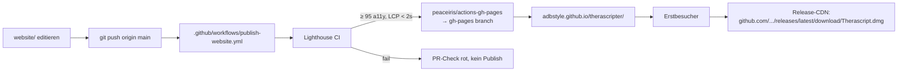

# GitHub Pages Landing für Therascript

**Issue:** [#92](https://github.com/adbstyle/therascripter/issues/92)
**Datum:** 2026-05-08
**Status:** Bereit zur Umsetzung – alle inhaltlichen Blocker geklärt.
**Repo-Slug:** `adbstyle/therascripter` (Pages-URL wird `https://adbstyle.github.io/therascripter/`)

---

## 1. Zielbild

Ein One-Pager auf der github.io-Subdomain, der Therapeut:innen und ihren Empfehlenden (Praxisleitung, IT, DSB) in unter 30 Sekunden erklärt, was Therascript ist, warum es vertrauenswürdig ist und wie sie es bekommen. Sprache: nur Deutsch (Sie-Form). Kein Tracking, keine Cookies, keine Drittanbieter-Skripte. Reine HTML/CSS-Auslieferung, kein Build-Schritt.

## 2. Geklärte Entscheidungen

| Thema | Entscheidung |
|---|---|
| Hero-Headline | „Transkription, die Ihre Praxis nicht verlässt." |
| Sub-Headline | „Therascript transkribiert und pseudonymisiert Therapie-Sitzungen direkt auf Ihrem Mac – ohne Cloud, ohne Account." |
| Kontakt-Mail | `therascript.flatworm325@passmail.com` (Forwarding-Alias) |
| Rechtsberatung | Eigenrecherche + Standard-Template + Open-Source-Haftungsausschluss („AS IS"-Klausel der MIT-Lizenz). Adrian übernimmt Eigenverantwortung für die Rechtsaussagen. |
| Source-Layout | Neuer Top-Level-Folder `website/` (kollidiert nicht mit existierendem `docs/`) |
| Publish-Mechanismus | GitHub Action publiziert `website/` auf `gh-pages`-Branch, Pages-Source = `gh-pages` |
| Quality-Gate | Lighthouse-CI im PR-Check (LCP < 2s, A11y ≥ 95) |
| Tech-Stack | Plain HTML5 + CSS3 + System-Fonts. Kein JavaScript ausser dem nativen `<details>`/`<summary>` für FAQ. Keine externen Ressourcen. |

## 3. Architektur

### Datei-Struktur

```
Therascript/
├── docs/                        ← unverändert (interne Produkt-Doku)
├── website/                     ← NEU: Quellen der Landing Page
│   ├── index.html
│   ├── impressum.html
│   ├── styles.css
│   ├── robots.txt
│   ├── sitemap.xml
│   ├── .lighthouserc.json
│   └── assets/
│       ├── favicon.svg
│       ├── og-image.png            (1200×630)
│       ├── hero.{avif,webp,jpg}
│       ├── screenshot-recording.{avif,webp,jpg}
│       ├── screenshot-review.{avif,webp,jpg}
│       ├── screenshot-sessions.{avif,webp,jpg}
│       ├── screenshot-blocklist.{avif,webp,jpg}
│       └── screenshot-models.{avif,webp,jpg}
└── .github/workflows/
    └── publish-website.yml      ← NEU: Action publiziert auf gh-pages
```

### Publish-Flow



### Pfad-Konvention

Alle Asset-Pfade **relativ** (`assets/hero.avif`, **nicht** `/assets/...`). Damit funktioniert die Seite auf `adbstyle.github.io/therascripter/` (mit Subpfad) **und** auf späterer Custom-Domain ohne Änderung.

## 4. Sektionsstruktur des One-Pagers

```
1. Hero
   - Headline + Sub-Headline
   - Download-Button („Kostenlos herunterladen")
   - Plattform-Hinweis: „Für Mac mit Apple-Silicon-Chip (M1–M4), macOS 14 oder neuer"
   - Hero-Screenshot

2. Vier Vorteils-Kacheln
   - Daten bleiben auf Ihrem Mac
   - Versteht Hochdeutsch und Schweizerdeutsch
   - Namen automatisch unkenntlich machen
   - Kostenlos und quelloffen

3. Features (5 Screenshots mit Captions, alternierend links/rechts)
   - Aufnahme starten
   - Transkript prüfen
   - Sitzungen verwalten
   - Eigene Begriffe pflegen
   - Sprachmodelle wählen
   - Wiederholter Download-CTA am Ende

4. Datenschutz mit Substanz
   - Automatische Löschung nach 30 Tagen
   - Keine Verbindung nach aussen
   - Hinweis auf Festplattenverschlüsselung
   - Was bedeutet Pseudonymisierung?

5. Systemanforderungen

6. FAQ (7 Fragen, native <details>)
   - Wo werden meine Daten gespeichert?
   - Wie kann ich Sitzungen vor der automatischen Löschung exportieren?
   - Welche Sprachmodelle nutzt Therascript?
   - Welche Mac-Modelle werden unterstützt?
   - Gibt es eine kostenpflichtige Version oder ein Abo?
   - Ist Therascript Open Source?
   - Wie erhalte ich Updates?

7. Footer
   - „Therascript ist Open Source unter MIT-Lizenz"
   - Quellcode auf GitHub
   - Kontakt-Mail (mailto:)
   - Impressum
   - Datenschutzerklärung
```

## 5. Visuelles System

### Farb-Tokens

| Token | Light | Dark | Verwendung |
|---|---|---|---|
| `bg-base` | `#fafaf9` | `#0a0a0a` | Seitenhintergrund |
| `bg-surface` | `#ffffff` | `#161616` | Kacheln, FAQ-Karten |
| `text-primary` | `#171717` | `#fafafa` | Headlines, Body |
| `text-secondary` | `#525252` | `#a3a3a3` | Captions, Helper |
| `accent` | `#0f766e` (Teal-700) | `#5eead4` (Teal-300) | CTA, Links, Akzente |
| `accent-hover` | `#0d5d56` | `#2dd4bf` | Button-Hover |

Kontrast-Verifikation: Teal-700 auf Weiss = 5.4:1 → WCAG AA für normalen Text erfüllt.

### Typografie (System-Fonts)

```
font-family: -apple-system, BlinkMacSystemFont, 'Segoe UI', system-ui, sans-serif;
```

| Klasse | Desktop | Mobile |
|---|---|---|
| Hero | 56 px / 64 lh / -0.02em | 36 px / 44 lh |
| H2 | 36 px / 44 lh | 28 px / 36 lh |
| H3 | 22 px / 30 lh | 20 px / 28 lh |
| Body | 18 px / 28 lh | 16 px / 26 lh |
| Caption | 14 px / 20 lh | 14 px / 20 lh |

### CTA-Button

- Höhe: 56 px (Desktop) / 52 px (Mobile) → > 44 px Touch-Target
- Padding: 16 px 32 px
- Background: Teal-700; Hover: leichte Y-Verschiebung -1 px, Shadow-Vertiefung
- Text: weiss, 18 px, semi-bold
- Border-Radius: 12 px
- Focus-Ring: 3 px solid Teal-300, 2 px Offset

## 6. Finale UX-Texte

### Hero

> # Transkription, die Ihre Praxis nicht verlässt.
>
> Therascript transkribiert und pseudonymisiert Therapie-Sitzungen direkt auf Ihrem Mac – ohne Cloud, ohne Account.
>
> [↓ Kostenlos herunterladen]
>
> Für Mac mit Apple-Silicon-Chip (M1–M4), macOS 14 oder neuer

### Vorteile-Kacheln

**Daten bleiben auf Ihrem Mac**
Keine Cloud, kein Online-Konto, keine Drittdienste. Therascript funktioniert vollständig offline.

**Versteht Hochdeutsch und Schweizerdeutsch**
Hochdeutsch wird sehr gut transkribiert. Schweizerdeutsch funktioniert ordentlich – gelegentliche Korrekturen sind nötig.

**Namen automatisch unkenntlich machen**
Personen, Orte und Diagnosen werden im Transkript durch Platzhalter ersetzt. Eigene Begriffe lassen sich ergänzen.

**Kostenlos und quelloffen**
Therascript ist Open Source unter MIT-Lizenz. Code und Releases liegen öffentlich auf GitHub.

### Feature-Captions (5 Screenshots)

1. **Aufnahme starten** – Ein Klick startet die Aufzeichnung. Der Mikrofon-Pegel ist sichtbar, nach zwei Stunden stoppt sie automatisch.
2. **Transkript prüfen** – Pseudonymisierte Begriffe lassen sich per Klick anpassen oder ergänzen.
3. **Sitzungen verwalten** – Alle Aufnahmen chronologisch sortiert. Sitzungen werden nach 30 Tagen automatisch gelöscht.
4. **Eigene Begriffe pflegen** – Personen, Orte, Diagnosen oder Praxis-spezifische Begriffe zur Sperrliste hinzufügen.
5. **Sprachmodelle wählen** – Standardmodell oder optional ein Schweizerdeutsch-spezialisiertes Modell.

### Datenschutz-Sektion

> ### Daten bleiben in Ihrer Hand
>
> **Automatische Löschung nach 30 Tagen**
> Sitzungen werden 30 Tage nach Erstellung automatisch gelöscht. Was Sie für die kantonale Aufbewahrungspflicht behalten müssen, exportieren Sie vorher als verschlüsselte Datei.
>
> **Keine Verbindung nach aussen**
> Therascript verbindet sich nicht mit dem Internet. Keine Cloud, keine Telemetrie, kein Konto.
>
> **Hinweis auf Festplattenverschlüsselung**
> Beim ersten Start prüft Therascript, ob FileVault aktiviert ist – Apples Festplattenverschlüsselung. Falls nicht, erscheint ein Hinweis.
>
> **Was bedeutet Pseudonymisierung?**
> Im Transkript werden echte Namen durch Platzhalter wie [PERSON 1] oder [ORT 1] ersetzt. Die Zuordnung zwischen Platzhalter und Original bleibt lokal auf Ihrem Mac gespeichert – Sie können jederzeit nachschauen, wer mit [PERSON 1] gemeint war. Andere sehen nur die Platzhalter.

### Systemanforderungen

> · Mac mit Apple-Silicon-Chip (M1, M2, M3 oder M4)
> · macOS 14 (Sonoma) oder neuer
> · 8 GB Arbeitsspeicher (RAM) oder mehr
> · 5 GB freier Festplattenspeicher

### Meta-Tags

```html
<title>Therascript – Therapie-Sitzungen lokal transkribieren | macOS</title>
<meta name="description" content="Mac-App für Therapie-Sitzungen: Transkription auf Hochdeutsch und Schweizerdeutsch, automatische Pseudonymisierung. Kostenlos, Open Source, läuft offline.">
<meta property="og:title" content="Therascript – Lokale Transkription für Therapie-Sitzungen">
<meta property="og:description" content="Hochdeutsch und Schweizerdeutsch verstehen, Daten pseudonymisieren – alles lokal auf Ihrem Mac. Kostenlos, Open Source.">
<meta property="og:image" content="assets/og-image.png">
<meta property="og:locale" content="de_CH">
<meta name="twitter:card" content="summary_large_image">
```

## 7. Rechts-Texte (Eigenrecherche-Ansatz)

### Rechtliche Grundlage in der Schweiz

| Quelle | Geltung für Therascript-Seite | Konsequenz |
|---|---|---|
| **UWG Art. 3 lit. s** | Identifikationspflicht im „kommerziellen elektronischen Geschäftsverkehr". Open-Source ohne Verkauf, Werbung oder Lead-Generierung ist keine eindeutig kommerzielle Tätigkeit. | Sichere Variante: Minimal-Impressum mit Identifikationsmöglichkeit (Pseudonym + Kontakt-Mail genügt für eine private Open-Source-Seite). |
| **DSG (revidiert, gültig seit 2023-09-01)** | Datenschutzerklärung empfohlen, auch wenn keine personenbezogenen Daten verarbeitet werden – schafft Transparenz. | Kurze Datenschutzerklärung, die genau festhält: keine Cookies, keine Logs ausserhalb GitHub Pages-Standard, keine Tracking-Skripte. passmail.com als Auftragsverarbeiter beim Mail-Verkehr offen nennen. |
| **MIT-Lizenz „AS IS"-Klausel** | Standard-Open-Source-Disclaimer: keine Gewährleistung, keine Haftung des Erstellers. | Wörtlich zitiert oder paraphrasiert übernehmen. |
| **Schweizer Heilberufe-Recht** | Therascript ist kein Medizinprodukt nach MepV (kein Diagnose-/Therapiezweck). | Disclaimer: „technisches Hilfsmittel ohne Rechts- oder Therapieberatungs-Charakter". |

### Inhalts-Bausteine `impressum.html`

1. **Anbieter** – Pseudonym oder Klarname + Wohnort. Empfehlung: Klarname (Adrian) + Land („Schweiz"), keine vollständige Adresse, weil keine kommerzielle Tätigkeit. Kontakt-Mail.
2. **Verantwortlich für den Inhalt** – Selbe Person.
3. **Haftungsausschluss Inhalt** – Standard-Klausel: Inhalte ohne Gewähr, keine Haftung für externe Links.
4. **Haftungsausschluss Software** – MIT-„AS IS"-Klausel wörtlich zitieren. Klarstellung: User trägt Eigenverantwortung für Verwendung; Therascript ist kein Medizinprodukt.
5. **Datenschutzerklärung** als zweiter Block:
   - Welche Daten erfasst die Webseite? → Keine. Keine Cookies. Keine Tracking-Skripte. Keine Logs ausserhalb der von GitHub Pages standardmässig erhobenen IP-Logs (~7 Tage).
   - Hosting: GitHub Inc., USA. Verweis auf GitHub-Privacy-Statement.
   - Kontakt-Mail-Verarbeitung: passmail.com als Forwarder. Inhalte werden an Maintainer weitergeleitet.
   - Welche Daten erfasst die App? → Keine. Alle Daten lokal. Verweis auf Open-Source-Code als Beleg.
6. **Open-Source-Hinweis** – Lizenz, GitHub-Link.

### Disclaimer-Wortlaut (Vorschlag)

> Therascript ist freie Open-Source-Software unter der MIT-Lizenz. Die Software wird „wie sie ist" zur Verfügung gestellt, ohne jegliche Gewährleistung, weder ausdrücklich noch stillschweigend, einschliesslich, aber nicht beschränkt auf Gewährleistungen der Marktgängigkeit, der Eignung für einen bestimmten Zweck oder der Nichtverletzung von Rechten Dritter.
>
> Therascript ist ein technisches Hilfsmittel zur Transkription und Pseudonymisierung von Audio- und PDF-Dokumenten. Es ist kein Medizinprodukt im Sinne der schweizerischen Medizinprodukteverordnung und ersetzt weder fachliche, rechtliche noch datenschutzrechtliche Beratung. Die Verantwortung für eine rechtskonforme Verwendung – insbesondere im Hinblick auf das Schweizer Datenschutzgesetz, kantonale Aufbewahrungspflichten, Schweigepflicht nach StGB Art. 321 und Patienten-Einwilligung – liegt vollständig bei der nutzenden Person.

## 8. Implementierungs-Sequenz

### Track A – Rechts-Texte (Block 1)

1. Recherche der oben gelisteten Quellen verifizieren (UWG, DSG, MIT-Lizenz-Wortlaut).
2. `website/impressum.html` schreiben:
   - HTML-Skeleton mit gleichem Header/Footer wie `index.html` (Konsistenz).
   - Zwei `<section>`-Blöcke: Impressum + Datenschutzerklärung.
   - Disclaimer-Block prominent am Anfang oder Ende des Impressums.
3. Querverlinkung Impressum ↔ Datenschutzerklärung (gleiche Datei, Anker-Links).

**Aufwand:** ~1-2 Stunden.

### Track B – Skeleton (Block 2)

1. `website/index.html` mit allen Sektionen aus Abschnitt 4, Texten aus Abschnitt 6, Strukturen aus Abschnitt 5.
   - `<!doctype html>`, `<html lang="de-CH">`, alle Meta-Tags
   - Critical CSS inline im `<head>`, externes `styles.css` async geladen
   - Skip-Link, semantische Sektionen (`<header>`, `<main>`, `<section aria-labelledby>`, `<footer>`)
   - Hero-Bild als `<picture>` mit AVIF/WebP/JPEG, `fetchpriority="high"`, expliziten `width`/`height`
   - Andere Bilder `loading="lazy"`
   - FAQ als `<details><summary>`
   - Download-Link: `<a href="https://github.com/adbstyle/therascripter/releases/latest/download/Therascript.dmg" download>`
   - Platzhalter-Bilder (1×1 transparente PNG mit Bildunterschriften), bis echte Screenshots da sind
2. `website/styles.css` – Below-the-Fold-Styles, Dark-Mode-Block, Print-Styles
3. `website/robots.txt`:
   ```
   User-agent: *
   Allow: /
   Sitemap: https://adbstyle.github.io/therascripter/sitemap.xml
   ```
4. `website/sitemap.xml` – 2 URLs (Index + Impressum)
5. `website/assets/favicon.svg` – aus `src/renderer/src/components/AppLogo.tsx` exportieren
6. `website/assets/og-image.png` – Platzhalter, wird in Track C produziert

**Aufwand:** ~1 Personentag.

### Track C – Action + Lighthouse-CI (Block 3)

1. `.github/workflows/publish-website.yml`:
   ```yaml
   name: Publish Website
   on:
     push:
       branches: [main]
       paths:
         - 'website/**'
         - '.github/workflows/publish-website.yml'
     pull_request:
       paths:
         - 'website/**'
   permissions:
     contents: write
   jobs:
     lighthouse:
       runs-on: ubuntu-latest
       steps:
         - uses: actions/checkout@v4
         - uses: actions/setup-node@v4
           with:
             node-version: '20'
         - run: npm install -g @lhci/cli@0.14.x
         - run: lhci autorun --config=./website/.lighthouserc.json
     publish:
       needs: lighthouse
       if: github.ref == 'refs/heads/main'
       runs-on: ubuntu-latest
       steps:
         - uses: actions/checkout@v4
         - uses: peaceiris/actions-gh-pages@v4
           with:
             github_token: ${{ secrets.GITHUB_TOKEN }}
             publish_dir: ./website
             publish_branch: gh-pages
   ```
2. `website/.lighthouserc.json`:
   ```json
   {
     "ci": {
       "collect": {
         "staticDistDir": "./website",
         "url": ["http://localhost/index.html", "http://localhost/impressum.html"]
       },
       "assert": {
         "assertions": {
           "categories:performance": ["error", { "minScore": 0.9 }],
           "categories:accessibility": ["error", { "minScore": 0.95 }],
           "categories:best-practices": ["error", { "minScore": 0.95 }],
           "categories:seo": ["error", { "minScore": 0.95 }],
           "largest-contentful-paint": ["error", { "maxNumericValue": 2000 }],
           "cumulative-layout-shift": ["error", { "maxNumericValue": 0.1 }]
         }
       }
     }
   }
   ```
3. PR → merge → erster Workflow-Run scheitert beim Push (gh-pages-Branch existiert noch nicht – Action legt ihn an).
4. Manuell in GitHub Settings → Pages → Source = `gh-pages`-Branch, Folder = `/ (root)` aktivieren.
5. Zweiter Run nach Setup-Speichern → Site live unter `https://adbstyle.github.io/therascripter/`.

**Aufwand:** ~0.5 Personentage.

### Track D – Screenshot-Produktion (Block 4)

1. Demo-Daten in der App präparieren:
   - Eine **frei erfundene** Beispiel-Sitzung mit Patient „Müller, M." (wird zu [PERSON 1]) und Therapeut:in „Dr. Weber" (wird zu [PERSON 2]). Inhalt 5–10 Minuten Demo-Audio mit klarem Therapie-Vokabular auf Hochdeutsch.
   - Sperrliste mit 3-5 Beispiel-Einträgen.
   - Mehrere Sitzungen in der Übersicht (verschiedene Daten, Status: Review-fertig, Verarbeitung, Aufnahme).
2. App im **Light-Mode** auf 2880×1800 Retina-Display starten.
3. Screenshots mit ⇧⌘4 + Space (Fenster mit Schatten):
   - **Hero / Review-Editor** (Hero-Bild der Seite): Review-Editor mit sichtbaren Pseudonymisierungs-Chips
   - **Aufnahme-Ansicht** mit Mikrofon-Pegel
   - **Sessions-Übersicht** mit mehreren Sitzungen
   - **Sperrliste/Settings** mit Beispieleinträgen
   - **Modell-Auswahl** mit optionalen Schweizerdeutsch-Modellen
4. Export-Originale als PNG ins temporäre `screenshots/raw/`.
5. Konvertierung mit `cwebp` und `avifenc`:
   ```bash
   for f in screenshots/raw/*.png; do
     base=$(basename "$f" .png)
     avifenc --min 30 --max 50 "$f" "website/assets/$base.avif"
     cwebp -q 75 "$f" -o "website/assets/$base.webp"
     magick "$f" -quality 80 -strip "website/assets/$base.jpg"
   done
   ```
   Zielgrössen: Hero AVIF < 80 KB / WebP < 150 KB / JPEG < 250 KB. Feature-Screenshots AVIF < 60 KB / WebP < 100 KB / JPEG < 180 KB.
6. **OG-Image** (`og-image.png`, 1200×630) statisch in Figma/Sketch erstellen: App-Logo + Hero-Headline + Screenshot-Ausschnitt.
7. **Favicon** aus `src/renderer/src/components/AppLogo.tsx` als SVG exportieren.

**Aufwand:** ~1 Personentag (Adrian).

### Track E – Verifikation (Block 5)

| Check | Methode | Akzeptanz |
|---|---|---|
| Lighthouse-Mobile | CI-Run auf live URL re-runnen | LCP < 2s, A11y ≥ 95 |
| Cross-Browser | Manuell: Safari macOS, Safari iOS, Chrome Desktop, Chrome Android, Firefox Desktop | Layout intakt, FAQ funktioniert, Download startet |
| Mobile Initial-Viewport | iPhone-Simulator 375×812: Download-Button sichtbar ohne Scroll | Sichtbar |
| Cookie-/Tracking-Check | DevTools → Application → Cookies leer; Network-Tab zeigt nur eigene Assets | AC-12 erfüllt |
| Tastaturnavigation | Tab durch alle Elemente, sichtbarer Focus, Skip-Link | NFR-4 |
| Screen-Reader-Test | VoiceOver auf Safari macOS – Hero, Buttons, Bild-Alts korrekt | NFR-4 |
| OG-Image-Vorschau | Twitter Card Validator + LinkedIn Post Inspector | Vorschau zeigt OG-Image |
| Download-Klick | Klick auf Hero-CTA → DMG-Download startet aus GitHub Releases | AC-3 |
| Umlaute in Title/OG | DevTools → Elements → `<title>`-Inhalt | NFR-6 |

**Aufwand:** ~0.5 Personentage.

## 9. Acceptance-Criteria-Mapping (Issue #92)

| AC | Erfüllung |
|---|---|
| AC-1 (Erreichbar via github.io) | Track C – Pages-Setup |
| AC-2 (Hero mit Headline + Button + Plattform-Hinweis) | Track B – Hero-Sektion |
| AC-3 (Direct DMG via `/releases/latest/download/Therascript.dmg`) | Track B – Download-Anker mit `download`-Attribut |
| AC-4 (4 Vorteile) | Track B – Vorteils-Kacheln aus Abschnitt 6 |
| AC-5 (Pseudonymisierungs-Erklärung) | Track B – Datenschutz-Sektion |
| AC-6 (5 Screenshots mit Captions) | Track B + D |
| AC-7 (Datenschutz: 30-Tage-Auto-Delete + Export) | Track B – Datenschutz-Sektion |
| AC-8 (FAQ: 7 Fragen) | Track B – FAQ-Sektion |
| AC-9 (Sysreq vor Download lesbar) | Track B – Reihenfolge |
| AC-10 (Footer: Kontakt + Impressum) | Track B – Footer + Track A – Impressum |
| AC-11 (Mobile + Desktop) | Track B – Responsive CSS |
| AC-12 (kein Cookie-Banner) | Track B – kein Cookie-Code = kein Banner nötig |

## 10. Risiken & Mitigationen

| Risiko | Mitigation |
|---|---|
| Screenshot-Drift (App ändert sich, Screenshots veralten) | In `scripts/release.sh` Checklist-Item „Screenshots in `website/assets/` prüfen" einbauen. |
| Lighthouse-Score auf realer Hardware schlechter als im CI | CI-Score ist nur Indikator. Nach Launch manueller Run von echtem Mobilgerät. |
| Custom-Domain später → Pfad-Brüche | Disziplin bei relativen Pfaden im Skeleton. CI-Test: keine absoluten URLs ausser GitHub-Release-Link. |
| GitHub Pages Cache-Verhalten | GH Pages cacht 10 min für HTML, lange für Assets. Bei Asset-Updates Query-String-Versionierung manuell (`hero.avif?v=2026-05-08`). |
| Schweizerdeutsch-Aussage rechtlich angreifbar | UX-Writing-Review hat „ordentlich, mit gelegentlichen Korrekturen" konservativ formuliert. |
| Eigene Recherche statt Anwalts-Mandat → eventuelles Compliance-Risiko | Disclaimer-Klausel macht Open-Source-/Eigenverantwortung-Charakter explizit. Adrian trägt das Risiko bewusst. |

## 11. Pflege nach Launch

- Pro App-Release: Screenshots aktualisieren, falls UI relevant geändert hat. Im selben PR wie der Release-Commit.
- FAQ-Antworten reviewen, falls sich App-Verhalten ändert (z. B. Aufbewahrungsfrist, neue Modelle).
- OG-Image bei grösserem Marken-Refresh neu erstellen.
- Quartalsweise: Lighthouse-Run live, Cross-Browser-Spotcheck.

## 12. Abhängigkeiten zur Haupt-App

- **Download-URL → erledigt**: Asset-Naming wurde auf stabilen Namen umgestellt. `electron-builder.yml` setzt nun `artifactName: ${productName}.dmg`, das DMG heisst entsprechend `Therascript.dmg`. Damit funktioniert die im Issue spezifizierte URL `https://github.com/adbstyle/therascripter/releases/latest/download/Therascript.dmg` ab dem nächsten Release. Geänderte Files:
  - `electron-builder.yml` (Zeile 51, neu: `artifactName: ${productName}.dmg`)
  - `scripts/release.sh` (Zeile 134, DMG_PATH ohne Versions-/Arch-Suffix)
  - `scripts/sim-clean-install.sh` (Zeilen 59 + 71, Glob auf `Therascript.dmg`)

  Historische Releases (v0.7.x, v0.8.0, v0.8.1) behalten ihre versionierten Asset-Namen unverändert. Der nächste Release (v0.8.2 oder höher) produziert das stabile Asset, das die Landing Page erwartet.
- **AppLogo** (`src/renderer/src/components/AppLogo.tsx`): Quelle für Favicon. Bei Logo-Änderung in der App auch `website/assets/favicon.svg` aktualisieren.
- **30-Tage-Auto-Delete-Aussage**: Hängt von der App-Konstante in `src/main/services/AutoDeleteService.ts` ab. Falls die Frist je geändert wird, FAQ + Datenschutz-Sektion synchron updaten.

## 13. Out of Scope (gemäss Issue + Bestätigt)

- Demo-Video
- Mehrsprachigkeit (FR, IT, EN)
- Eigene Domain
- Tracking, Analytics, Cookies, Newsletter, Live-Chat
- Differenzierte Persona-Sektionen
- Konkrete Schweizerdeutsch-Genauigkeitswerte
- Dynamische Versionsnummer-Anzeige
- SEO-Ranking-Ziele

## 14. Reihenfolge der Ausführung in dieser Session

1. **Track A** – Recherche + `impressum.html`
2. **Track B** – `index.html`, `styles.css`, `robots.txt`, `sitemap.xml`
3. **Track C** – Action + Lighthouse-Config
4. **Track D-Anleitung** – Screenshot-Anleitung als separates Markdown für Adrian
5. **Track E** – Verifikation und Pages-Aktivierung erfolgt nach Adrians Screenshot-Produktion und manueller Pages-Aktivierung in den Repo-Settings (das kann der Agent nicht).

## 15. Was nach diesem Plan offen bleibt

- Adrian: Patch-Release v0.8.2 (oder höher) fahren – produziert das erste DMG mit stabilem Namen `Therascript.dmg` und schliesst das Lücken-Fenster.
- Adrian: Demo-Sitzung und Screenshots produzieren (Track D)
- Adrian: GitHub Pages in den Repo-Settings aktivieren nach erstem Action-Run
- Adrian: Verifikation auf realer Hardware (Track E)
- Adrian: `og-image.png` durch echtes Asset ersetzen (aktuell solid-Teal-Platzhalter)
- Adrian: `LICENSE`-Datei im Repo-Root anlegen (`package.json` deklariert MIT, aber kein File vorhanden)
