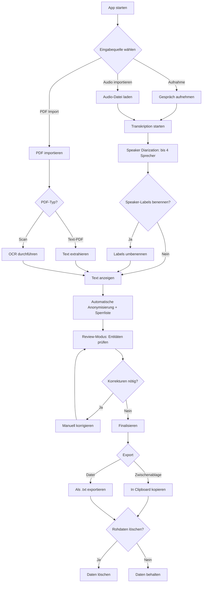

# Requirements: Therapie-Transkriptions- & Anonymisierungs-App (Therascript)

## 1. Kontextverständnis

**Problem:** Psychotherapeuten müssen Therapiegespräche dokumentieren und dabei die Vertraulichkeit der Patienten wahren. Aktuell gibt es keine integrierte Lösung, die Aufnahme, Transkription mit Sprechererkennung und umfassende Anonymisierung in einem lokalen, datenschutzkonformen Tool vereint.

**Lösung:** Eine Electron-basierte Desktop-Applikation für macOS, die:
- Gespräche aufnimmt und automatisch transkribiert (Hochdeutsch + Schweizerdeutsch allgemein)
- Sprecher automatisch unterscheidet (bis zu 4 Personen — Einzel- und Paartherapie)
- Personennamen, Orte, Kontaktdaten, medizinische Identifikatoren und Geburtsdaten automatisch erkennt und durch Platzhalter ersetzt
- Eine persönliche Sperrliste für wiederkehrende Begriffe unterstützt
- PDFs (inkl. Scans via OCR) importiert und anonymisiert
- Alles komplett lokal verarbeitet — keine Daten verlassen das Gerät

---

## 2. Stakeholders & Personas

### Primärer Nutzer: Psychotherapeut/in
- **Kontext:** Führt Therapiesitzungen durch (Einzel- und Paartherapie), muss Gespräche für Dokumentation und Supervision anonymisiert festhalten
- **Technisches Level:** Durchschnittlich — App muss einfach und intuitiv sein
- **Kritische Anforderung:** Absolute Vertraulichkeit der Patientendaten
- **Typische Nutzung:** Manchmal Live-Aufnahme während der Sitzung (App im Hintergrund), manchmal nachträglicher Audio-Import
- **Exportziele:** Supervision/Intervision, eigene Dokumentation, Praxissoftware — je nach Situation

---

## 3. Funktionale Anforderungen (User Stories)

### Epic 0: Sitzungsverwaltung

#### US-0: Sitzungen verwalten

**Als** Psychotherapeut/in
**möchte ich** eine Übersicht aller meiner Sitzungen haben,
**damit** ich mehrere Sitzungen parallel bearbeiten und den Überblick behalten kann.

**Vorbedingungen:**
1. Die App ist geöffnet

**Akzeptanzkriterien:**
1. Das SYSTEM zeigt eine Sitzungsliste (Dashboard) als zentrale Übersicht
2. Jede neue Sitzung (Aufnahme oder Import) erhält automatisch einen Titel basierend auf Datum und Uhrzeit (z.B. "Sitzung 07.02.2026 14:30")
3. Der USER kann den Titel einer Sitzung nachträglich umbenennen
4. Jede Sitzung zeigt ihren aktuellen Status (Aufnahme läuft, Transkription, Review, Exportiert)
5. Der USER kann eine Sitzung manuell löschen (mit Bestätigungsdialog)
6. Sitzungen bleiben in der Liste erhalten bis der USER sie aktiv löscht — auch nach Export
7. Das SYSTEM persistiert die Sitzungsliste zwischen App-Neustarts

**Nachbedingungen:**
1. Alle Sitzungen sind in der Liste sichtbar und nach Status/Datum navigierbar

**Hinweis:** Die Sitzungsliste enthält zwei Typen: Audio-Sitzungen (Aufnahme/Import → Transkription → Anonymisierung → Review → Export) und PDF-Sitzungen (Import → Textextraktion → Anonymisierung → Review → Export). Beide Typen sind visuell unterscheidbar (Typ-Icon).

**Offene Fragen:**
1. Soll die Sitzungsliste sortier- oder filterbar sein (z.B. nach Status oder Typ)?
2. Gibt es eine maximale Anzahl Sitzungen, die praktikabel in der Liste bleiben?

---

### Epic 1: Audio-Aufnahme & Import

#### US-1: Gespräch aufnehmen

**Als** Psychotherapeut/in
**möchte ich** ein Therapiegespräch über das Mikrofon meines Macs aufnehmen können,
**damit** ich das Gespräch anschliessend transkribieren lassen kann.

**Vorbedingungen:**
1. Die App ist geöffnet und betriebsbereit
2. Ein Mikrofon ist verfügbar und die App hat Mikrofonzugriff (Standard-Eingabegerät des OS)

**Akzeptanzkriterien:**
1. Der USER kann eine Aufnahme mit einem Klick starten
2. Der USER kann eine laufende Aufnahme mit einem Klick stoppen
3. Der USER sieht während der Aufnahme eine visuelle Anzeige (Dauer, Audiopegel)
4. Das SYSTEM speichert die Aufnahme lokal auf dem Gerät
5. Der USER kann eine Aufnahme pausieren und fortsetzen
6. Die App funktioniert zuverlässig im Hintergrund (minimiert), da der USER während der Therapiesitzung nicht mit der App interagiert
7. Das SYSTEM zeigt ein Menu Bar Icon in der macOS-Menüleiste mit Aufnahmestatus (rot = läuft), Dauer und Stop/Pause-Steuerung — damit der USER die Aufnahme kontrollieren kann, ohne die App in den Vordergrund zu holen
8. Das SYSTEM verhindert aktiv den macOS-Ruhezustand während einer laufenden Aufnahme (analog zu Zoom/Spotify)
9. Das SYSTEM speichert die Aufnahme periodisch als Zwischensicherung (mindestens alle 60 Sekunden), sodass bei einem Absturz maximal 60 Sekunden Audio verloren gehen
10. Beim App-Start nach einem Absturz zeigt das SYSTEM wiederhergestellte Aufnahmen an und bietet deren Weiterverarbeitung an
11. Das SYSTEM stoppt die Aufnahme automatisch nach 3 Stunden und informiert den USER, um versehentliche Endlos-Aufnahmen zu vermeiden
12. Beim erstmaligen Starten einer Aufnahme zeigt das SYSTEM einen Hinweis zur Einholung der Patienteneinwilligung (StGB Art. 179bis) — ohne die Aufnahme zu blockieren
13. Wenn Parallel-Transkription aktiviert ist (Settings): Das SYSTEM transkribiert das Audio bereits während der laufenden Aufnahme im Hintergrund — OHNE dem USER das Transkript anzuzeigen
14. Nach Aufnahme-Stop führt das SYSTEM einen finalen Qualitäts-/Diarization-Pass durch und zeigt das fertige Transkript innerhalb von 5 Minuten an (statt 20-40 Min bei sequenzieller Verarbeitung)

**Nachbedingungen:**
1. Die Audiodatei ist lokal gespeichert und bereit zur Transkription
2. Eine neue Sitzung wurde in der Sitzungsliste erstellt
3. Bei aktivierter Parallel-Transkription: Das Transkript ist innerhalb von 5 Minuten nach Stop verfügbar

**Out of Scope:**
- Mikrofon-Auswahlmenü — die App nutzt das vom macOS gewählte Standard-Eingabegerät
- Anzeige des Transkripts WÄHREND der laufenden Aufnahme (inhaltlich unerwünscht: Therapeut soll während der Sitzung nicht auf ein Transkript schauen — auch wenn im Hintergrund bereits transkribiert wird)

**Constraints & Randbedingungen:**
1. macOS bietet APIs zur Standby-Unterdrückung (IOPMAssertionCreateWithName / NSProcessInfo.beginActivity)
2. Audio-Streaming direkt auf Disk ist für Auto-Recovery nötig (kein reines In-Memory-Recording)
3. Parallel-Transkription erfordert deutlich mehr CPU/RAM — ist daher optional (Settings, Standard: an)

---

#### US-1b: Audio-Datei importieren

**Als** Psychotherapeut/in
**möchte ich** bestehende Audio-Dateien in die App importieren können,
**damit** ich auch extern aufgenommene Gespräche transkribieren und anonymisieren kann.

**Vorbedingungen:**
1. Die App ist geöffnet

**Akzeptanzkriterien:**
1. Der USER kann Audio-Dateien per Dateiauswahl-Dialog importieren
2. Der USER kann Audio-Dateien per Drag-and-Drop in die App importieren
3. Der USER kann mehrere Audio-Dateien gleichzeitig importieren (Batch-Import)
4. Das SYSTEM akzeptiert gängige Formate (mp3, wav, m4a, webm)
5. Das SYSTEM zeigt eine klare Fehlermeldung bei nicht unterstützten oder beschädigten Dateien, inkl. Liste der unterstützten Formate
6. Nach dem Import wird automatisch die Transkription gestartet
7. Bei Batch-Import werden die Dateien in einer Queue nacheinander transkribiert (FIFO)
8. Der USER sieht den Fortschritt der Queue (welche Datei wird gerade verarbeitet, wie viele verbleiben)

**Nachbedingungen:**
1. Für jede importierte Datei wurde eine neue Sitzung in der Sitzungsliste erstellt
2. Die Transkription läuft oder steht in der Queue

**Out of Scope:**
- Audio-Player/Vorschau vor der Transkription — der USER nutzt dafür seinen Standard-Player

---

### Epic 2: Transkription & Sprechererkennung

#### US-2: Gespräch transkribieren mit Sprechererkennung

**Als** Psychotherapeut/in
**möchte ich** eine Aufnahme automatisch transkribieren lassen, wobei das System die verschiedenen Sprecher unterscheidet,
**damit** ich ein lesbares Protokoll mit klarer Zuordnung erhalte.

**Vorbedingungen:**
1. Eine Audioaufnahme oder importierte Audiodatei ist vorhanden

**Akzeptanzkriterien:**
1. Das SYSTEM transkribiert die Aufnahme komplett lokal (keine Cloud-Verarbeitung)
2. Das SYSTEM erkennt die Anzahl Sprecher automatisch und weist ihnen Labels zu (Person A, Person B, Person C, Person D)
3. Bei nur 1 erkanntem Sprecher wird kein Speaker-Label vergeben (einfacher Fliesstext)
4. Bei 5+ erkannten Sprechern arbeitet das SYSTEM best-effort (Stimmen können zusammengefasst werden)
5. Das SYSTEM transkribiert Deutsch allgemein (Hochdeutsch und Schweizerdeutsche Dialekte) in lesbaren Hochdeutsch-Text
6. Das SYSTEM entfernt offensichtliche Verlegenheitslaute ("äh", "ähm") aus dem Transkript. Sonstige Füllwörter ("also", "halt"), Satzabbrüche und Wiederholungen bleiben erhalten
7. Das SYSTEM versieht den Text mit voller Interpunktion (Satzzeichen, Grossschreibung) und setzt Absatzumbrüche bei jedem Sprecherwechsel
8. Das SYSTEM fügt bei jedem Sprecherwechsel einen Zeitstempel ein (z.B. [00:23:40])
9. Das SYSTEM zeigt den transkribierten Text mit Sprecherzuordnung an
10. Der USER sieht den Fortschritt der Transkription (Prozent + geschätzte Restzeit)
11. Der USER kann die App während der Transkription für andere Sitzungen nutzen (nicht-blockierend)
12. Das SYSTEM zeigt eine macOS-Benachrichtigung, wenn die Transkription abgeschlossen ist
13. Nach Abschluss der Transkription startet das SYSTEM automatisch die Anonymisierung (kein manueller Zwischenschritt)
14. Bei Live-Aufnahmen mit aktivierter Parallel-Transkription: Das SYSTEM nutzt die bereits im Hintergrund erstellte Transkription und führt nach Aufnahme-Stop nur einen finalen Diarization-/Qualitäts-Pass durch — Ergebnis innerhalb von 5 Minuten nach Stop
15. Bei importierten Audio-Dateien oder deaktivierter Parallel-Transkription: Sequenzielle Verarbeitung wie bisher (max. 2x Echtzeit gemäss NFR-3)

**Nachbedingungen:**
1. Ein strukturierter Text mit Sprecherzuordnung und Zeitstempeln liegt vor
2. Die Anonymisierung wurde automatisch gestartet

**Out of Scope:**
- Abbrechen oder Neustarten einer laufenden Transkription — sie läuft immer bis zum Ende durch
- Korrektur einzelner Sprecherzuordnungen (z.B. Segment von Person A → Person B umhängen) — nicht im MVP
- Originaler Dialekt-Text verfügbar machen — nur Hochdeutsch-Output, keine Originalversion
- Audio-Qualitätscheck vor der Transkription — kein Vorher-Check, das System liefert best-effort Ergebnis

**Constraints & Randbedingungen:**
1. NFR-3: Transkription max. 2x Echtzeit (10 Min Audio → max. 20 Min Verarbeitung)
2. Schweizerdeutsch → Hochdeutsch ist eine Übersetzungsleistung, nicht nur Transkription. Begriffe ohne Hochdeutsch-Äquivalent werden bestmöglich übersetzt
3. Transkription muss non-blocking sein, da der User parallel andere Sitzungen bearbeiten kann (Epic 0)

---

#### US-2b: Speaker-Labels benennen

**Als** Psychotherapeut/in
**möchte ich** die automatisch zugewiesenen Speaker-Labels (Person A, Person B) nachträglich benennen können,
**damit** das Transkript für Supervision und Dokumentation besser lesbar ist.

**Vorbedingungen:**
1. Eine Transkription mit Sprecherzuordnung liegt vor (mindestens 2 erkannte Sprecher)

**Akzeptanzkriterien:**
1. Der USER kann jedes Speaker-Label individuell umbenennen (z.B. "Person A" → "Therapeut", "Person B" → "Patient", "Person C" → "Partnerin")
2. Das SYSTEM ersetzt das Label konsistent im gesamten Transkript
3. Die Umbenennung ist optional — der USER kann Labels auch als Person A/B/C/D belassen
4. Die Umbenennung ist jederzeit möglich — auch nach der Anonymisierung, im Review-Modus (Epic 6)
5. **Achtung:** Speaker-Labels werden bei der Anonymisierung (Epic 4) mitgeprüft. Enthält ein Label einen erkannten Namen (z.B. "Dr. Müller"), wird es anonymisiert (z.B. → [PERSON 1]). Der USER sollte daher rollenbasierte Labels verwenden (z.B. "Therapeut", "Patient")

**Nachbedingungen:**
1. Der Text zeigt die vom USER gewählten Sprecherbezeichnungen

**Out of Scope:**
- Korrektur einzelner Sprecherzuordnungen (Segment einem anderen Sprecher zuweisen) — nicht im MVP

---

### Epic 3: PDF-Import & OCR

#### US-3: PDF importieren und Text extrahieren

**Als** Psychotherapeut/in
**möchte ich** PDF-Dokumente in die App importieren können, auch gescannte Dokumente,
**damit** ich deren Textinhalt anonymisieren kann.

**Typische Dokumente:** Ärztliche Berichte/Zuweisungen, psychiatrische Gutachten, Versicherungsformulare, eigene Therapienotizen/-protokolle, Laborergebnisse.

**Vorbedingungen:**
1. Die App ist geöffnet

**Akzeptanzkriterien:**
1. Der USER kann PDF-Dateien per Drag-and-Drop oder Dateiauswahl-Dialog importieren
2. Der USER kann mehrere PDF-Dateien gleichzeitig importieren (Batch-Import)
3. Das SYSTEM erkennt pro Seite automatisch, ob Text direkt extrahierbar ist oder OCR nötig ist (Mixed-PDF-Unterstützung)
4. Das SYSTEM extrahiert Text aus Text-PDF-Seiten direkt
5. Das SYSTEM erkennt gedruckten Text in gescannten Seiten mittels OCR (lokal, Deutsch)
6. Das SYSTEM erkennt passwortgeschützte PDFs und fragt den USER nach dem Passwort
7. Der extrahierte Text wird als linearer Fliesstext dargestellt (keine Layout-Erhaltung von Tabellen, Spalten etc.)
8. Das SYSTEM zeigt den extrahierten Text dem USER an
9. Nach der Textextraktion startet das SYSTEM automatisch die Anonymisierung (konsistent mit Audio-Workflow)
10. Bei Batch-Import werden die PDFs in einer Queue nacheinander verarbeitet (FIFO)
11. Die Textextraktion/OCR ist non-blocking — der USER kann die App für andere Aufgaben nutzen
12. Das SYSTEM zeigt eine macOS-Benachrichtigung, wenn die Verarbeitung abgeschlossen ist
13. Das SYSTEM zeigt eine Warnung bei PDFs mit mehr als 50 Seiten (Verarbeitung trotzdem möglich)
14. Jedes importierte PDF erstellt einen Eintrag in der Sitzungsliste mit Typ-Kennzeichnung "PDF" (unterscheidbar von Audio-Sitzungen)

**Nachbedingungen:**
1. Der extrahierte Text ist bereit zur Anonymisierung bzw. die Anonymisierung wurde automatisch gestartet
2. Ein neuer Eintrag vom Typ "PDF" wurde in der Sitzungsliste erstellt

**Out of Scope:**
- Handschrift-Erkennung — OCR erkennt nur gedruckten Text
- Layout-Erhaltung (Tabellen, Spalten, Kopf-/Fusszeilen) — nur linearer Fliesstext
- Andere Dokumentformate (.docx, .jpg, .png) — nur PDF
- Anonymisierung von Bildinhalten in PDFs (z.B. Fotos, Logos)
- OCR in anderen Sprachen als Deutsch

**Constraints & Randbedingungen:**
1. OCR muss komplett lokal laufen (NFR-1: keine Cloud-Verarbeitung)
2. Mixed-PDFs erfordern eine Seite-für-Seite-Analyse (Text vorhanden → direkte Extraktion; kein Text → OCR)
3. PDF-Einträge in der Sitzungsliste haben einen kürzeren Workflow als Audio-Sitzungen (kein Transkriptions-/Diarization-Schritt)

---

### Epic 4: Anonymisierung

#### US-4: Text automatisch anonymisieren
**Als** Psychotherapeut/in
**möchte ich** dass identifizierende Informationen automatisch durch Platzhalter ersetzt werden,
**damit** der Text keine Rückschlüsse auf Patienten oder deren Umfeld erlaubt.

**Vorbedingungen:**
1. Ein transkribierter Text oder ein importierter PDF-Text liegt vor

**Akzeptanzkriterien:**
1. Das SYSTEM erkennt **Personennamen** im Text und ersetzt sie durch typ-spezifisch nummerierte Platzhalter ([PERSON 1], [PERSON 2] etc.)
2. Das SYSTEM erkennt **Ortsnamen** im Text und ersetzt sie durch typ-spezifisch nummerierte Platzhalter ([ORT 1], [ORT 2] etc.)
3. Das SYSTEM erkennt **Kontaktdaten** (Telefonnummern, E-Mail-Adressen, Postadressen, Social-Media-Handles) und ersetzt sie durch typisierte Platzhalter ([TELEFON 1], [EMAIL 1], [ADRESSE 1] etc.)
4. Das SYSTEM erkennt **medizinische Identifikatoren** (AHV-Nummern, Versicherungsnummern, Fallnummern) und ersetzt sie durch typisierte Platzhalter ([AHV-NR 1], [VERS-NR 1] etc.)
5. Das SYSTEM erkennt **Geburtsdaten** (explizite Datumsangaben wie "15.03.1985", "geb. 1990") und ersetzt sie durch Platzhalter ([GEBURTSDATUM 1] etc.)
6. Die Platzhalter-Nummerierung ist **typ-spezifisch**: Jeder Entitätstyp hat eine eigene Nummerierung ([PERSON 1], [PERSON 2], [ORT 1], [ORT 2] etc.) — nicht global fortlaufend
7. Gleiche Entitäten werden innerhalb einer Sitzung konsistent durch denselben Platzhalter ersetzt (kein sitzungsübergreifendes Mapping)
8. Das SYSTEM erkennt **Varianten desselben Namens** best-effort als eine Entität (Coreference-Resolution): "Dr. Müller", "Müller", "Herr Müller" → alle [PERSON 1]
9. Das SYSTEM anonymisiert nur **ganze Wörter/eigenständige Entitäten** — keine Teilstrings in zusammengesetzten Wörtern (z.B. "Müller" in "Müllerstrasse" bleibt unverändert)
10. Die **NER hat Vorrang** vor der Sperrliste: NER-Ergebnisse sind primär, die Sperrliste ergänzt was NER nicht erkennt. Bei Typ-Konflikt gilt der NER-Typ
11. Das SYSTEM wendet zusätzlich die persönliche Sperrliste des USERs an (siehe Epic 5)
12. Das SYSTEM anonymisiert auch **Speaker-Labels** (aus US-2b), wenn diese erkannte Namen enthalten (z.B. "Dr. Müller" als Label → [PERSON 1])
13. Die Sprecherzuordnung (Absätze, Zeitstempel) bleibt nach der Anonymisierung erhalten
14. Das SYSTEM versucht **best-effort** auch gesprochene Kontaktdaten in Transkripten zu erkennen (z.B. "null sieben neun...") — ohne Garantie auf vollständige Erkennung
15. Im Review-Modus (Epic 6) sind die **Originalwerte hinter den Platzhaltern sichtbar** (z.B. Hover/Tooltip), damit der USER die Korrektheit prüfen kann. Originale werden erst bei Rohdaten-Löschung (US-7b) endgültig entfernt
16. Die Anonymisierung erfolgt komplett lokal
17. Die Anonymisierung ist innerhalb von **30 Sekunden** abgeschlossen — auch bei langen Texten (ca. 10'000 Wörter)

**Nachbedingungen:**
1. Der Text enthält keine identifizierenden Informationen mehr (im Rahmen der definierten Entitätstypen)
2. Das Platzhalter-Mapping (Original → Platzhalter) bleibt bis zur Rohdaten-Löschung (US-7b) gespeichert — der USER kann jederzeit zurück in den Review

**Out of Scope:**
- ICD-Diagnose-Codes und ausgeschriebene Diagnosenamen werden NICHT anonymisiert (klinisch relevant, kein Identifikationsrisiko)
- Relative Zeitangaben ("letzte Woche", "vor drei Tagen") werden NICHT anonymisiert
- Institutionsnamen (Spitäler, Schulen, Arbeitgeber) werden NICHT anonymisiert
- Sonstige Datumsangaben ausser Geburtsdaten werden NICHT anonymisiert
- Sitzungsübergreifende Platzhalter-Konsistenz — kein globales Entitäts-Mapping zwischen Sitzungen
- Automatische Re-Anonymisierung nach Text-Editierung im Review — User markiert neue Entitäten manuell (Epic 6)
- Teilstring-Anonymisierung in zusammengesetzten Wörtern

**Constraints & Randbedingungen:**
1. Coreference-Resolution für Namens-Varianten ist best-effort — Qualität hängt vom gewählten NER-Modell ab (NFR-9)
2. Platzhalter-Mapping muss bis zur Rohdaten-Löschung (US-7b) persistiert werden (für Review-Modus, Epic 6)
3. Anonymisierung muss Sprecherzuordnung, Zeitstempel und Absatzstruktur unangetastet lassen
4. Speaker-Label-Anonymisierung erfordert Koordination mit US-2b (Labels können nach Anonymisierung nicht mehr auf Klarnamen gesetzt werden)

---

### Epic 5: Sperrliste / Benutzerwörterbuch

#### US-5: Persönliche Sperrliste pflegen
**Als** Psychotherapeut/in
**möchte ich** eine persönliche Liste von Begriffen pflegen, die immer anonymisiert werden,
**damit** wiederkehrende Namen und Begriffe zuverlässig erkannt werden — auch wenn die automatische Erkennung sie nicht findet.

**Vorbedingungen:**
1. Die App ist geöffnet

**Akzeptanzkriterien:**
1. Der USER kann eigene Begriffe (Namen, Orte, andere Ausdrücke) zur Sperrliste hinzufügen
2. Der USER kann jedem Eintrag einen Platzhalter-Typ zuweisen (Person, Ort, Kontaktdaten etc.)
3. Der USER kann auch **Mehrwort-Phrasen** als einen Eintrag hinzufügen (z.B. "Dr. Hans Müller", "Bahnhofstrasse 42")
4. Das SYSTEM speichert die Sperrliste lokal und **persistiert sie zwischen App-Neustarts**
5. Die Sperrliste wird bei jeder Anonymisierung zusätzlich zur automatischen NER angewendet (NER hat Vorrang, siehe US-4 AC 10)
6. Der USER kann Einträge aus der Sperrliste entfernen oder bearbeiten
7. Es gibt EINE globale Sperrliste pro Therapeut/in (nicht pro Fall)
8. Das SYSTEM verwendet **exaktes String-Matching** (keine Varianten-/Fuzzy-Erkennung), aber **case-insensitive** — Gross-/Kleinschreibung wird ignoriert
9. Bei **überlappenden Einträgen** gilt Longest Match: "Hans Müller" wird als Ganzes anonymisiert, nicht einzeln als "Hans" + "Müller"
10. Die Sperrliste ist über **zwei Zugangspunkte** erreichbar: Globale Settings (volle Übersicht + CRUD) UND im Review-Modus als Schnellaktion ("zur Sperrliste hinzufügen") bei manuell markierten False Negatives
11. Wenn der USER im Review-Modus einen Begriff zur Sperrliste hinzufügt, wird dieser **sofort auf den gesamten Text der aktuellen Sitzung angewendet** (alle weiteren Vorkommen werden anonymisiert)
12. Im Review-Modus ist die **Herkunft jedes Treffers sichtbar** — der USER erkennt, ob eine Anonymisierung von der NER oder von der Sperrliste stammt (z.B. Icon oder Tooltip)
13. Das SYSTEM führt **keine Eingabe-Validierung** durch (keine Duplikat-Prüfung, keine Mindestlänge) — der USER ist verantwortlich für sinnvolle Einträge

**Nachbedingungen:**
1. Die Sperrliste ist gespeichert und wird bei der nächsten Anonymisierung berücksichtigt
2. Bei Hinzufügen aus dem Review-Modus: Alle Vorkommen des Begriffs in der aktuellen Sitzung wurden anonymisiert

**Out of Scope:**
- Import/Export der Sperrliste — die Liste lebt nur lokal in der App (kein Backup, kein Transfer)
- Varianten-/Fuzzy-Matching (Entscheidung #17)
- Fallbasierte Sperrlisten — nur eine globale Liste (Entscheidung #16)
- Eingabe-Validierung (Duplikate, Mindestlänge, generische Begriffe)

**Constraints & Randbedingungen:**
1. Case-insensitive Matching erfordert normalisierte Vergleiche
2. Longest-Match-Strategie erfordert sortierte Anwendung (längste Einträge zuerst)
3. Retroaktive Anwendung im Review erfordert Re-Scan des gesamten Texts der aktuellen Sitzung
4. NER hat Vorrang vor Sperrliste (Entscheidung #68) — Sperrliste ergänzt nur was NER nicht erkennt

---

### Epic 6: Review & Korrektur

#### US-6: Anonymisierung überprüfen und korrigieren (Review-Modus)
**Als** Psychotherapeut/in
**möchte ich** den anonymisierten Text überprüfen, korrigieren und frei bearbeiten können,
**damit** ich sicherstellen kann, dass alle sensiblen Informationen korrekt anonymisiert sind und der Text inhaltlich stimmt.

**Vorbedingungen:**
1. Die automatische Anonymisierung wurde durchgeführt

**Akzeptanzkriterien:**
1. Der Text ist als **freier Texteditor** verfügbar — der USER kann den gesamten Text frei bearbeiten (Cursor setzen, tippen, löschen, Copy-Paste)
2. Alle Platzhalter ([PERSON 1], [ORT 1] etc.) sind als **spezielle Elemente farblich hervorgehoben** (nach Entitätstyp)
3. Der USER kann auf einen Platzhalter klicken/hovern, um den **Originalwert** dahinter zu sehen (z.B. [PERSON 1] → "Dr. Müller")
4. Die **Herkunft jedes Treffers** ist visuell erkennbar — ob die Anonymisierung von NER oder Sperrliste stammt (z.B. kleines Icon)
5. Der USER kann einen Platzhalter **rückgängig machen** (False Positive: Platzhalter wird durch Originaltext ersetzt)
6. Der USER kann nicht erkannten Text markieren und als **neue Entität anonymisieren** (False Negative: Text wird durch Platzhalter ersetzt, mit Typ-Auswahl)
7. Bei False-Negative-Markierung bietet das SYSTEM eine Schnellaktion **"zur Sperrliste hinzufügen"** an (US-5 AC 10) — sofort auf alle weiteren Vorkommen in der aktuellen Sitzung angewendet
8. Der Review-Modus ist **jederzeit unterbrechbar** — alle Änderungen werden automatisch gespeichert. Der USER kann später fortsetzen
9. Es gibt **keinen expliziten Finalisierungs-Schritt** — der USER exportiert den Text wenn er zufrieden ist (Epic 7). Originale werden erst bei Rohdaten-Löschung (US-7b) entfernt
10. Der Review-Modus ist für **Audio- und PDF-Sitzungen identisch** — bei PDF-Sitzungen fehlen lediglich Zeitstempel und Speaker-Labels
11. Speaker-Labels (aus US-2b) können im Review-Modus **umbenannt** werden
12. Bei Text-Editierung im Review erfolgt **KEINE automatische Re-Anonymisierung** — der USER markiert neue Entitäten manuell (AC 6)

**Nachbedingungen:**
1. Der Text ist bereit zum Export (kein separater Finalisierungs-Schritt nötig)

**Out of Scope:**
- Audio-Player im Review-Modus — der USER nutzt für Audio-Abgleich seinen Standard-Player
- Entitäten-Navigation (zum nächsten/vorherigen Platzhalter springen) — der USER scrollt durch den Text
- Platzhalter-Typ nachträglich ändern (z.B. [PERSON] → [ORT]) — der USER muss den Platzhalter rückgängig machen und neu markieren
- Expliziter Finalisierungs-Schritt — es gibt keinen separaten "Abschliessen"-Button

**Constraints & Randbedingungen:**
1. Freies Text-Editieren muss mit speziellen Platzhalter-Elementen koexistieren (Platzhalter dürfen nicht versehentlich gelöscht/zerstückelt werden)
2. Auto-Save muss alle Änderungen (Text + Anonymisierungs-Korrekturen) zwischen App-Neustarts persistieren
3. Originale bleiben bis zur Rohdaten-Löschung (US-7b) gespeichert — es gibt keinen separaten Finalisierungs-Zeitpunkt
4. Review-Modus für PDF- und Audio-Sitzungen teilt die gleiche Funktionalität, nur mit/ohne Zeitstempel + Speaker-Labels

---

### Epic 7: Export & Datenverwaltung

#### US-7: Anonymisierten Text exportieren
**Als** Psychotherapeut/in
**möchte ich** den anonymisierten Text in die Zwischenablage kopieren oder als Textdatei exportieren können,
**damit** ich ihn in anderen Anwendungen weiterverwenden kann.

**Vorbedingungen:**
1. Ein anonymisierter und finalisierter Text liegt vor

**Akzeptanzkriterien:**
1. Der USER kann den gesamten anonymisierten Text mit einem Klick in die Zwischenablage kopieren
2. Der USER kann den Text als .txt-Datei exportieren
3. Der exportierte Text behält die Formatierung mit Sprecherzuordnung bei (z.B. "[Therapeut]: ..." oder "[PERSON A]: ...")
4. Das SYSTEM zeigt eine Bestätigung nach erfolgreichem Kopieren/Export

**Nachbedingungen:**
1. Der anonymisierte Text befindet sich in der Zwischenablage oder als Datei auf dem Dateisystem

---

#### US-7b: Rohdaten nach Export löschen
**Als** Psychotherapeut/in
**möchte ich** nach dem Export entscheiden können, ob die Rohdaten (Audio, Originaltext) gelöscht werden,
**damit** ich die Kontrolle über sensible Daten behalte.

**Vorbedingungen:**
1. Ein Export (Zwischenablage oder Datei) wurde durchgeführt

**Akzeptanzkriterien:**
1. Das SYSTEM fragt den USER nach dem Export, ob die Rohdaten (Audiodatei, Originaltext) gelöscht werden sollen
2. Der USER kann wählen: Daten löschen ODER behalten
3. Das SYSTEM löscht die Daten endgültig WENN der USER die Löschaktion bestätigt
4. Das SYSTEM zeigt einen Bestätigungsdialog vor der endgültigen Löschung

**Nachbedingungen:**
1. Die Rohdaten sind gelöscht ODER der USER hat sich bewusst entschieden, sie zu behalten

---

## 4. Nicht-funktionale Anforderungen

| ID | Kategorie | Anforderung | Ziel | Priorität |
|----|-----------|-------------|------|-----------|
| NFR-1 | Datenschutz | Alle Verarbeitung komplett lokal | 0 Netzwerk-Requests für Datenverarbeitung | Kritisch |
| NFR-2 | Datenschutz | Löschung von Rohdaten nach Export | USER entscheidet nach Export über Löschung von Audio und Originaltexten | Hoch |
| NFR-3 | Performance | Transkription in akzeptabler Zeit | Sequenziell: Max. 2x Echtzeit (10 Min Audio → max. 20 Min). Mit Parallel-Transkription: < 5 Min nach Aufnahme-Stop | Hoch |
| NFR-4 | Usability | Einfache, intuitive Bedienung | Ohne technische Vorkenntnisse bedienbar | Hoch |
| NFR-5 | Sprache | Deutsch allgemein (Hochdeutsch + CH-Dialekte) | Verständlicher Hochdeutsch-Output aus allen gängigen Schweizerdeutschen Dialekten | Hoch |
| NFR-6 | Plattform | macOS Desktop-Applikation | Electron-basiert, macOS 13+ | Hoch |
| NFR-7 | Qualität | NER-Genauigkeit für Anonymisierung | >90% Recall für Namen und Orte; Best-effort für Kontaktdaten in gesprochener Sprache | Hoch |
| NFR-8 | Persistenz | Sperrliste überlebt App-Neustart | Lokale Speicherung der Benutzerdaten (Sperrliste) | Hoch |
| NFR-9 | Flexibilität | Alle ML-Modelle austauschbar (Transkription, Diarization, NER, OCR) | Globale Einstellung in Settings; User wählt aus verfügbaren Modellen (technische Modellnamen) | Hoch |
| NFR-10 | Erweiterbarkeit | User kann eigene/neue lokale Modelle hinzufügen und aktivieren | Plugin-artige Architektur; neue Modelle ohne App-Update einsetzbar | Hoch |
| NFR-11 | Performance | Anonymisierung in akzeptabler Zeit | < 30 Sekunden, auch bei langen Texten (ca. 10'000 Wörter / 60 Min Transkript) | Hoch |

---

## 5. Prozessfluss

---

## 6. Zusätzliche Anforderungen (aus Klärung)

- **Nutzungskontext:** App wird sowohl während der Sitzung (Hintergrund-Aufnahme) als auch nachträglich (Audio-Import) genutzt
- **Aufnahmedauer:** Typisch 45-60 Minuten (Standard-Therapiesitzung), Max. 3 Stunden (Auto-Stop)
- **Sitzungsverwaltung:** Mehrere Sitzungen parallel möglich, Dashboard mit Auto-Titel, persistiert bis manuell gelöscht
- **Hintergrund-Modus:** Menu Bar Icon mit Status, Standby-Unterdrückung, Auto-Recovery (max. 60s Verlust)
- **Import:** Dateiauswahl + Drag-and-Drop + Batch, Queue-basierte Verarbeitung
- **Einwilligung:** Hinweis beim ersten Aufnahmestart, kein Zwang
- **Therapieformen:** Einzeltherapie (2 Sprecher) UND Paartherapie/Angehörigengespräche (bis 4 Sprecher)
- **Exportziele:** Supervision/Intervision, eigene Dokumentation, Praxissoftware — je nach Situation
- **Sperrliste:** Global pro Therapeut/in, exaktes Matching (case-insensitive), Mehrwort-Phrasen erlaubt, Longest Match bei Überlappung, persistiert lokal; Zugang via Settings + Review-Schnellaktion; retroaktive Anwendung in aktueller Sitzung; Herkunft (NER vs. Sperrliste) im Review sichtbar; kein Import/Export; keine Eingabe-Validierung
- **Transkription:** Bereinigt (nur Äh/Ähm entfernt), volle Interpunktion, Zeitstempel bei Sprecherwechsel
- **Sprecheranzahl:** Auto-Erkennung; 1 Sprecher = kein Label; 5+ = best-effort
- **Workflow:** Transkription → Anonymisierung automatisch, kein Zwischenschritt; Transkription non-blocking
- **Review:** Freier Texteditor mit farblich hervorgehobenen Platzhaltern; Original per Hover/Klick sichtbar; Herkunft (NER/Sperrliste) erkennbar; False Positives rückgängig, False Negatives markieren + zur Sperrliste; kein Finalisierungs-Schritt (Export wenn fertig); jederzeit unterbrechbar (Auto-Save); kein Audio-Player; identisch für Audio + PDF; kein Typ-Ändern; nur Scrollen
- **Modellauswahl:** Alle ML-Modelle (Transkription, Diarization, NER, OCR) austauschbar in globalen Settings; technische Modellnamen; User kann eigene Modelle hinzufügen (Plugin-Architektur)
- **PDF-Import:** Nur PDF-Format; Batch + non-blocking; Mixed-PDF auto pro Seite (Text vs. OCR); Passwort-Eingabe; max. 50 Seiten (Warnung); linearer Fliesstext; nur gedruckter Text (keine Handschrift); nur Deutsch-OCR
- **Sitzungstypen:** Audio-Sitzungen und PDF-Sitzungen in gleicher Liste, visuell unterscheidbar; PDF hat kürzeren Workflow (kein Transkriptions-Schritt)
- **Parallel-Transkription:** Bei Live-Aufnahmen wird im Hintergrund bereits transkribiert (ohne Anzeige); nach Stop finaler Qualitäts-/Diarization-Pass; Ergebnis innerhalb 5 Minuten nach Stop; optional in Settings (Standard: an); erfordert mehr CPU/RAM
- **Anonymisierung:** Typ-spezifische Platzhalter ([PERSON 1], [ORT 1] etc.); Konsistenz nur pro Sitzung; Coreference-Resolution für Namens-Varianten (best-effort); NER hat Vorrang vor Sperrliste; nur ganze Wörter (keine Teilstrings); Speaker-Labels werden mitanonymisiert; Originale im Review sichtbar (Hover/Tooltip), erst nach Finalisierung weg; < 30 Sekunden Performance; keine Re-Anonymisierung nach Text-Edit im Review

---

## 7. Out of Scope
1. Cloud-basierte Verarbeitung oder Synchronisation
2. Automatische Pseudonymisierung (fiktive Namen statt Platzhalter)
3. Anonymisierung von Bildinhalten in PDFs (z.B. Gesichtserkennung)
4. Anzeige des Transkripts WÄHREND der laufenden Aufnahme (inhaltlich unerwünscht — therapeutische Beziehung). Hinweis: Hintergrund-Transkription ohne Anzeige ist IN Scope (Parallel-Transkription, siehe US-1 AC 13-14)
5. Nutzerverwaltung / Multi-User-Betrieb
6. Mobile Version (iOS/Android)
7. ~~Archivierung/Verwaltung vergangener Transkripte~~ → Ersetzt durch Epic 0: Sitzungsverwaltung
8. ICD-Diagnose-Codes und ausgeschriebene Diagnosenamen (kein Identifikationsrisiko)
9. Institutionsnamen (Spitäler, Schulen, Arbeitgeber, Behörden)
10. Relative Zeitangaben ("letzte Woche", "vor drei Tagen")
11. Sonstige Datumsangaben ausser expliziten Geburtsdaten
12. Varianten-/Fuzzy-Matching in der Sperrliste
13. Fallbasierte Sperrlisten (nur eine globale Liste)
14. Word-/PDF-Export (nur Plaintext und Zwischenablage)

---

## 8. Entscheidungsprotokoll

| # | Frage | Entscheidung | Datum |
|---|-------|-------------|-------|
| 1 | Wann wird die App genutzt? | Beides: Live-Aufnahme (Hintergrund) + nachträglicher Import | 2026-02-07 |
| 2 | Anonymisierungsumfang? | Umfassend: Namen, Orte, Kontaktdaten, Med. Identifikatoren, Geburtsdaten | 2026-02-07 |
| 3 | Exportziele? | Mehrere: Supervision, Dokumentation, Praxissoftware | 2026-02-07 |
| 4 | MVP-Scope? | Alles inkl. PDF — beide Eingabepfade von Anfang an | 2026-02-07 |
| 5 | Welche Entitätstypen genau? | Kontaktdaten, Med. Identifikatoren, Geburtsdaten (NICHT Institutionen) | 2026-02-07 |
| 6 | Live-Modus Interaktion? | Nur Hintergrund — keine Interaktion während Therapie | 2026-02-07 |
| 7 | Exportformate? | Nur Plaintext (.txt) + Zwischenablage | 2026-02-07 |
| 8 | Sperrliste? | Ja, MVP-Feature — globale Liste pro Therapeut/in | 2026-02-07 |
| 9 | Nur Geburtsdaten oder alle Daten? | Nur explizite Geburtsdaten | 2026-02-07 |
| 10 | Welche Dialekte? | Deutsch allgemein — Hochdeutsch + Schweizerdeutsch breit | 2026-02-07 |
| 11 | Datenlöschung nach Export? | User entscheidet — wird gefragt | 2026-02-07 |
| 12 | Teilnehmerzahl? | Bis 3-4 Personen (Paartherapie, Angehörige) | 2026-02-07 |
| 13 | Speaker-Labels benennbar? | Ja — Therapeut/in kann Labels umbenennen | 2026-02-07 |
| 14 | Gesprochene Kontaktdaten? | Best-effort — System versucht es, keine Garantie | 2026-02-07 |
| 15 | ICD-Codes anonymisieren? | Nein — Diagnosen bleiben im Text | 2026-02-07 |
| 16 | Sperrliste pro Therapeut oder pro Fall? | Eine globale Liste pro Therapeut/in | 2026-02-07 |
| 17 | Varianten-Matching in Sperrliste? | Exakte Treffer — keine Fuzzy-Erkennung | 2026-02-07 |
| 18 | Mikrofon-Auswahl nötig? | Nein — Standard-Mikrofon (OS-Default) reicht | 2026-02-07 |
| 19 | Auto-Recovery bei Absturz? | Pflicht — max. 60 Sekunden Datenverlust, Wiederherstellung beim Start | 2026-02-07 |
| 20 | Auto-Transkription nach Import? | Immer automatisch, Queue bei Batch-Import | 2026-02-07 |
| 21 | Parallele Sitzungen? | Ja — mehrere Sitzungen gleichzeitig in verschiedenen Stadien | 2026-02-07 |
| 22 | Sitzungsliste/Dashboard? | Ja — mit Auto-Titel (Datum+Uhrzeit), User kann umbenennen | 2026-02-07 |
| 23 | Hintergrund-Feedback? | Menu Bar Icon mit Status (rot=läuft), Dauer, Stop/Pause | 2026-02-07 |
| 24 | Standby während Aufnahme? | App verhindert aktiv den Ruhezustand | 2026-02-07 |
| 25 | Batch-Verarbeitung? | Queue — nacheinander, FIFO | 2026-02-07 |
| 26 | Warum keine Echtzeit-Transkription? | Inhaltlich unerwünscht — stört therapeutische Beziehung | 2026-02-07 |
| 27 | Einwilligungs-Dialog? | Hinweis beim ersten Mal, kein Zwang (Therapeut verantwortlich) | 2026-02-07 |
| 28 | Maximale Aufnahmedauer? | 3 Stunden, dann Auto-Stop mit Benachrichtigung | 2026-02-07 |
| 29 | Import-Fehler & Preview? | Klare Fehlermeldung, kein Audio-Player (User nutzt Standard-Player) | 2026-02-07 |
| 30 | Sitzungsverwaltung als Epic? | Ja — neues Epic 0 (Grundlage für alle Workflows) | 2026-02-07 |
| 31 | Lebenszyklus Sitzungen? | Bleiben bis manuell gelöscht — auch nach Export | 2026-02-07 |
| 32 | Audio-Import UX? | Dateiauswahl + Drag-and-Drop + Batch | 2026-02-07 |
| 33 | Bereinigung — was genau? | Nur Äh/Ähm entfernen; Füllwörter, Satzabbrüche, Wiederholungen bleiben | 2026-02-07 |
| 34 | Schweizerdeutsch-Begriffe? | Nur Hochdeutsch-Output, bestmöglich übersetzt, kein Original verfügbar | 2026-02-07 |
| 35 | Sprecherzuordnung korrigierbar? | Out of Scope für MVP — nur Label-Umbenennung | 2026-02-07 |
| 36 | Transkript editierbar? | Ja, im Review-Modus (Epic 6), kein separater Schritt | 2026-02-07 |
| 37 | Zeitstempel im Transkript? | Ja — bei jedem Sprecherwechsel (z.B. [00:23:40]) | 2026-02-07 |
| 38 | Sprecheranzahl-Handling? | Auto-Erkennung; 1 Sprecher = kein Label; 5+ = best-effort | 2026-02-07 |
| 39 | Transkription abbrechen/neustarten? | Nein — läuft immer durch, Korrektur im Review | 2026-02-07 |
| 40 | Wartezeit-UX? | Fortschrittsbalken (% + Restzeit) + App nutzbar + macOS-Benachrichtigung | 2026-02-07 |
| 41 | Anonymisierung nach Transkription? | Automatisch, kein manueller Zwischenschritt | 2026-02-07 |
| 42 | Formatierung Transkript? | Volle Interpunktion + Grossschreibung + Absätze bei Sprecherwechsel | 2026-02-07 |
| 43 | Audio-Qualitätscheck? | Kein Vorher-Check — best-effort Ergebnis | 2026-02-07 |
| 44 | Warum Modellauswahl? | Zukunftssicherheit — neue/bessere Modelle ohne App-Update einsetzbar | 2026-02-07 |
| 45 | Welche Modelle wählbar? | Alle: Transkription, Diarization, NER, OCR | 2026-02-07 |
| 46 | Wo konfiguriert? | Globale Einstellung in Settings (gilt für alle Sitzungen) | 2026-02-07 |
| 47 | Zielgruppe Modellauswahl? | Auch Therapeut/in, nicht nur Power-User | 2026-02-07 |
| 48 | Darstellung Modellnamen? | Technische Modellnamen direkt anzeigen | 2026-02-07 |
| 49 | Eigene Modelle hinzufügen? | Ja — User kann neue lokale Modelle installieren/aktivieren (Plugin-Architektur) | 2026-02-07 |
| 50 | Welche PDF-Typen? | Ärztliche Berichte, Gutachten, Versicherungsformulare, eigene Notizen, Laborergebnisse | 2026-02-07 |
| 51 | PDF-Workflow vs. Audio? | Eigener kürzerer Workflow (kein Transkriptions-Schritt), aber gleiche Sitzungsliste | 2026-02-07 |
| 52 | PDF in Sitzungsliste? | Ja — gleiche Liste, anderer Typ (visuell unterscheidbar) | 2026-02-07 |
| 53 | Handschrift-OCR? | Nein — nur gedruckter Text | 2026-02-07 |
| 54 | PDF-Layout? | Linearer Fliesstext, keine Layout-Erhaltung | 2026-02-07 |
| 55 | Auto-Anonymisierung bei PDF? | Ja — automatisch nach Textextraktion, wie bei Audio | 2026-02-07 |
| 56 | PDF-Seitenlimit? | Max. 50 Seiten, darüber Warnung (Verarbeitung trotzdem möglich) | 2026-02-07 |
| 57 | Dokumentformate? | Nur PDF — kein Word, keine Bilder | 2026-02-07 |
| 58 | Passwortgeschützte PDFs? | Passwort-Eingabe ermöglichen | 2026-02-07 |
| 59 | Mixed-PDFs (Text + Scan)? | Automatisch pro Seite erkennen (Text → direkte Extraktion, Scan → OCR) | 2026-02-07 |
| 60 | OCR-Sprache? | Nur Deutsch | 2026-02-07 |
| 61 | PDF Batch & Blocking? | Batch-Import + non-blocking (Queue, FIFO) — konsistent mit Audio | 2026-02-07 |
| 62 | Parallel-Transkription: Was genau? | Hintergrund-Transkription während Live-Aufnahme — OHNE Anzeige des Transkripts (inhaltliche Entscheidung #26 bleibt) | 2026-02-07 |
| 63 | Qualität vs. Geschwindigkeit? | Qualität hat Priorität — nach Aufnahme-Stop finaler Diarization-/Qualitäts-Pass | 2026-02-07 |
| 64 | Ziel-Wartezeit nach Stop? | < 5 Minuten nach Aufnahme-Stop (statt 20-40 Min bei sequenzieller Verarbeitung) | 2026-02-07 |
| 65 | Parallel-Transkription obligatorisch? | Optional in Settings (Standard: an) — da deutlich mehr CPU/RAM benötigt wird | 2026-02-07 |
| 66 | Platzhalter-Konsistenz Scope? | Nur pro Sitzung — jede Sitzung hat eigene Platzhalter-Nummerierung, kein sitzungsübergreifendes Mapping | 2026-02-07 |
| 67 | Originale nach Anonymisierung sichtbar? | Im Review sichtbar (Hover/Tooltip), erst bei Rohdaten-Löschung (US-7b) endgültig entfernt (kein Finalisierungs-Schritt, siehe #87) | 2026-02-07 |
| 68 | NER vs. Sperrliste Priorität? | NER hat Vorrang; Sperrliste ergänzt was NER nicht findet; bei Typ-Konflikt gilt NER | 2026-02-07 |
| 69 | Umgang mit Mehrdeutigkeiten? | Auto-Anonymisierung + Review bei Bedarf (kein Bestätigungs-Zwang pro Fund) | 2026-02-07 |
| 70 | Namens-Varianten erkennen? | Intelligente Zuordnung (best-effort Coreference): "Dr. Müller" = "Müller" = "Herr Müller" → [PERSON 1] | 2026-02-07 |
| 71 | Re-Anonymisierung nach Text-Edit? | Nein — im Review ist der User verantwortlich; neue Entitäten manuell markieren | 2026-02-07 |
| 72 | Anonymisierungs-Performance? | < 30 Sekunden, auch bei langen Texten (ca. 10'000 Wörter) | 2026-02-07 |
| 73 | Teilstrings anonymisieren? | Nein — nur ganze Wörter/eigenständige Entitäten. "Müller" in "Müllerstrasse" bleibt | 2026-02-07 |
| 74 | Speaker-Labels anonymisieren? | Ja — Labels werden wie jeder andere Text anonymisiert, wenn sie erkannte Namen enthalten | 2026-02-07 |
| 75 | Platzhalter-Nummerierung? | Typ-spezifisch: [PERSON 1], [ORT 1], [TELEFON 1] etc. (nicht global fortlaufend) | 2026-02-07 |
| 76 | Sperrliste Zugangspunkt? | Settings (volle CRUD-Verwaltung) + Review-Modus (Schnellaktion: Begriff zur Sperrliste hinzufügen) | 2026-02-08 |
| 77 | Sperrliste Case-Sensitivity? | Case-insensitive — Gross-/Kleinschreibung wird ignoriert (präzisiert Entscheidung #17) | 2026-02-08 |
| 78 | Mehrwort-Einträge in Sperrliste? | Ja — beliebige Phrasen als ein Eintrag (z.B. "Dr. Hans Müller", "Bahnhofstrasse 42") | 2026-02-08 |
| 79 | Sperrliste Import/Export? | Nein — kein Import/Export, nur lokale Verwaltung | 2026-02-08 |
| 80 | Retroaktive Anwendung im Review? | Sofort — hinzugefügter Begriff wird auf gesamten Text der aktuellen Sitzung angewendet | 2026-02-08 |
| 81 | Überlappende Sperrlisten-Einträge? | Longest Match — längster Treffer hat Vorrang | 2026-02-08 |
| 82 | Herkunft im Review sichtbar? | Ja — User sieht ob Treffer von NER oder Sperrliste stammt (z.B. Icon/Tooltip) | 2026-02-08 |
| 83 | Sperrlisten-Eingabe-Validierung? | Keine — User ist vollständig verantwortlich für sinnvolle Einträge | 2026-02-08 |
| 84 | Review: Text-Editierung? | Freies Editieren wie in einem Texteditor (Cursor, Tippen, Löschen, Copy-Paste) | 2026-02-08 |
| 85 | Review: Audio-Player? | Nein — kein Audio-Player im Review. User nutzt externen Player für Audio-Abgleich | 2026-02-08 |
| 86 | Review: Zwischenspeicherung? | Jederzeit unterbrechbar — alle Änderungen werden automatisch gespeichert | 2026-02-08 |
| 87 | Review: Finalisierung? | Kein expliziter Finalisierungs-Schritt — User exportiert wenn zufrieden. Originale erst bei Rohdaten-Löschung (US-7b) entfernt | 2026-02-08 |
| 88 | Review-Modell? | Mittlerer Weg: Freier Texteditor + farblich hervorgehobene Platzhalter + Klick für Original. Keine komplexen Werkzeuge wie Typ-Ändern | 2026-02-08 |
| 89 | Review: Entitäten-Navigation? | Nur Scrollen — kein Springen zum nächsten/vorherigen Platzhalter | 2026-02-08 |
| 90 | Review: Herkunft (NER/Sperrliste)? | Bestätigt: Herkunft bleibt sichtbar (Entscheidung #82 gilt) | 2026-02-08 |
| 91 | Review: PDF vs. Audio? | Identischer Review-Modus — bei PDF fehlen nur Zeitstempel und Speaker-Labels | 2026-02-08 |

---

## 9. Requirements-Readiness

| Kriterium | Bewertung |
|-----------|-----------|
| Geschäftswert | Klar — Vertraulichkeit in der Psychotherapie |
| Vollständigkeit | Alle offenen Fragen geklärt |
| NFRs | Definiert — lokale Verarbeitung als Kernprinzip |
| Testbarkeit | Akzeptanzkriterien sind messbar |
| Konflikte | Schweizerdeutsch lokal transkribieren ist technisch anspruchsvoll; Best-effort für gesprochene Kontaktdaten akzeptiert |

**Status:** READY — Alle Kernanforderungen sind klar definiert. Offene Fragen wurden im Requirements-Engineering geklärt (siehe Entscheidungsprotokoll).
