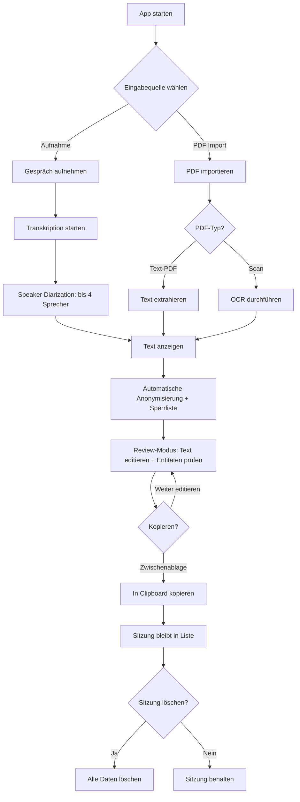

# Requirements: Therapie-Transkriptions- & Anonymisierungs-App (Therascript)

## 1. Kontextverständnis

**Problem:** Psychotherapeuten müssen Therapiegespräche dokumentieren und dabei die Vertraulichkeit der Patienten wahren. Aktuell gibt es keine integrierte Lösung, die Aufnahme, Transkription mit Sprechererkennung und umfassende Anonymisierung in einem lokalen, datenschutzkonformen Tool vereint.

**Lösung:** Eine Electron-basierte Desktop-Applikation für macOS, die:
- Gespräche aufnimmt und automatisch transkribiert (Hochdeutsch + Schweizerdeutsch allgemein)
- Sprecher automatisch unterscheidet (bis zu 4 Personen — Einzel- und Paartherapie)
- Personennamen, Orte, Kontaktdaten, medizinische Identifikatoren und Geburtsdaten automatisch erkennt und durch Platzhalter ersetzt
- Eine persönliche Sperrliste für wiederkehrende Begriffe unterstützt
- PDFs (inkl. Scans via OCR) importiert und anonymisiert
- Alles komplett lokal verarbeitet — keine Daten verlassen das Gerät

---

## 2. Stakeholders & Personas

### Primärer Nutzer: Psychotherapeut/in
- **Kontext:** Führt Therapiesitzungen durch (Einzel- und Paartherapie), muss Gespräche für Dokumentation und Supervision anonymisiert festhalten
- **Technisches Level:** Durchschnittlich — App muss einfach und intuitiv sein
- **Kritische Anforderung:** Absolute Vertraulichkeit der Patientendaten
- **Typische Nutzung:** Live-Aufnahme während der Sitzung (App im Hintergrund)
- **Exportziele:** Supervision/Intervision, eigene Dokumentation, Praxissoftware — je nach Situation

---

## 3. Funktionale Anforderungen (User Stories)

### Epic 0: Sitzungsverwaltung

#### US-0: Sitzungen verwalten

**Als** Psychotherapeut/in
**möchte ich** eine Übersicht aller meiner Sitzungen haben,
**damit** ich mehrere Sitzungen parallel bearbeiten und den Überblick behalten kann.

**Vorbedingungen:**
1. Die App ist geöffnet

**Akzeptanzkriterien:**
1. Das SYSTEM zeigt eine Sitzungsliste (Dashboard) als zentrale Übersicht
2. Jede neue Sitzung (Aufnahme oder PDF-Import) erhält automatisch einen Titel basierend auf Datum und Uhrzeit (z.B. "Sitzung 07.02.2026 14:30")
3. Der USER kann den Titel einer Sitzung nachträglich umbenennen
4. Jede Sitzung zeigt ihren aktuellen Status (Aufnahme läuft, Transkription, Anonymisierung, Review, Fehler)
5. Der USER kann eine Sitzung manuell löschen (mit Bestätigungsdialog). Beim Löschen werden **ALLE zugehörigen Daten** entfernt: Audiodatei, Originaltext, Platzhalter-Mapping, anonymisierter Text — die Sitzung verschwindet vollständig
6. Das SYSTEM persistiert die Sitzungsliste zwischen App-Neustarts
7. Das SYSTEM löscht Sitzungen automatisch **30 Tage nach Erstellung** — inklusive aller zugehörigen Daten (Audio, Texte, Mapping, anonymisierter Text). Die Löschung erfolgt ohne Vorwarnung und unabhängig vom Export-Status. Die Frist ist nicht konfigurierbar. Die App ist kein Langzeit-Archiv — der USER ist verantwortlich, den kopierten Text extern zu sichern
8. Die Sitzungsliste ist **chronologisch absteigend** sortiert (neueste Sitzung zuerst). Die Sortierung ist fest — kein Umschalten möglich
9. Die Sitzungsliste ist **nach relativen Zeiträumen gruppiert**: "Heute", "Gestern", "Diese Woche", "Letzte Woche", "Älter" — dynamisch basierend auf dem aktuellen Datum. Leere Gruppen werden nicht angezeigt

**Nachbedingungen:**
1. Alle Sitzungen sind in der Liste sichtbar, chronologisch absteigend sortiert und nach Zeiträumen gruppiert

**Hinweis:** Die Sitzungsliste enthält zwei Typen: Audio-Sitzungen (Aufnahme → Transkription → Anonymisierung → Review → Export) und PDF-Sitzungen (Import → Textextraktion → Anonymisierung → Review → Export). Beide Typen sind visuell unterscheidbar (Typ-Icon).

**Offene Fragen:**
*Alle geklärt (siehe Entscheidungen #122-#124)*

---

### Epic 1: Audio-Aufnahme

#### US-1: Gespräch aufnehmen

**Als** Psychotherapeut/in
**möchte ich** ein Therapiegespräch über das Mikrofon meines Macs aufnehmen können,
**damit** ich das Gespräch anschliessend transkribieren lassen kann.

**Vorbedingungen:**
1. Die App ist geöffnet und betriebsbereit
2. Ein Mikrofon ist verfügbar und die App hat Mikrofonzugriff (Standard-Eingabegerät des OS)

**Akzeptanzkriterien:**
1. Der USER kann eine Aufnahme mit einem Klick starten
2. Der USER kann eine laufende Aufnahme mit einem Klick stoppen
3. Der USER sieht während der Aufnahme eine visuelle Anzeige (Dauer, Audiopegel)
4. Das SYSTEM speichert die Aufnahme lokal auf dem Gerät
5. Die App funktioniert zuverlässig im Hintergrund (minimiert), da der USER während der Therapiesitzung nicht mit der App interagiert
6. Das SYSTEM zeigt ein Menu Bar Icon in der macOS-Menüleiste mit Aufnahmestatus (rot = läuft), Dauer und Stop-Steuerung — damit der USER die Aufnahme kontrollieren kann, ohne die App in den Vordergrund zu holen
8. Das SYSTEM verhindert aktiv den macOS-Ruhezustand während einer laufenden Aufnahme (analog zu Zoom/Spotify)
9. Das SYSTEM speichert die Aufnahme periodisch als Zwischensicherung (mindestens alle 60 Sekunden), sodass bei einem Absturz maximal 60 Sekunden Audio verloren gehen
10. Beim App-Start nach einem Absturz zeigt das SYSTEM wiederhergestellte Aufnahmen an und bietet deren Weiterverarbeitung an
11. Das SYSTEM stoppt die Aufnahme automatisch nach 2 Stunden und informiert den USER, um versehentliche Endlos-Aufnahmen zu vermeiden
12. Beim erstmaligen Starten einer Aufnahme zeigt das SYSTEM einen Hinweis zur Einholung der Patienteneinwilligung (StGB Art. 179bis) — ohne die Aufnahme zu blockieren

**Nachbedingungen:**
1. Die Audiodatei ist lokal gespeichert und bereit zur Transkription
2. Eine neue Sitzung wurde in der Sitzungsliste erstellt

**Out of Scope:**
- Mikrofon-Auswahlmenü — die App nutzt das vom macOS gewählte Standard-Eingabegerät
- Parallel-Transkription (Hintergrund-Transkription während laufender Aufnahme) — gestrichen wegen 8 GB RAM-Minimum (Entscheidung #125)

**Constraints & Randbedingungen:**
1. macOS bietet APIs zur Standby-Unterdrückung (IOPMAssertionCreateWithName / NSProcessInfo.beginActivity)
2. Audio-Streaming direkt auf Disk ist für Auto-Recovery nötig (kein reines In-Memory-Recording)
3. ML-Verarbeitung erfolgt strikt sequenziell — immer nur ein Modell gleichzeitig geladen (8 GB RAM-Constraint)

---

### Epic 2: Transkription & Sprechererkennung

#### US-2: Gespräch transkribieren mit Sprechererkennung

**Als** Psychotherapeut/in
**möchte ich** eine Aufnahme automatisch transkribieren lassen, wobei das System die verschiedenen Sprecher unterscheidet,
**damit** ich ein lesbares Protokoll mit klarer Zuordnung erhalte.

**Vorbedingungen:**
1. Eine Audioaufnahme ist vorhanden

**Akzeptanzkriterien:**
1. Das SYSTEM transkribiert die Aufnahme komplett lokal (keine Cloud-Verarbeitung)
2. Das SYSTEM erkennt die Anzahl Sprecher automatisch und weist ihnen Labels zu (Person A, Person B, Person C, Person D)
3. Bei nur 1 erkanntem Sprecher wird kein Speaker-Label vergeben (einfacher Fliesstext)
4. Bei 5+ erkannten Sprechern arbeitet das SYSTEM best-effort (Stimmen können zusammengefasst werden)
5. Das SYSTEM transkribiert Deutsch allgemein (Hochdeutsch und Schweizerdeutsche Dialekte) in lesbaren Hochdeutsch-Text
6. Das SYSTEM entfernt offensichtliche Verlegenheitslaute ("äh", "ähm") aus dem Transkript. Sonstige Füllwörter ("also", "halt"), Satzabbrüche und Wiederholungen bleiben erhalten
7. Das SYSTEM versieht den Text mit voller Interpunktion (Satzzeichen, Grossschreibung) und setzt Absatzumbrüche bei jedem Sprecherwechsel
8. Das SYSTEM fügt bei jedem Sprecherwechsel einen Zeitstempel ein (z.B. [00:23:40])
9. Das SYSTEM zeigt den transkribierten Text mit Sprecherzuordnung an
10. Der USER sieht den Fortschritt der Transkription (Prozent + geschätzte Restzeit)
11. Der USER kann die App während der Transkription für andere Sitzungen nutzen (nicht-blockierend)
12. Das SYSTEM zeigt eine macOS-Benachrichtigung, wenn die Transkription abgeschlossen ist
13. Nach Abschluss der Transkription startet das SYSTEM automatisch die Anonymisierung (kein manueller Zwischenschritt)
14. Die Verarbeitung erfolgt immer sequenziell nach Aufnahme-Stop: Transkription → Diarization → Anonymisierung (max. 2x Echtzeit gemäss NFR-3)

**Nachbedingungen:**
1. Ein strukturierter Text mit Sprecherzuordnung und Zeitstempeln liegt vor
2. Die Anonymisierung wurde automatisch gestartet

**Out of Scope:**
- Abbrechen oder Neustarten einer laufenden Transkription — sie läuft immer bis zum Ende durch
- Korrektur einzelner Sprecherzuordnungen (z.B. Segment von Person A → Person B umhängen) — nicht im MVP
- Originaler Dialekt-Text verfügbar machen — nur Hochdeutsch-Output, keine Originalversion
- Audio-Qualitätscheck vor der Transkription — kein Vorher-Check, das System liefert best-effort Ergebnis

**Constraints & Randbedingungen:**
1. NFR-3: Transkription max. 2x Echtzeit (10 Min Audio → max. 20 Min Verarbeitung)
2. Schweizerdeutsch → Hochdeutsch ist eine Übersetzungsleistung, nicht nur Transkription. Begriffe ohne Hochdeutsch-Äquivalent werden bestmöglich übersetzt
3. Transkription muss non-blocking sein, da der User parallel andere Sitzungen bearbeiten kann (Epic 0)

---

### Epic 3: PDF-Import & OCR

#### US-3: PDF importieren und Text extrahieren

**Als** Psychotherapeut/in
**möchte ich** PDF-Dokumente in die App importieren können, auch gescannte Dokumente,
**damit** ich deren Textinhalt anonymisieren kann.

**Typische Dokumente:** Ärztliche Berichte/Zuweisungen, psychiatrische Gutachten, Versicherungsformulare, eigene Therapienotizen/-protokolle, Laborergebnisse.

**Vorbedingungen:**
1. Die App ist geöffnet

**Akzeptanzkriterien:**
1. Der USER kann PDF-Dateien per Drag-and-Drop oder Dateiauswahl-Dialog importieren
2. Der USER kann mehrere PDF-Dateien gleichzeitig importieren (Batch-Import)
3. Das SYSTEM erkennt pro Seite automatisch, ob Text direkt extrahierbar ist oder OCR nötig ist (Mixed-PDF-Unterstützung)
4. Das SYSTEM extrahiert Text aus Text-PDF-Seiten direkt
5. Das SYSTEM erkennt gedruckten Text in gescannten Seiten mittels OCR (lokal, Deutsch)
7. Der extrahierte Text wird als linearer Fliesstext dargestellt (keine Layout-Erhaltung von Tabellen, Spalten etc.)
8. Nach der Textextraktion startet das SYSTEM automatisch die Anonymisierung (konsistent mit Audio-Workflow)
10. Bei Batch-Import werden die PDFs in einer Queue nacheinander verarbeitet (FIFO)
11. Die Textextraktion/OCR ist non-blocking — der USER kann die App für andere Aufgaben nutzen
12. Das SYSTEM zeigt eine macOS-Benachrichtigung, wenn die Verarbeitung abgeschlossen ist
13. Jedes importierte PDF erstellt einen Eintrag in der Sitzungsliste mit Typ-Kennzeichnung "PDF" (unterscheidbar von Audio-Sitzungen)

**Nachbedingungen:**
1. Der extrahierte Text ist bereit zur Anonymisierung bzw. die Anonymisierung wurde automatisch gestartet
2. Ein neuer Eintrag vom Typ "PDF" wurde in der Sitzungsliste erstellt

**Out of Scope:**
- Handschrift-Erkennung — OCR erkennt nur gedruckten Text
- Layout-Erhaltung (Tabellen, Spalten, Kopf-/Fusszeilen) — nur linearer Fliesstext
- Andere Dokumentformate (.docx, .jpg, .png) — nur PDF
- Anonymisierung von Bildinhalten in PDFs (z.B. Fotos, Logos)
- OCR in anderen Sprachen als Deutsch

**Constraints & Randbedingungen:**
1. OCR muss komplett lokal laufen (NFR-1: keine Cloud-Verarbeitung)
2. Mixed-PDFs erfordern eine Seite-für-Seite-Analyse (Text vorhanden → direkte Extraktion; kein Text → OCR)
3. PDF-Einträge in der Sitzungsliste haben einen kürzeren Workflow als Audio-Sitzungen (kein Transkriptions-/Diarization-Schritt)

---

### Epic 4: Anonymisierung

#### US-4: Text automatisch anonymisieren
**Als** Psychotherapeut/in
**möchte ich** dass identifizierende Informationen automatisch durch Platzhalter ersetzt werden,
**damit** der Text keine Rückschlüsse auf Patienten oder deren Umfeld erlaubt.

**Vorbedingungen:**
1. Ein transkribierter Text oder ein importierter PDF-Text liegt vor

**Akzeptanzkriterien:**
1. Das SYSTEM erkennt **Personennamen** im Text und ersetzt sie durch typ-spezifisch nummerierte Platzhalter ([PERSON 1], [PERSON 2] etc.)
2. Das SYSTEM erkennt **Ortsnamen** im Text und ersetzt sie durch typ-spezifisch nummerierte Platzhalter ([ORT 1], [ORT 2] etc.)
3. Das SYSTEM erkennt **Kontaktdaten** (Telefonnummern, E-Mail-Adressen, Postadressen, Social-Media-Handles) und **medizinische Identifikatoren** (AHV-Nummern, Versicherungsnummern, Fallnummern) und ersetzt sie durch typ-spezifisch nummerierte Platzhalter ([KONTAKT 1], [KONTAKT 2] etc.)
4. Das SYSTEM erkennt **Geburtsdaten** (explizite Datumsangaben wie "15.03.1985", "geb. 1990") und ersetzt sie durch typ-spezifisch nummerierte Platzhalter ([DATUM 1], [DATUM 2] etc.)
5. Die Platzhalter-Nummerierung ist **typ-spezifisch**: Jeder der 7 Entitätstypen (PERSON, ORT, DATUM, KONTAKT, ORGANISATION, MEDIZINISCH, SONSTIGES) hat eine eigene Nummerierung — nicht global fortlaufend
6. Gleiche Entitäten werden innerhalb einer Sitzung konsistent durch denselben Platzhalter ersetzt (kein sitzungsübergreifendes Mapping)
7. Das SYSTEM erkennt **Varianten desselben Namens** best-effort als eine Entität (Coreference-Resolution): "Dr. Müller", "Müller", "Herr Müller" → alle [PERSON 1]
8. Das SYSTEM anonymisiert nur **ganze Wörter/eigenständige Entitäten** — keine Teilstrings in zusammengesetzten Wörtern (z.B. "Müller" in "Müllerstrasse" bleibt unverändert)
9. Die **NER hat Vorrang** vor der Sperrliste: NER-Ergebnisse sind primär, die Sperrliste ergänzt was NER nicht erkennt. Bei Typ-Konflikt gilt der NER-Typ
10. Das SYSTEM wendet zusätzlich die persönliche Sperrliste des USERs an (siehe Epic 5)
11. Die Sprecherzuordnung (Absätze, Zeitstempel) bleibt nach der Anonymisierung erhalten
12. Das SYSTEM versucht **best-effort** auch gesprochene Kontaktdaten in Transkripten zu erkennen (z.B. "null sieben neun...") — ohne Garantie auf vollständige Erkennung
13. Die Anonymisierung erfolgt komplett lokal

**Nachbedingungen:**
1. Der Text enthält keine identifizierenden Informationen mehr (im Rahmen der definierten Entitätstypen)
2. Das Platzhalter-Mapping (Original → Platzhalter) ist intern gespeichert, damit False Positives rückgängig gemacht werden können (US-6b AC 1). Es wird bei Sitzungslöschung (US-0 AC 5) entfernt

**Out of Scope:**
- ICD-Diagnose-Codes und ausgeschriebene Diagnosenamen werden NICHT anonymisiert (klinisch relevant, kein Identifikationsrisiko)
- Relative Zeitangaben ("letzte Woche", "vor drei Tagen") werden NICHT anonymisiert
- Institutionsnamen (Spitäler, Schulen) werden NICHT anonymisiert
- Sonstige Datumsangaben ausser Geburtsdaten werden NICHT anonymisiert
- Sitzungsübergreifende Platzhalter-Konsistenz — kein globales Entitäts-Mapping zwischen Sitzungen
- Automatische Re-Anonymisierung nach Text-Editierung im Review — User markiert neue Entitäten manuell (US-6a AC 9, US-6b)
- Teilstring-Anonymisierung in zusammengesetzten Wörtern

**Constraints & Randbedingungen:**
1. Coreference-Resolution für Namens-Varianten ist best-effort — Qualität hängt vom gewählten NER-Modell ab (NFR-9)
2. Platzhalter-Mapping muss intern persistiert werden (für False-Positive-Undo im Review, US-6b), wird bei Sitzungslöschung entfernt
3. Anonymisierung muss Sprecherzuordnung, Zeitstempel und Absatzstruktur unangetastet lassen

---

### Epic 5: Sperrliste / Benutzerwörterbuch

#### US-5: Persönliche Sperrliste pflegen
**Als** Psychotherapeut/in
**möchte ich** eine persönliche Liste von Begriffen pflegen, die immer anonymisiert werden,
**damit** wiederkehrende Namen und Begriffe zuverlässig erkannt werden — auch wenn die automatische Erkennung sie prinzipiell nicht finden kann (z.B. Spitznamen, Firmennamen, Therapie-spezifische Codes).

**Vorbedingungen:**
1. Die App ist geöffnet

**Akzeptanzkriterien:**
1. Der USER kann eigene Begriffe (Namen, Orte, andere Ausdrücke) zur Sperrliste hinzufügen
2. Der USER kann jedem Eintrag einen **Platzhalter-Typ** zuweisen: PERSON, ORT, DATUM, KONTAKT, ORGANISATION, MEDIZINISCH, SONSTIGES
3. Der USER kann auch **Mehrwort-Phrasen** als einen Eintrag hinzufügen (z.B. "Dr. Hans Müller", "Bahnhofstrasse 42")
4. Beim Hinzufügen zeigt das SYSTEM einen **Bestätigungsdialog**: "[Begriff] als [Typ] zur Sperrliste hinzufügen?" mit [Abbrechen] und [Hinzufügen]
5. Das SYSTEM speichert die Sperrliste lokal und **persistiert sie zwischen App-Neustarts**
6. Die Sperrliste wird bei jeder Anonymisierung zusätzlich zur automatischen NER angewendet (NER hat Vorrang, siehe US-4 AC 10)
7. Der USER kann Einträge aus der Sperrliste **entfernen** — Löschung wirkt nur auf zukünftige Anonymisierungen (bestehende Platzhalter in vergangenen Sitzungen bleiben unverändert)
8. Der USER kann Einträge **bearbeiten** (Begriff oder Typ ändern) — Bearbeitung wirkt wie Löschen + Neuanlegen (bestehende Platzhalter bleiben, geänderter Begriff wirkt nur zukünftig)
9. Es gibt EINE globale Sperrliste pro Therapeut/in (nicht pro Sitzung)
10. Das SYSTEM verwendet **case-insensitive** String-Matching mit **Umlaut-Normalisierung**: ü↔ue, ä↔ae, ö↔oe, ß↔ss — "Müller" findet auch "Mueller" und umgekehrt
11. Bei **überlappenden Einträgen** gilt Longest Match: "Hans Müller" wird als Ganzes anonymisiert, nicht einzeln als "Hans" + "Müller"
12. Die Sperrliste ist über die **globalen Settings** erreichbar (volle Übersicht + CRUD). Für die Review-Schnellaktion siehe US-6c
13. Das SYSTEM führt **keine Eingabe-Validierung** durch (keine Duplikat-Prüfung, keine Mindestlänge) — der USER ist verantwortlich für sinnvolle Einträge

**Nachbedingungen:**
1. Die Sperrliste ist gespeichert und wird bei der nächsten Anonymisierung berücksichtigt
2. Bei Löschung eines Eintrags: Bestehende Platzhalter in vergangenen Sitzungen bleiben unverändert
3. Bei Bearbeitung eines Eintrags: Wie Löschung + Neuanlegen — alter Platzhalter bleibt, neuer Begriff wirkt zukünftig

**Out of Scope:**
- Import/Export der Sperrliste — die Liste lebt nur lokal in der App (kein Backup, kein Transfer)
- Varianten-/Fuzzy-Matching über Umlaut-Normalisierung hinaus (Entscheidung #17)
- Fallbasierte Sperrlisten — nur eine globale Liste (Entscheidung #16)
- Eingabe-Validierung (Duplikate, Mindestlänge, generische Begriffe)
- Treffer-Vorschau im Bestätigungsdialog (keine Anzeige wie viele Treffer der Begriff im aktuellen Text hätte)
- Review-Integration (Schnellaktion + retroaktive Anwendung + Herkunft) — siehe US-6c und US-6b

**Constraints & Randbedingungen:**
1. Umlaut-Normalisierung (ü↔ue, ä↔ae, ö↔oe, ß↔ss) erfordert bidirektionale Normalisierung beim Matching
2. Case-insensitive Matching erfordert normalisierte Vergleiche
3. Longest-Match-Strategie erfordert sortierte Anwendung (längste Einträge zuerst)
4. NER hat Vorrang vor Sperrliste (Entscheidung #68) — Sperrliste ergänzt nur was NER nicht erkennt
5. Platzhalter-Typen der Sperrliste (7 Typen) sind ein Superset der NER-Typen (5 Typen) + MEDIZINISCH + SONSTIGES

---

### Epic 6: Review & Korrektur

#### US-6a: Review-Basis-Editor (Text + Platzhalter-Anzeige)
**Als** Psychotherapeut/in
**möchte ich** den anonymisierten Text in einem Editor sehen und frei bearbeiten können,
**damit** ich inhaltliche Korrekturen am Transkript vornehmen kann und die anonymisierten Stellen klar erkenne.

**Vorbedingungen:**
1. Die automatische Anonymisierung wurde durchgeführt

**Akzeptanzkriterien:**
1. Der Text ist als **freier Texteditor** verfügbar — der USER kann den gesamten Text frei bearbeiten (Cursor setzen, tippen, löschen, Copy-Paste)
2. Alle Platzhalter ([PERSON 1], [ORT 1] etc.) sind als **atomare Inline-Chips farblich hervorgehoben** (nach Entitätstyp) — der Cursor springt über Chips, sie können nicht teilweise editiert werden
3. Bei **Audio-Sitzungen** sind Speaker-Labels (z.B. "[Therapeut]:") und Zeitstempel als **atomare Elemente** dargestellt — sie können vom USER durch Delete/Backspace oder Markieren+Löschen entfernt, aber nicht teilweise editiert werden
4. Bei **PDF-Sitzungen** werden keine Speaker-Labels und Zeitstempel angezeigt — der restliche Editor ist identisch
5. Der USER kann **Undo** (Cmd+Z) und **Redo** (Cmd+Shift+Z) verwenden — Standard-Editor-Verhalten mit gruppierten Schritten (z.B. "ein Wort tippen" = 1 Schritt), mindestens 100 Schritte Tiefe, History geht bei App-Neustart verloren
6. **Auto-Save:** Alle Änderungen werden nach **~2 Sekunden Inaktivität** automatisch gespeichert (debounced). Gespeichert wird der gesamte Zustand (Text + Platzhalter-Positionen + Herkunfts-Metadaten), OHNE Undo-History
7. Der Review-Modus ist **jederzeit unterbrechbar** — der USER kann die App schliessen und später am exakt gleichen Zustand fortsetzen
8. Es gibt **keinen expliziten Finalisierungs-Schritt** — der USER exportiert den Text wenn er zufrieden ist (Epic 7)
9. Bei Text-Editierung im Review erfolgt **KEINE automatische Re-Anonymisierung** — der USER markiert neue Entitäten manuell (US-6b)
10. Standard-Keyboard-Shortcuts funktionieren: Cmd+Z (Undo), Cmd+Shift+Z (Redo), Cmd+C (Copy), Cmd+V (Paste), Cmd+X (Cut), Cmd+A (Alles markieren)
11. **Copy-Paste mit Chips:** Innerhalb von Therascript bleiben Platzhalter-Chips beim Kopieren/Einfügen als atomare Chips erhalten. Beim Einfügen in **externe Anwendungen** wird der Platzhalter-String (z.B. "[PERSON 1]") als Klartext eingefügt

**Nachbedingungen:**
1. Der Text ist im Editor dargestellt und editierbar
2. Alle Änderungen sind persistiert (Auto-Save)

**Out of Scope:**
- Audio-Player im Review-Modus — der USER nutzt für Audio-Abgleich seinen Standard-Player
- Entitäten-Navigation (zum nächsten/vorherigen Platzhalter springen) — der USER scrollt durch den Text
- Anonymisierungs-Korrekturen (False Positive/Negative) — siehe US-6b
- Sperrliste-Integration — siehe US-6c

**Constraints & Randbedingungen:**
1. Platzhalter-Chips sind **atomare Elemente** — der Editor muss ein Rich-Text-Modell verwenden (z.B. ProseMirror, Slate, TipTap), kein reines Textarea
2. Auto-Save muss alle Änderungen (Text + Platzhalter + Herkunfts-Metadaten) zwischen App-Neustarts persistieren
3. Review-Modus für PDF- und Audio-Sitzungen teilt die gleiche Editorkomponente, nur mit/ohne Zeitstempel + Speaker-Labels
4. NFR-25: Editor muss bei Texten bis ~15'000 Wörter mit ~100+ Platzhalter-Chips flüssig funktionieren (kein Lag beim Tippen, Scrollen, Hover)

---

#### US-6b: Anonymisierungs-Korrektur (False Positives + False Negatives)
**Als** Psychotherapeut/in
**möchte ich** fälschlich anonymisierte Stellen rückgängig machen und übersehene sensible Informationen nachträglich anonymisieren können,
**damit** die Anonymisierung korrekt und vollständig ist.

**Vorbedingungen:**
1. Der Review-Editor ist geöffnet (US-6a)

**Akzeptanzkriterien:**
1. **False Positive (Batch-Rückgängig):** Der USER kann einen Platzhalter-Chip per **Delete/Backspace löschen** — das SYSTEM ersetzt **ALLE Chips mit derselben Identität** (z.B. alle [PERSON 1]) im gesamten Text durch den jeweiligen **Originaltext**
2. **False Positive (Batch-Rückgängig):** Alternativ kann der USER über ein **Kontextmenü** (Rechtsklick auf Chip) die Aktion "Rückgängig machen" wählen — gleiches Batch-Ergebnis wie Delete
3. **False Negative (Markieren):** Der USER kann Text selektieren und über ein **Kontextmenü** (Rechtsklick) die Aktion "Anonymisieren" wählen — das SYSTEM zeigt eine Typ-Auswahl mit allen Entitätstypen: PERSON, ORT, DATUM, KONTAKT, ORGANISATION
4. Nach Typ-Auswahl ersetzt das SYSTEM den selektierten Text durch einen **neuen Platzhalter-Chip** des gewählten Typs (mit **fortlaufender Nummerierung** — immer nächste freie Nummer, Lücken werden NICHT gefüllt)
5. Die **Herkunft jedes Platzhalter-Chips** ist visuell erkennbar — drei Herkünfte sind unterscheidbar: **NER** (automatisch erkannt), **Sperrliste** (via Blocklist-Match), **Manuell** (vom USER markiert) — z.B. durch kleine Icons oder Tooltip
6. Alle Korrektur-Aktionen (Rückgängig + Markieren) sind über **Undo/Redo** (Cmd+Z / Cmd+Shift+Z) rücknehmbar — eine Batch-Rückgängig-Aktion zählt als **ein** Undo-Schritt
7. Bei Markierung (AC 3): Wenn die Selektion einen **bestehenden Platzhalter-Chip teilweise überlappt**, erweitert das SYSTEM die Selektion automatisch auf den **gesamten Chip** (Chip + umgebenden selektierten Text)

**Nachbedingungen:**
1. Korrigierte Anonymisierungen sind im Text sichtbar und persistiert (Auto-Save aus US-6a)
2. Platzhalter-Mapping ist aktualisiert (für False-Positive-Undo wird Originaltext aus Mapping gelesen)

**Out of Scope:**
- Platzhalter-Typ nachträglich ändern (z.B. [PERSON] → [ORT]) — der USER muss den Platzhalter rückgängig machen und neu markieren
- Automatische Re-Anonymisierung nach Text-Editierung — der USER ist verantwortlich (siehe US-6a AC 9)
- Einzelnes Rückgängig-Machen eines Chips OHNE die anderen gleichen Chips — Rückgängig ist immer Batch (alle gleichen Identitäten)
- Sperrliste-Integration — siehe US-6c

**Constraints & Randbedingungen:**
1. Platzhalter-Mapping (Original → Platzhalter) muss intern gespeichert bleiben für Undo-Funktionalität — wird bei Sitzungslöschung entfernt
2. Nummerierung ist **fortlaufend** — neue Chips bekommen immer die nächste Nummer, auch wenn durch Batch-Undo Lücken entstanden sind (z.B. [PERSON 1] und [PERSON 3] existieren → nächster wird [PERSON 4])
3. Herkunfts-Metadaten (NER/Sperrliste/Manuell) müssen pro Platzhalter gespeichert werden
4. Batch-Rückgängig einer Identität (z.B. alle [PERSON 1]) muss als **eine atomare Undo-Operation** implementiert werden

---

#### US-6c: Sperrliste-Schnellaktion im Review
**Als** Psychotherapeut/in
**möchte ich** einen nicht erkannten Begriff direkt aus dem Review zur Sperrliste hinzufügen können,
**damit** dieser und alle weiteren Vorkommen in der aktuellen Sitzung sofort anonymisiert werden, ohne den Review zu verlassen.

**Vorbedingungen:**
1. Der Review-Editor ist geöffnet (US-6a)
2. Die Sperrliste existiert (US-5)

**Akzeptanzkriterien:**
1. Beim **Anonymisieren eines False Negative** (US-6b AC 3) bietet das Kontextmenü zusätzlich die Option **"zur Sperrliste hinzufügen"** an
2. Bei Auswahl dieser Option wird der selektierte Text zur **globalen Sperrliste** hinzugefügt (US-5) UND als Platzhalter-Chip anonymisiert
3. Das SYSTEM wendet den neuen Sperrlisten-Eintrag **sofort retroaktiv** auf den gesamten Text der aktuellen Sitzung an — alle weiteren Vorkommen (case-insensitive + Umlaut-Normalisierung, siehe US-5 AC 10) werden automatisch anonymisiert
4. Die retroaktiv anonymisierten Platzhalter erhalten die Herkunft **"Sperrliste"** (US-6b AC 5)
5. Die retroaktive Anwendung erfolgt in **< 2 Sekunden** (NFR-27), auch bei langen Texten (~15'000 Wörter)
6. **Undo einer Sperrlisten-Schnellaktion** (Cmd+Z) macht die **gesamte Aktion rückgängig**: Eintrag wird aus der Sperrliste entfernt UND alle retroaktiv anonymisierten Chips werden durch Originaltext ersetzt — zählt als **ein** Undo-Schritt

**Nachbedingungen:**
1. Der Begriff ist in der globalen Sperrliste gespeichert (wirkt auch auf zukünftige Sitzungen)
2. Alle Vorkommen des Begriffs in der aktuellen Sitzung sind anonymisiert

**Out of Scope:**
- Feedback über Anzahl der retroaktiv anonymisierten Treffer — das SYSTEM zeigt keine Meldung wie "3 weitere Treffer anonymisiert"
- Fuzzy-Matching oder Varianten-Erkennung über Umlaut-Normalisierung hinaus — Matching wie in US-5 AC 10 definiert
- Sperrliste verwalten (CRUD) — dafür gibt es die Settings-Ansicht (US-5)

**Constraints & Randbedingungen:**
1. Retroaktive Anwendung erfordert Re-Scan des gesamten Texts der aktuellen Sitzung
2. NER hat Vorrang vor Sperrliste (Entscheidung #68) — bereits von NER erkannte Stellen werden nicht doppelt anonymisiert
3. Sperrlisten-Einträge aus dem Review müssen sofort in die persistierte Sperrliste geschrieben werden (nicht nur in-memory)
4. Undo der Sperrlisten-Schnellaktion muss sowohl den Sperrlisten-Eintrag als auch alle retroaktiven Anonymisierungen als **eine atomare Operation** rückgängig machen

---

### Epic 7: Export

#### US-7: Anonymisierten Text exportieren
**Als** Psychotherapeut/in
**möchte ich** den anonymisierten Text in die Zwischenablage kopieren können,
**damit** ich ihn in anderen Anwendungen weiterverwenden kann.

**Vorbedingungen:**
1. Eine Anonymisierung wurde durchgeführt (kein Finalisierungs-Schritt erforderlich)

**Akzeptanzkriterien:**
1. Der USER kann den gesamten anonymisierten Text mit einem Klick in die **Zwischenablage** kopieren
2. Der kopierte Text enthält **nur den anonymisierten Text** mit Speaker-Labels und Zeitstempeln — keine Metadaten (kein Titel, kein Datum, keine Dauer)
3. Der kopierte Text behält die Formatierung mit Sprecherzuordnung bei (z.B. "[Therapeut]: ..." oder "[PERSON 1]: ...")
4. Das Kopieren ist **jederzeit verfügbar** — der USER muss den Review nicht abschliessen
5. Der USER kann **beliebig oft kopieren** — jedes Kopieren gibt den aktuellen Stand des Textes aus
6. Das SYSTEM zeigt eine Bestätigung nach erfolgreichem Kopieren

**Nachbedingungen:**
1. Der anonymisierte Text befindet sich in der Zwischenablage
2. Die Sitzung bleibt in der Sitzungsliste erhalten (kein automatisches Löschen nach Kopieren)

**Out of Scope:**
- Automatische Löschfrage nach dem Kopieren — Datenverwaltung passiert unabhängig über die Sitzungsverwaltung (Epic 0, US-0 AC 5)
- Kopieren mit Metadaten (Titel, Datum, Dauer) — bewusste Datenschutz-Entscheidung: weniger Kontext = weniger Identifizierbarkeit des Patienten (Entscheidung #113)
- .txt-Dateiexport — nicht MVP, Zwischenablage reicht (Entscheidung #127)
- Batch-Export (mehrere Sitzungen gleichzeitig) — nicht MVP (Entscheidung #116)
- Teil-Export (Bereich markieren + exportieren) — ganzer Text via Kopieren-Button, Teil-Export via normales Copy-Paste im Editor (Entscheidung #114)

**Constraints & Randbedingungen:**
1. Kopieren muss den aktuellen Stand des Review-Textes widerspiegeln (inkl. aller User-Editierungen)
2. Bei PDF-Sitzungen: gleiches Kopieren, aber ohne Zeitstempel und Speaker-Labels (nur Fliesstext mit Platzhaltern)

**Hinweis:** ~~US-7b (Rohdaten nach Export löschen)~~ wurde gestrichen. Die Datenverwaltung erfolgt über: (1) Manuelle Löschung via Sitzungsverwaltung (Epic 0, US-0 AC 5) und (2) Auto-Löschung nach 30 Tagen (US-0 AC 8). Beim Löschen werden ALLE zugehörigen Daten entfernt (Audio, Originaltext, Mapping, anonymisierter Text).

---

### Epic 8: Distribution & Installation

#### US-8a: App als .dmg installieren
**Als** Psychotherapeut/in
**möchte ich** die App als .dmg-Datei herunterladen und per Drag-and-Drop installieren können,
**damit** ich Therascript ohne technische Vorkenntnisse auf meinem Mac einrichten kann.

**Vorbedingungen:**
1. Der USER hat einen Mac mit Apple Silicon (M1-M4) und macOS 14+
2. Der USER hat Internetzugang (für Modell-Download beim ersten Start)

**Akzeptanzkriterien:**
1. Das SYSTEM wird als **.dmg-Datei** verteilt (~250 MB ohne ML-Modelle)
2. Die .dmg enthält ein Standard-macOS-Installationsfenster mit Drag-to-Applications-Anweisung
3. Die App ist **ausschliesslich als ARM64-Binary** gebaut — auf Intel-Macs ist die App nicht startbar
4. Nach Drag-and-Drop in den Applications-Ordner startet die App ohne weitere Installationsschritte
5. Das SYSTEM zeigt beim **ersten Start** eine Fortschrittsanzeige für den Modell-Download (~4 GB) mit Meldung was geladen wird und warum
6. Der Modell-Download ist **resume-fähig** — bei Netzwerk-Abbruch wird der Download beim nächsten Start fortgesetzt (nicht von vorne)
7. Die App ist erst **nach vollständigem Modell-Download** einsatzbereit für Verarbeitungsaufgaben
8. Das SYSTEM prüft beim Start, ob **ausreichend Speicherplatz** vorhanden ist (~5 GB frei) und zeigt eine verständliche Fehlermeldung wenn nicht

**Nachbedingungen:**
1. Die App ist im Applications-Ordner installiert und startbereit
2. Alle ML-Modelle sind lokal heruntergeladen und verifiziert (SHA-256, siehe NFR-16)

**Out of Scope:**
- Automatische Updates (kein Auto-Updater im MVP — neue Version = neue .dmg, Entscheidung #131)
- Mac App Store Distribution (Entscheidung #128, #129)
- Intel (x86_64) Unterstützung (Entscheidung #130)
- Offline-Installation (Modelle müssen beim First-Launch heruntergeladen werden)
- Universal Binary (ARM64 + x86_64 Hybrid)

**Offene Fragen:**
1. **Code Signing & Notarization**: Wird ein Apple Developer Account (99€/Jahr) verwendet? Ohne Notarization zeigt macOS Gatekeeper eine Warnung, die nicht-technische Nutzer blockiert. Entscheidung #104 sagt "Pflicht", aber Kosten wurden als Hindernis genannt — **muss vor Distribution an Dritte entschieden werden**
2. Wo wird die .dmg gehostet? (GitHub Releases? Eigene Website?)
3. Soll die Downloadseite Systemvoraussetzungen (Apple Silicon, macOS 14+, 5 GB freier Speicher, Internet) klar kommunizieren?

**Constraints & Randbedingungen:**
1. Entscheidung #109 (kein Resume) wird hiermit revidiert → Resume-fähiger Download
2. NFR-1 (keine Cloud-Verarbeitung) bleibt unberührt — der Modell-Download ist einmalig und enthält keine Nutzerdaten
3. NFR-16 (Modell-Integritätsprüfung per SHA-256) gilt auch für heruntergeladene Modelle
4. Ohne Code Signing müssen Nutzer Gatekeeper manuell umgehen (Rechtsklick → Öffnen)

---

#### US-8b: App sauber deinstallieren
**Als** Psychotherapeut/in
**möchte ich** die App vollständig deinstallieren können, inklusive aller heruntergeladenen Modelle und gespeicherten Daten,
**damit** nach der Deinstallation keine sensiblen Therapiedaten auf meinem Mac verbleiben.

**Vorbedingungen:**
1. Die App ist installiert

**Akzeptanzkriterien:**
1. Das SYSTEM bietet einen Deinstallations-Menüpunkt (z.B. im App-Menü: "Therascript vollständig entfernen")
2. Der USER erhält einen **Bestätigungsdialog** vor der Deinstallation mit Hinweis, dass alle Daten unwiderruflich gelöscht werden
3. Die Deinstallation entfernt: ML-Modelle (~4 GB), SQLite-Datenbank (Sitzungen + Sperrliste), Audio-Dateien, Settings, Temp-Dateien, Log-Dateien
4. Nach der Deinstallation verbleiben **keine Therascript-Dateien** im Benutzerverzeichnis (kein `~/.therascript/`, kein Application Support Ordner)
5. Die .app-Datei im Applications-Ordner wird dem USER zum manuellen Löschen empfohlen (die App kann sich nicht selbst löschen)

**Nachbedingungen:**
1. Alle Therascript-Daten sind vom System entfernt (ausser der .app-Datei selbst)

**Out of Scope:**
- Automatische Entfernung der .app-Datei aus /Applications (macOS-Limitation)
- Remote-Wipe oder Management-Funktionen

**Offene Fragen:**
1. Reicht ein In-App-Menüpunkt, oder braucht es ein separates Uninstaller-Script für den Fall, dass die App nicht mehr startet?

**Constraints & Randbedingungen:**
1. NFR-17 (Sichere Datenlöschung: SQLite VACUUM, Temp-Cleanup) gilt auch für die Deinstallation
2. App Sandbox (NFR-18) beschränkt, welche Verzeichnisse die App löschen kann

---

## 4. Nicht-funktionale Anforderungen

| ID | Kategorie | Anforderung | Ziel | Priorität |
|----|-----------|-------------|------|-----------|
| NFR-1 | Datenschutz | Alle Verarbeitung komplett lokal | 0 Netzwerk-Requests für Datenverarbeitung | Kritisch |
| NFR-2 | Datenschutz | Löschung von Sitzungsdaten | USER kann Sitzungen jederzeit manuell löschen + SYSTEM löscht automatisch nach 30 Tagen ab Erstellung (alle Daten: Audio, Text, Mapping). Stille Löschung, nicht konfigurierbar | Hoch |
| NFR-3 | Performance | Transkription in akzeptabler Zeit | Sequenziell: Max. 2x Echtzeit (10 Min Audio → max. 20 Min Verarbeitung). Verarbeitung startet nach Aufnahme-Stop | Hoch |
| NFR-4 | Usability | Einfache, intuitive Bedienung | Ohne technische Vorkenntnisse bedienbar | Hoch |
| NFR-5 | Sprache | Deutsch allgemein (Hochdeutsch + CH-Dialekte) | Verständlicher Hochdeutsch-Output aus allen gängigen Schweizerdeutschen Dialekten | Hoch |
| NFR-6 | Plattform | macOS Desktop-Applikation | Electron-basiert, macOS 14+, Apple Silicon, **8 GB RAM Minimum** | Hoch |
| NFR-7 | Qualität | NER-Genauigkeit für Anonymisierung | >90% Recall für Namen und Orte; Best-effort für Kontaktdaten in gesprochener Sprache | Hoch |
| NFR-8 | Persistenz | Sperrliste überlebt App-Neustart | Lokale Speicherung der Benutzerdaten (Sperrliste) | Hoch |
| NFR-9 | Flexibilität | Alle ML-Modelle austauschbar (Transkription, Diarization, NER, OCR) | Globale Einstellung in Settings; User wählt aus verfügbaren Modellen (technische Modellnamen) | Hoch |
| NFR-10 | Erweiterbarkeit | User kann eigene/neue lokale Modelle hinzufügen und aktivieren | Plugin-artige Architektur; neue Modelle ohne App-Update einsetzbar | Hoch |
| NFR-11 | Performance | Anonymisierung in akzeptabler Zeit | < 30 Sekunden, auch bei langen Texten (ca. 10'000 Wörter / 60 Min Transkript) | Hoch |
| NFR-12 | Sicherheit | Netzwerk-Isolation durchsetzen | CSP `connect-src 'none'` im Renderer; kein unbeabsichtigtes Telefonieren (Telemetrie, DNS-Leaks); Electron Auto-Updater bewusst konfigurieren oder deaktivieren | Kritisch |
| NFR-13 | Sicherheit | FileVault-Prüfung beim App-Start | Warnung wenn macOS FileVault deaktiviert ist (OS-Verschlüsselung ist Grundvoraussetzung für Datenschutz) | Hoch |
| NFR-14 | Sicherheit | Electron Security Hardening | `contextIsolation: true`, `nodeIntegration: false`, `sandbox: true`, Electron Fuses (`RunAsNode=false`, `EnableNodeCliInspectArguments=false`), keine Remote-Inhalte | Hoch |
| NFR-15 | Sicherheit | IPC-Eingabevalidierung | Alle IPC-Messages im Main Process gegen Schema validieren; keine unkontrollierten User-Strings in child_process-Aufrufen | Hoch |
| NFR-16 | Sicherheit | Modell-Integritätsprüfung | Gebündelte Modelle per SHA-256 Hash verifizieren; PyTorch `weights_only=True`; Modell-Pfade auf `~/.therascript/models/` beschränken (kein Path Traversal) | Hoch |
| NFR-17 | Sicherheit | Sichere Datenlöschung | SQLite `VACUUM` nach Sitzungslöschung; Temp-/Recovery-Dateien konsequent aufräumen; Spotlight-Ausschluss (`.metadata_never_index`) für Datenverzeichnis | Hoch |
| NFR-18 | Sicherheit | macOS App Sandbox | App Sandbox aktivieren — verhindert Zugriff anderer Apps auf Therascript-Daten; restriktive File Permissions (700) auf Datenverzeichnis | Hoch |
| NFR-19 | Sicherheit | Code Signing & Notarization | macOS Code Signing mit Apple Developer Certificate + Notarization für Gatekeeper-Kompatibilität | Hoch |
| NFR-20 | Sicherheit | Supply-Chain-Hygiene | `npm audit` + Lockfile im CI; Python-Dependencies gepinnt mit Hash-Verification; Electron regelmässig aktualisieren (Chromium-Patches) | Mittel |
| NFR-21 | Performance | App-Startzeit (Cold Start) | < 5 Sekunden bis Dashboard sichtbar und interaktiv — ohne Modell-Loading (Modelle werden on-demand geladen) | Hoch |
| NFR-22 | Performance | Modell-Loading on-demand | ML-Modelle werden erst bei erster Nutzung geladen (nicht beim App-Start). Ladezeit wird dem User mit Indikator angezeigt | Hoch |
| NFR-23 | Performance | UI-Responsiveness während ML-Verarbeitung | Mac bleibt für andere Arbeit flüssig benutzbar; ML-Tasks (Whisper, pyannote, flair) werden bei Bedarf gedrosselt (QoS/Nice-Level); Transkription darf dafür etwas länger dauern | Hoch |
| NFR-24 | Performance | Recording-Overhead | Audio-Aufnahme verursacht < 5% CPU-Last — andere Apps dürfen nicht spürbar beeinträchtigt werden. Keine ML-Verarbeitung während laufender Aufnahme | Hoch |
| NFR-25 | Performance | Review-Editor flüssig bis 90 Min Transkript | Editor muss bei Texten bis ~15'000 Wörter mit ~100+ Platzhalter-Elementen ohne spürbare Verzögerung beim Tippen, Scrollen und Hover funktionieren | Hoch |
| NFR-26 | Performance | OCR-Verarbeitungszeit | Text-PDF: < 5 Sekunden (bis 50 Seiten); Scan-PDF via OCR: < 3 Sekunden pro Seite (Apple Vision). 50-Seiten-Scan: < 3 Minuten gesamt | Mittel |
| NFR-27 | Performance | Sperrliste retroaktive Anwendung | Beim Hinzufügen eines Begriffs im Review wird der gesamte Text der Sitzung in < 2 Sekunden neu gescannt und alle Treffer anonymisiert | Hoch |
| NFR-28 | Performance | First-Launch Modell-Download | ~4.0 GB Download beim ersten Start mit Fortschrittsanzeige (pro Modell); **resume-fähig bei Abbruch** (Entscheidung #109 revidiert). App ist erst nach vollständigem Download einsatzbereit. Speicherplatz-Prüfung vor Download (~5 GB frei) | Mittel |
| NFR-29 | Performance | Sitzungslöschung | Löschen einer Sitzung (inkl. Audio, Texte, SQLite-Cleanup, VACUUM) in < 5 Sekunden — auch bei 60-Min-Sitzungen (~115 MB Daten) | Mittel |
| NFR-30 | Performance | Maximale Sitzungsanzahl | Dashboard performant bis ~100 Sitzungen (typische Nutzung: Auto-Löschung nach 30 Tagen + manuelle Löschung limitieren die Anzahl) | Mittel |
| NFR-31 | Distribution | .dmg-Packaging für macOS | ARM64-only .dmg mit Drag-to-Applications; ~250 MB Installer-Grösse (ohne ML-Modelle) | Hoch |
| NFR-32 | Usability | Saubere Deinstallation | In-App-Uninstaller entfernt alle Daten und Modelle (~4.7 GB); keine Rückstände im Benutzerverzeichnis | Mittel |
| NFR-33 | Lizenz | Open Source Lizenz | MIT-Lizenz; kompatibel mit allen verwendeten Dependencies (siehe Lizenz-Tabelle Kap. 19) | Hoch |

---

## 5. Prozessfluss

---

## 6. Zusätzliche Anforderungen (aus Klärung)

- **Nutzungskontext:** App wird während der Sitzung genutzt (Hintergrund-Aufnahme)
- **Aufnahmedauer:** Typisch 45-60 Minuten (Standard-Therapiesitzung), Max. 2 Stunden (Auto-Stop)
- **Sitzungsverwaltung:** Mehrere Sitzungen parallel möglich, Dashboard mit Auto-Titel, persistiert bis manuell gelöscht oder automatisch nach 30 Tagen ab Erstellung; chronologisch absteigend sortiert (fest); gruppiert nach "Heute", "Gestern", "Diese Woche", "Letzte Woche", "Älter"; kein Filter
- **Hintergrund-Modus:** Menu Bar Icon mit Status, Standby-Unterdrückung, Auto-Recovery (max. 60s Verlust)
- **PDF-Import:** Dateiauswahl + Drag-and-Drop + Batch, Queue-basierte Verarbeitung
- **Einwilligung:** Hinweis beim ersten Aufnahmestart, kein Zwang
- **Therapieformen:** Einzeltherapie (2 Sprecher) UND Paartherapie/Angehörigengespräche (bis 4 Sprecher)
- **Exportziele:** Supervision/Intervision, eigene Dokumentation, Praxissoftware — je nach Situation
- **Sperrliste:** Global pro Therapeut/in (< 50 Einträge erwartet); case-insensitive + Umlaut-Normalisierung (ü↔ue, ä↔ae, ö↔oe, ß↔ss); Mehrwort-Phrasen erlaubt; Longest Match bei Überlappung; persistiert lokal; 7 Platzhalter-Typen (PERSON, ORT, DATUM, KONTAKT, ORGANISATION, MEDIZINISCH, SONSTIGES); Bestätigungsdialog beim Hinzufügen; Löschen/Bearbeiten wirkt nur zukünftig; Zugang via Settings (CRUD) + Review-Schnellaktion (US-6c); kein Import/Export; keine Eingabe-Validierung
- **Transkription:** Bereinigt (nur Äh/Ähm entfernt), volle Interpunktion, Zeitstempel bei Sprecherwechsel
- **Sprecheranzahl:** Auto-Erkennung; 1 Sprecher = kein Label; 5+ = best-effort
- **Workflow:** Transkription → Anonymisierung automatisch, kein Zwischenschritt; Transkription non-blocking
- **Review:** Freier Texteditor mit atomaren Platzhalter-Chips (Inline, farblich nach Typ); Herkunft dreifach unterscheidbar (NER/Sperrliste/Manuell); False Positives rückgängig (Delete auf Chip = Original erscheint), False Negatives markieren (Selektion + Kontextmenü + Typ-Auswahl: PERSON/ORT/DATUM/KONTAKT/ORGANISATION) + zur Sperrliste; kein Finalisierungs-Schritt (Export wenn fertig); jederzeit unterbrechbar (Auto-Save debounced ~2s, gesamter Zustand ohne Undo-History); Undo/Redo (Cmd+Z/Shift+Z, Standard-Editor, ~100 Schritte, nicht persistent); Speaker-Labels + Zeitstempel atomar aber löschbar; kein Audio-Player; identisch für Audio + PDF; kein Typ-Ändern; nur Scrollen; nur Standard-Shortcuts
- **Modellauswahl:** Alle ML-Modelle (Transkription, Diarization, NER, OCR) austauschbar in globalen Settings; technische Modellnamen; User kann eigene Modelle hinzufügen (Plugin-Architektur)
- **PDF-Import:** Nur PDF-Format; Batch + non-blocking; Mixed-PDF auto pro Seite (Text vs. OCR); linearer Fliesstext; nur gedruckter Text (keine Handschrift); nur Deutsch-OCR
- **Sitzungstypen:** Audio-Sitzungen und PDF-Sitzungen in gleicher Liste, visuell unterscheidbar; PDF hat kürzeren Workflow (kein Transkriptions-Schritt)
- **Verarbeitung:** Strikt sequenziell — immer nur ein ML-Modell gleichzeitig geladen (8 GB RAM-Constraint). Keine Parallel-Transkription während Aufnahme. Verarbeitung startet nach Aufnahme-Stop. ML-Jobs werden über Task Queue serialisiert (FIFO)
- **Anonymisierung:** Typ-spezifische Platzhalter ([PERSON 1], [ORT 1] etc.); Konsistenz nur pro Sitzung; Coreference-Resolution für Namens-Varianten (best-effort); NER hat Vorrang vor Sperrliste; nur ganze Wörter (keine Teilstrings); Platzhalter-Mapping intern gespeichert (für False-Positive-Undo), bei Sitzungslöschung entfernt; < 30 Sekunden Performance; keine Re-Anonymisierung nach Text-Edit im Review
- **Export:** Nur Zwischenablage (ein Klick); nur anonymisierter Text (keine Metadaten — bewusste Datenschutz-Entscheidung); Formatierung mit Speaker-Labels erhalten; jederzeit + mehrfach kopierbar; Bestätigung nach Kopieren; immer ganzer Text (Teil-Export via Copy-Paste im Editor); kein .txt-Dateiexport (nicht MVP); kein Batch-Export (nicht MVP); kein Export-Status/Flag in Sitzungsliste
- **Datenretention:** Auto-Löschung aller Sitzungen 30 Tage nach Erstellung — inklusive aller Daten (Audio, Texte, Mapping). Stille Löschung ohne Vorwarnung. Nicht konfigurierbar. Unabhängig vom Export-Status. App ist kein Langzeit-Archiv — der USER ist verantwortlich, den kopierten Text extern zu sichern
- **Distribution:** .dmg via Direktdownload (kein Mac App Store); ARM64-only; ~250 MB Installer + ~4 GB Modell-Download beim First-Launch (resume-fähig); manuelles Update (neue .dmg); kostenlos / MIT-Lizenz; In-App-Uninstaller für saubere Entfernung; Code Signing/Notarization noch offen (Entscheidung #104 vs. Kosten)

---

## 7. Out of Scope
1. Cloud-basierte Verarbeitung oder Synchronisation
2. Automatische Pseudonymisierung (fiktive Namen statt Platzhalter)
3. Anonymisierung von Bildinhalten in PDFs (z.B. Gesichtserkennung)
4. Jegliche ML-Verarbeitung WÄHREND der laufenden Aufnahme — weder Transkription noch andere Modelle laufen parallel zur Aufnahme (8 GB RAM-Constraint, Entscheidung #125)
5. Nutzerverwaltung / Multi-User-Betrieb
6. Mobile Version (iOS/Android)
7. ~~Archivierung/Verwaltung vergangener Transkripte~~ → Ersetzt durch Epic 0: Sitzungsverwaltung
8. ICD-Diagnose-Codes und ausgeschriebene Diagnosenamen (kein Identifikationsrisiko)
9. Institutionsnamen (Spitäler, Schulen, Arbeitgeber, Behörden)
10. Relative Zeitangaben ("letzte Woche", "vor drei Tagen")
11. Sonstige Datumsangaben ausser expliziten Geburtsdaten
12. Varianten-/Fuzzy-Matching in der Sperrliste über Umlaut-Normalisierung hinaus
13. Fallbasierte Sperrlisten (nur eine globale Liste)
14. Word-/PDF-/.txt-Dateiexport — nur Zwischenablage (Entscheidung #127)
15. Batch-Export (mehrere Sitzungen gleichzeitig exportieren) — nicht MVP
16. Konfigurierbare Datenretention — fixer 30-Tage-Default, nicht änderbar
17. Export-Status/Flag in der Sitzungsliste — kein visueller Marker für "wurde exportiert"
18. Parallel-Transkription (Hintergrund-Transkription während laufender Aufnahme) — gestrichen wegen 8 GB RAM-Minimum (Entscheidung #125)
19. Gleichzeitige ML-Workloads (mehrere Modelle parallel) — immer nur ein Modell gleichzeitig geladen

---

## 8. Entscheidungsprotokoll

| # | Frage | Entscheidung | Datum |
|---|-------|-------------|-------|
| 1 | Wann wird die App genutzt? | Live-Aufnahme (Hintergrund) — kein externer Audio-Import, nur In-App-Aufnahme | 2026-02-07 |
| 2 | Anonymisierungsumfang? | Umfassend: Namen, Orte, Kontaktdaten, Med. Identifikatoren, Geburtsdaten | 2026-02-07 |
| 3 | Exportziele? | Mehrere: Supervision, Dokumentation, Praxissoftware | 2026-02-07 |
| 4 | MVP-Scope? | Alles inkl. PDF — beide Eingabepfade von Anfang an | 2026-02-07 |
| 5 | Welche Entitätstypen genau? | Kontaktdaten, Med. Identifikatoren, Geburtsdaten (NICHT Institutionen) | 2026-02-07 |
| 6 | Live-Modus Interaktion? | Nur Hintergrund — keine Interaktion während Therapie | 2026-02-07 |
| 7 | ~~Exportformate?~~ | ~~Nur Plaintext (.txt) + Zwischenablage~~ → **AKTUALISIERT**: Nur Zwischenablage (kein .txt-Dateiexport, Entscheidung #127) | 2026-02-07 |
| 8 | Sperrliste? | Ja, MVP-Feature — globale Liste pro Therapeut/in | 2026-02-07 |
| 9 | Nur Geburtsdaten oder alle Daten? | Nur explizite Geburtsdaten | 2026-02-07 |
| 10 | Welche Dialekte? | Deutsch allgemein — Hochdeutsch + Schweizerdeutsch breit | 2026-02-07 |
| 11 | Datenlöschung nach Export? | User entscheidet — wird gefragt | 2026-02-07 |
| 12 | Teilnehmerzahl? | Bis 3-4 Personen (Paartherapie, Angehörige) | 2026-02-07 |
| 13 | ~~Speaker-Labels benennbar?~~ | ~~Ja — Therapeut/in kann Labels umbenennen~~ → **GESTRICHEN** (US-2b entfernt, Labels bleiben Person A/B/C/D) | 2026-02-07 |
| 14 | Gesprochene Kontaktdaten? | Best-effort — System versucht es, keine Garantie | 2026-02-07 |
| 15 | ICD-Codes anonymisieren? | Nein — Diagnosen bleiben im Text | 2026-02-07 |
| 16 | Sperrliste pro Therapeut oder pro Fall? | Eine globale Liste pro Therapeut/in | 2026-02-07 |
| 17 | ~~Varianten-Matching in Sperrliste?~~ | ~~Exakte Treffer — keine Fuzzy-Erkennung~~ → **ERWEITERT durch #147**: Umlaut-Normalisierung (ü↔ue etc.) im MVP; darüber hinaus kein Fuzzy | 2026-02-07 |
| 18 | Mikrofon-Auswahl nötig? | Nein — Standard-Mikrofon (OS-Default) reicht | 2026-02-07 |
| 19 | Auto-Recovery bei Absturz? | Pflicht — max. 60 Sekunden Datenverlust, Wiederherstellung beim Start | 2026-02-07 |
| 20 | ~~Auto-Transkription nach Import?~~ | ~~Immer automatisch, Queue bei Batch-Import~~ → **GESTRICHEN** (kein externer Audio-Import; Transkription startet automatisch nach Aufnahme-Stop) | 2026-02-07 |
| 21 | Parallele Sitzungen? | Ja — mehrere Sitzungen gleichzeitig in verschiedenen Stadien | 2026-02-07 |
| 22 | Sitzungsliste/Dashboard? | Ja — mit Auto-Titel (Datum+Uhrzeit), User kann umbenennen | 2026-02-07 |
| 23 | Hintergrund-Feedback? | Menu Bar Icon mit Status (rot=läuft), Dauer, Stop/Pause | 2026-02-07 |
| 24 | Standby während Aufnahme? | App verhindert aktiv den Ruhezustand | 2026-02-07 |
| 25 | Batch-Verarbeitung? | Queue — nacheinander, FIFO | 2026-02-07 |
| 26 | Warum keine Echtzeit-Transkription? | Inhaltlich unerwünscht — stört therapeutische Beziehung | 2026-02-07 |
| 27 | Einwilligungs-Dialog? | Hinweis beim ersten Mal, kein Zwang (Therapeut verantwortlich) | 2026-02-07 |
| 28 | Maximale Aufnahmedauer? | **2 Stunden**, dann Auto-Stop mit Benachrichtigung (korrigiert: konsistent mit US-1 AC 11) | 2026-02-07 |
| 29 | ~~Import-Fehler & Preview?~~ | ~~Klare Fehlermeldung, kein Audio-Player~~ → **GESTRICHEN** (kein externer Audio-Import) | 2026-02-07 |
| 30 | Sitzungsverwaltung als Epic? | Ja — neues Epic 0 (Grundlage für alle Workflows) | 2026-02-07 |
| 31 | Lebenszyklus Sitzungen? | Bleiben bis manuell gelöscht — auch nach Export | 2026-02-07 |
| 32 | ~~Audio-Import UX?~~ | ~~Dateiauswahl + Drag-and-Drop + Batch~~ → **GESTRICHEN** (kein externer Audio-Import; Audio nur via In-App-Aufnahme) | 2026-02-07 |
| 33 | Bereinigung — was genau? | Nur Äh/Ähm entfernen; Füllwörter, Satzabbrüche, Wiederholungen bleiben | 2026-02-07 |
| 34 | Schweizerdeutsch-Begriffe? | Nur Hochdeutsch-Output, bestmöglich übersetzt, kein Original verfügbar | 2026-02-07 |
| 35 | Sprecherzuordnung korrigierbar? | Out of Scope für MVP — Labels bleiben Person A/B/C/D (keine Umbenennung) | 2026-02-07 |
| 36 | Transkript editierbar? | Ja, im Review-Modus (Epic 6), kein separater Schritt | 2026-02-07 |
| 37 | Zeitstempel im Transkript? | Ja — bei jedem Sprecherwechsel (z.B. [00:23:40]) | 2026-02-07 |
| 38 | Sprecheranzahl-Handling? | Auto-Erkennung; 1 Sprecher = kein Label; 5+ = best-effort | 2026-02-07 |
| 39 | Transkription abbrechen/neustarten? | Nein — läuft immer durch, Korrektur im Review | 2026-02-07 |
| 40 | Wartezeit-UX? | Fortschrittsbalken (% + Restzeit) + App nutzbar + macOS-Benachrichtigung | 2026-02-07 |
| 41 | Anonymisierung nach Transkription? | Automatisch, kein manueller Zwischenschritt | 2026-02-07 |
| 42 | Formatierung Transkript? | Volle Interpunktion + Grossschreibung + Absätze bei Sprecherwechsel | 2026-02-07 |
| 43 | Audio-Qualitätscheck? | Kein Vorher-Check — best-effort Ergebnis | 2026-02-07 |
| 44 | Warum Modellauswahl? | Zukunftssicherheit — neue/bessere Modelle ohne App-Update einsetzbar | 2026-02-07 |
| 45 | Welche Modelle wählbar? | Alle: Transkription, Diarization, NER, OCR | 2026-02-07 |
| 46 | Wo konfiguriert? | Globale Einstellung in Settings (gilt für alle Sitzungen) | 2026-02-07 |
| 47 | Zielgruppe Modellauswahl? | Auch Therapeut/in, nicht nur Power-User | 2026-02-07 |
| 48 | Darstellung Modellnamen? | Technische Modellnamen direkt anzeigen | 2026-02-07 |
| 49 | Eigene Modelle hinzufügen? | Ja — User kann neue lokale Modelle installieren/aktivieren (Plugin-Architektur) | 2026-02-07 |
| 50 | Welche PDF-Typen? | Ärztliche Berichte, Gutachten, Versicherungsformulare, eigene Notizen, Laborergebnisse | 2026-02-07 |
| 51 | PDF-Workflow vs. Audio? | Eigener kürzerer Workflow (kein Transkriptions-Schritt), aber gleiche Sitzungsliste | 2026-02-07 |
| 52 | PDF in Sitzungsliste? | Ja — gleiche Liste, anderer Typ (visuell unterscheidbar) | 2026-02-07 |
| 53 | Handschrift-OCR? | Nein — nur gedruckter Text | 2026-02-07 |
| 54 | PDF-Layout? | Linearer Fliesstext, keine Layout-Erhaltung | 2026-02-07 |
| 55 | Auto-Anonymisierung bei PDF? | Ja — automatisch nach Textextraktion, wie bei Audio | 2026-02-07 |
| 56 | ~~PDF-Seitenlimit?~~ | ~~Max. 50 Seiten, darüber Warnung~~ → **GESTRICHEN** (kein Seitenlimit, keine Warnung) | 2026-02-07 |
| 57 | Dokumentformate? | Nur PDF — kein Word, keine Bilder | 2026-02-07 |
| 58 | ~~Passwortgeschützte PDFs?~~ | ~~Passwort-Eingabe ermöglichen~~ → **GESTRICHEN** (nicht MVP, Spec Sektion 5.4 entfernt) | 2026-02-07 |
| 59 | Mixed-PDFs (Text + Scan)? | Automatisch pro Seite erkennen (Text → direkte Extraktion, Scan → OCR) | 2026-02-07 |
| 60 | OCR-Sprache? | Nur Deutsch | 2026-02-07 |
| 61 | PDF Batch & Blocking? | Batch-Import + non-blocking (Queue, FIFO) | 2026-02-07 |
| 62 | ~~Parallel-Transkription: Was genau?~~ | ~~Hintergrund-Transkription während Live-Aufnahme~~ → **ÜBERHOLT durch #126** (gestrichen wegen 8 GB RAM) | 2026-02-07 |
| 63 | ~~Qualität vs. Geschwindigkeit?~~ | ~~Qualität hat Priorität~~ → **ÜBERHOLT durch #126** (nur noch sequenziell) | 2026-02-07 |
| 64 | ~~Ziel-Wartezeit nach Stop?~~ | ~~< 5 Minuten nach Stop~~ → **ÜBERHOLT durch #126** (sequenziell: max. 2x Echtzeit gemäss NFR-3) | 2026-02-07 |
| 65 | ~~Parallel-Transkription obligatorisch?~~ | ~~Optional in Settings~~ → **ÜBERHOLT durch #126** (Feature gestrichen) | 2026-02-07 |
| 66 | Platzhalter-Konsistenz Scope? | Nur pro Sitzung — jede Sitzung hat eigene Platzhalter-Nummerierung, kein sitzungsübergreifendes Mapping | 2026-02-07 |
| 67 | ~~Originale nach Anonymisierung sichtbar?~~ | ~~Im Review sichtbar (Hover/Tooltip)~~ → **GESTRICHEN** (nicht MVP; Platzhalter-Mapping intern für False-Positive-Undo, bei Sitzungslöschung entfernt) | 2026-02-07 |
| 68 | NER vs. Sperrliste Priorität? | NER hat Vorrang; Sperrliste ergänzt was NER nicht findet; bei Typ-Konflikt gilt NER | 2026-02-07 |
| 69 | Umgang mit Mehrdeutigkeiten? | Auto-Anonymisierung + Review bei Bedarf (kein Bestätigungs-Zwang pro Fund) | 2026-02-07 |
| 70 | Namens-Varianten erkennen? | Intelligente Zuordnung (best-effort Coreference): "Dr. Müller" = "Müller" = "Herr Müller" → [PERSON 1] | 2026-02-07 |
| 71 | Re-Anonymisierung nach Text-Edit? | Nein — im Review ist der User verantwortlich; neue Entitäten manuell markieren | 2026-02-07 |
| 72 | Anonymisierungs-Performance? | < 30 Sekunden, auch bei langen Texten (ca. 10'000 Wörter) | 2026-02-07 |
| 73 | Teilstrings anonymisieren? | Nein — nur ganze Wörter/eigenständige Entitäten. "Müller" in "Müllerstrasse" bleibt | 2026-02-07 |
| 74 | ~~Speaker-Labels anonymisieren?~~ | ~~Ja — Labels werden wie jeder andere Text anonymisiert~~ → **ENTFÄLLT** (Labels sind immer Person A/B/C/D, enthalten keine Namen) | 2026-02-07 |
| 75 | Platzhalter-Nummerierung? | Typ-spezifisch: [PERSON 1], [ORT 1], [KONTAKT 1] etc. (7 Typen, nicht global fortlaufend — konsolidiert durch Entscheidung #146) | 2026-02-07 |
| 76 | Sperrliste Zugangspunkt? | Settings (volle CRUD-Verwaltung) + Review-Modus (Schnellaktion: Begriff zur Sperrliste hinzufügen) | 2026-02-08 |
| 77 | Sperrliste Case-Sensitivity? | Case-insensitive + Umlaut-Normalisierung (ü↔ue, ä↔ae, ö↔oe, ß↔ss) — erweitert durch Entscheidung #147 | 2026-02-08 |
| 78 | Mehrwort-Einträge in Sperrliste? | Ja — beliebige Phrasen als ein Eintrag (z.B. "Dr. Hans Müller", "Bahnhofstrasse 42") | 2026-02-08 |
| 79 | Sperrliste Import/Export? | Nein — kein Import/Export, nur lokale Verwaltung | 2026-02-08 |
| 80 | Retroaktive Anwendung im Review? | Sofort — hinzugefügter Begriff wird auf gesamten Text der aktuellen Sitzung angewendet | 2026-02-08 |
| 81 | Überlappende Sperrlisten-Einträge? | Longest Match — längster Treffer hat Vorrang | 2026-02-08 |
| 82 | Herkunft im Review sichtbar? | Ja — User sieht ob Treffer von NER oder Sperrliste stammt (z.B. Icon/Tooltip) | 2026-02-08 |
| 83 | Sperrlisten-Eingabe-Validierung? | Keine — User ist vollständig verantwortlich für sinnvolle Einträge | 2026-02-08 |
| 84 | Review: Text-Editierung? | Freies Editieren wie in einem Texteditor (Cursor, Tippen, Löschen, Copy-Paste) | 2026-02-08 |
| 85 | Review: Audio-Player? | Nein — kein Audio-Player im Review. User nutzt externen Player für Audio-Abgleich | 2026-02-08 |
| 86 | Review: Zwischenspeicherung? | Jederzeit unterbrechbar — alle Änderungen werden automatisch gespeichert | 2026-02-08 |
| 87 | Review: Finalisierung? | Kein expliziter Finalisierungs-Schritt — User exportiert wenn zufrieden | 2026-02-08 |
| 88 | Review-Modell? | Mittlerer Weg: Freier Texteditor + atomare Platzhalter-Chips (Inline, farblich nach Typ). Keine komplexen Werkzeuge wie Typ-Ändern. Präzisiert durch Entscheidungen #128-#136 | 2026-02-08 |
| 89 | Review: Entitäten-Navigation? | Nur Scrollen — kein Springen zum nächsten/vorherigen Platzhalter | 2026-02-08 |
| 90 | Review: Herkunft (NER/Sperrliste)? | Bestätigt + erweitert: **3 Herkünfte** (NER/Sperrliste/Manuell) visuell unterscheidbar (Entscheidung #132) | 2026-02-08 |
| 91 | Review: PDF vs. Audio? | Identischer Review-Modus — bei PDF fehlen nur Zeitstempel und Speaker-Labels | 2026-02-08 |
| 92 | Export-Zeitpunkt? | Jederzeit + mehrfach — kein Finalisierungs-Voraussetzung, jeder Export = aktueller Stand | 2026-02-08 |
| 93 | Was wird bei Sitzungslöschung gelöscht? | Alles — Audio, Originaltext, Mapping, anonymisierter Text. Sitzung verschwindet komplett | 2026-02-08 |
| 94 | Löschfrage nach Export? | Nein — Löschung nur unabhängig via Sitzungsverwaltung (Epic 0, US-0 AC 5) | 2026-02-08 |
| 95 | Export-Inhalt? | Nur anonymisierter Text mit Speaker-Labels und Zeitstempeln, keine Metadaten | 2026-02-08 |
| 96 | US-7b nötig? | Gestrichen — redundant mit US-0 AC 5 (Sitzung löschen = alles löschen) | 2026-02-08 |
| 97 | ~~Clipboard vs. .txt?~~ | ~~Identischer Inhalt~~ → **ENTFÄLLT** (.txt-Export gestrichen, Entscheidung #127) | 2026-02-08 |
| 98 | ~~Speichern-Dialog?~~ | ~~Standard macOS Speichern-Dialog~~ → **ENTFÄLLT** (.txt-Export gestrichen, Entscheidung #127) | 2026-02-08 |
| 99 | Encryption at Rest nötig? | Nein — FileVault (Default auf Apple Silicon) + App Sandbox reichen. App hat kein eigenes Login, daher kein Mehrwert durch SQLCipher. FileVault-Check beim Start stattdessen | 2026-02-08 |
| 100 | Netzwerk-Isolation? | Strikte CSP im Renderer (`connect-src 'none'`); Electron-Telemetrie deaktivieren; Modell-Download nur beim First-Launch | 2026-02-08 |
| 101 | Electron Hardening? | Vollständig: Context Isolation, Sandbox, Fuses, keine Remote-Inhalte, IPC-Schema-Validierung | 2026-02-08 |
| 102 | Modell-Sicherheit (Plugin)? | Hash-Verification für gebündelte Modelle; `weights_only=True` für PyTorch; Pfad-Beschränkung auf `~/.therascript/models/` | 2026-02-08 |
| 103 | Sichere Löschung? | SQLite VACUUM + Temp-Cleanup + Spotlight-Ausschluss. Kein Overwrite auf SSD (ineffektiv bei TRIM) | 2026-02-08 |
| 104 | Code Signing? | Pflicht — Apple Developer Certificate + Notarization für Distribution | 2026-02-08 |
| 105 | Erwartete Sitzungsanzahl? | < 100 — User löscht regelmässig nach Export, behält nur aktive Sitzungen | 2026-02-08 |
| 106 | Modell-Loading-Strategie? | On-demand — Modelle werden erst bei erster Nutzung geladen, nicht beim App-Start. App startet sofort | 2026-02-08 |
| 107 | CPU-Budget bei Hintergrund-Transkription? | Mac muss flüssig bleiben — ML-Tasks werden bei Bedarf gedrosselt, Transkription darf dafür länger dauern | 2026-02-08 |
| 108 | App-Startzeit? | < 5 Sekunden bis Dashboard interaktiv (Cold Start ohne Modell-Loading) | 2026-02-08 |
| 109 | ~~Modell-Download Resume?~~ | ~~Nein — kein Resume bei Abbruch~~ → **REVIDIERT**: Ja — resume-fähiger Download bei Abbruch (Zielgruppe sind nicht-technische Nutzer mit evtl. instabiler Verbindung) | 2026-02-13 |
| 110 | Editor-Performance Zielgrösse? | Bis 90 Min Transkript (~15'000 Wörter) muss der Editor flüssig bleiben | 2026-02-08 |
| 111 | Epic 7 Name? | Umbenennen zu "Export" — Datenverwaltung ist vollständig in Epic 0 abgedeckt | 2026-02-13 |
| 112 | ~~.txt reicht für alle Exportziele?~~ | ~~Ja — Supervision, Dokumentation, Praxissoftware akzeptieren Plaintext~~ → **ENTFÄLLT** (.txt-Export gestrichen, nur Zwischenablage, Entscheidung #127) | 2026-02-13 |
| 113 | Keine Metadaten im Export? | Bewusste Datenschutz-Entscheidung — weniger Kontext = weniger Identifizierbarkeit des Patienten | 2026-02-13 |
| 114 | Teil-Export? | Nein — Export = immer ganzer Text. Teil-Export via normales Copy-Paste im Editor | 2026-02-13 |
| 115 | Status "Exportiert"? | Entfernt — kein echter Statuswechsel, da beliebig oft exportierbar ohne Finalisierung | 2026-02-13 |
| 116 | Batch-Export? | Nice-to-have, nicht MVP — einzeln exportieren reicht zunächst | 2026-02-13 |
| 117 | Datenretention? | Auto-Löschung nach 30 Tagen ab Erstellung — App ist kein Langzeit-Archiv, User sichert kopierten Text selbst | 2026-02-13 |
| 118 | Auch nicht-exportierte Sitzungen löschen? | Ja — Datenschutz hat Vorrang vor Komfort. Auch nie exportierte Sitzungen werden nach 30 Tagen gelöscht | 2026-02-13 |
| 119 | Lösch-Warnung bei Auto-Löschung? | Nein — stille Löschung, kein Hinweis. Therapeut weiss das, weil es ein fixer Default ist | 2026-02-13 |
| 120 | Export-Flag in Sitzungsliste? | Nein — kein visueller Marker für "wurde exportiert" | 2026-02-13 |
| 121 | ~~Encoding .txt-Export?~~ | ~~Plattform-konform — UTF-8 + LF~~ → **ENTFÄLLT** (.txt-Export gestrichen, Entscheidung #127) | 2026-02-13 |
| 122 | Sitzungsliste sortierbar? | Feste Sortierung: chronologisch absteigend (neueste zuerst). Kein Umschalten | 2026-02-13 |
| 123 | Sitzungsliste gruppiert? | Relative Zeiträume: "Heute", "Gestern", "Diese Woche", "Letzte Woche", "Älter". Leere Gruppen ausgeblendet | 2026-02-13 |
| 124 | Sitzungsliste filterbar? | Nein — bei max. 30 Tagen und typisch wenigen Sitzungen ist Filtern unnötig | 2026-02-13 |
| 125 | Minimum-RAM? | **8 GB ist Minimum UND Zielgerät** (MacBook Air M3 8 GB = typisches Therapeuten-Gerät). Parallel-Transkription fällt weg, ML-Verarbeitung strikt sequenziell | 2026-02-13 |
| 126 | Parallel-Transkription? | **Gestrichen** — passt nicht ins 8 GB RAM-Budget. Immer sequenziell nach Aufnahme-Stop. Entscheidungen #62-#65 sind damit überholt | 2026-02-13 |
| 127 | .txt-Dateiexport? | **Gestrichen** — nicht MVP. Nur Zwischenablage reicht. User ist verantwortlich, kopierten Text extern zu sichern. Entscheidungen #7, #97, #98, #112, #121 sind damit überholt | 2026-02-13 |
| 128 | Review: Platzhalter-Interaktionsmodell? | **Atomar (Inline-Chip)** — Platzhalter sind unteilbare Elemente, Cursor springt darüber, keine partielle Editierung möglich | 2026-02-13 |
| 129 | Review: Chip löschen = was passiert? | **Löschen = Undo** — Delete/Backspace auf Chip ersetzt ihn durch Originaltext (konsistent mit False-Positive-Rückgängig). Zum Entfernen von beidem: erst Chip löschen (Original erscheint), dann Text löschen | 2026-02-13 |
| 130 | Review: Undo/Redo? | **Standard-Editor-Verhalten** — Cmd+Z/Shift+Z, gruppierte Schritte, ~100 Tiefe, History geht bei App-Neustart verloren (nicht persistiert) | 2026-02-13 |
| 131 | Review: False-Negative-Interaktion? | **Selektion + Kontextmenü** — User selektiert Text, Rechtsklick zeigt Kontextmenü mit "Anonymisieren" + Typ-Auswahl (PERSON, ORT, DATUM, KONTAKT, ORGANISATION) | 2026-02-13 |
| 132 | Review: Herkunft 3 Quellen? | **Ja, 3 Herkünfte visuell unterscheidbar** — NER (automatisch), Sperrliste (Blocklist-Match), Manuell (vom User markiert) | 2026-02-13 |
| 133 | Review: Auto-Save Strategie? | **Debounced (~2s Inaktivität)** — Gesamtzustand (Text + Platzhalter + Metadaten) wird persistiert, OHNE Undo-History | 2026-02-13 |
| 134 | Review: Sperrliste retroaktives Feedback? | **Kein Feedback** — keine Meldung über Anzahl retroaktiv anonymisierter Treffer. Exakter String-Match (case-insensitive) wie in US-5 | 2026-02-13 |
| 135 | Review: Speaker-Labels/Zeitstempel? | **Atomar wie Platzhalter-Chips, aber löschbar** — können durch Delete/Backspace oder Markieren+Löschen entfernt werden, aber nicht teilweise editiert | 2026-02-13 |
| 136 | Review: Keyboard-Shortcuts? | **Nur Standard-Shortcuts** — Cmd+Z, Cmd+Shift+Z, Cmd+C/V/X/A. Kein dedizierter Anonymisieren-Shortcut, nur via Kontextmenü | 2026-02-13 |
| 137 | Review: Story-Slicing? | **US-6 aufgeteilt in 3 vertikale Slices** — US-6a (Basis-Editor), US-6b (False-Positive/Negative-Korrektur), US-6c (Sperrliste-Schnellaktion im Review) | 2026-02-13 |
| 138 | Review: Copy-Paste mit Chips? | **Chips bleiben intern, Text extern** — innerhalb Therascript bleiben Chips als atomare Elemente, in externen Apps wird Platzhalter-String (z.B. "[PERSON 1]") als Text eingefügt | 2026-02-13 |
| 139 | Review: Chip-Überlappung bei Selektion? | **Selektion wird erweitert** — überlappt die Selektion einen bestehenden Chip teilweise, erweitert das System automatisch auf den gesamten Chip | 2026-02-13 |
| 140 | Review: Nummerierung bei Lücken? | **Fortlaufend** — immer nächste Nummer, Lücken werden NICHT gefüllt (z.B. [PERSON 1]+[PERSON 3] → nächster wird [PERSON 4]) | 2026-02-13 |
| 141 | Review: Sperrliste-Undo? | **Vollständiges Undo** — Cmd+Z macht gesamte Sperrlisten-Schnellaktion rückgängig (Eintrag aus Sperrliste + alle retroaktiven Anonymisierungen) als ein Schritt | 2026-02-13 |
| 142 | Review: Batch-Rückgängig? | **Immer Batch** — Rückgängig-Machen eines Chips (Delete/Backspace) macht ALLE Chips derselben Identität rückgängig (z.B. alle [PERSON 1]). Kein einzelnes Rückgängig möglich | 2026-02-13 |
| 143 | Sperrliste: Bestätigungsdialog? | **Ja** — einfache Bestätigung beim Hinzufügen: "[Begriff] als [Typ] hinzufügen?" mit [Abbrechen] und [Hinzufügen]. Keine Treffer-Vorschau | 2026-02-13 |
| 144 | Sperrliste: Bearbeiten-Verhalten? | **Wie Löschen + Neuanlegen** — bestehende Platzhalter in vergangenen Sitzungen bleiben, geänderter Begriff wirkt nur auf zukünftige Anonymisierungen | 2026-02-13 |
| 145 | Sperrliste: Löschen-Verhalten? | **Nur zukünftig** — Löschung eines Eintrags wirkt nur auf zukünftige Anonymisierungen. Bestehende Platzhalter in vergangenen Sitzungen bleiben unverändert | 2026-02-13 |
| 146 | Sperrliste: Extra-Platzhalter-Typen? | **MEDIZINISCH + SONSTIGES** zusätzlich zu NER-Typen (PERSON, ORT, DATUM, KONTAKT, ORGANISATION) — insgesamt 7 Typen | 2026-02-13 |
| 147 | Sperrliste: Umlaut-Normalisierung? | **MVP-Feature** — bidirektionale Normalisierung: ü↔ue, ä↔ae, ö↔oe, ß↔ss. "Müller" findet "Mueller" und umgekehrt. CH-Varianten zu häufig für exaktes Matching | 2026-02-13 |
| 148 | Sperrliste: US-5 Scope? | **Entschlackt** — US-5 = nur CRUD + Matching-Logik + Settings-UI. Review-Integration (Schnellaktion, retroaktive Anwendung, Herkunft) bleibt in US-6c/US-6b | 2026-02-13 |
| 149 | Sperrliste: Kernproblem? | **Begriffe die NER prinzipiell nicht erkennt** — Spitznamen, Firmennamen, Therapie-spezifische Codes. Nicht primär für NER-Fehler (False Negatives) | 2026-02-13 |
| 150 | Sperrliste: Erwartete Grösse? | **< 50 Einträge** — einfache Liste reicht, keine Suche/Filter/Pagination nötig | 2026-02-13 |
| 151 | MEDIZINISCH/SONSTIGES im Review? | **Nein** — Extra-Typen nur in der Sperrliste verfügbar. Manuelle False-Negative-Markierung im Review bleibt bei 5 NER-Typen (PERSON, ORT, DATUM, KONTAKT, ORGANISATION) | 2026-02-13 |
| 152 | Distributionsformat? | **.dmg via Direktdownload** — kein Mac App Store | 2026-02-13 |
| 153 | Warum kein Mac App Store? | **Kontrolle + Kosten** — unabhängig von Apple verteilen, Apple Developer Program (99€/Jahr) + Review-Prozess vermeiden | 2026-02-13 |
| 154 | Architektur ARM64/Universal? | **Nur ARM64** (Apple Silicon) — kein Intel-Support, kein Universal Binary | 2026-02-13 |
| 155 | Update-Mechanismus? | **Manuell** — neue Version = neue .dmg herunterladen und installieren. Kein Auto-Updater im MVP | 2026-02-13 |
| 156 | Geschäftsmodell? | **Kostenlos / Open Source (MIT-Lizenz)** — kein Lizenzschlüssel, kein Bezahlmodell | 2026-02-13 |
| 157 | Deinstallation? | **In-App-Uninstaller nötig** — Menüpunkt entfernt Modelle, Daten, Settings. .app muss USER manuell löschen | 2026-02-13 |
| 158 | flair ORG automatisch anonymisieren? | **Nein** — flair ORG-Entitäten (Institutionsnamen) werden ignoriert. ORGANISATION nur via Sperrliste oder manuelle Markierung im Review. Konsistent mit Out of Scope (Entscheidung #5) | 2026-02-13 |
| 159 | Passwort-PDFs im MVP? | **Gestrichen** — passwortgeschützte PDFs werden nicht unterstützt. User muss PDF vorher entschlüsseln. Entscheidung #58 ist damit überholt | 2026-02-13 |
| 160 | US-4 Platzhalter-Subtypen? | **Konsolidiert auf 7 Typen** (Entscheidung #146 gilt): Telefon/Email/AHV-Nr etc. → KONTAKT; Geburtsdatum → DATUM. US-4 ACs entsprechend aktualisiert | 2026-02-13 |

---

## 9. Requirements-Readiness

| Kriterium | Bewertung |
|-----------|-----------|
| Geschäftswert | Klar — Vertraulichkeit in der Psychotherapie |
| Vollständigkeit | Alle offenen Fragen geklärt |
| NFRs | Definiert — lokale Verarbeitung als Kernprinzip |
| Testbarkeit | Akzeptanzkriterien sind messbar |
| Konflikte | Schweizerdeutsch lokal transkribieren ist technisch anspruchsvoll; Best-effort für gesprochene Kontaktdaten akzeptiert |

**Status:** READY — Alle Kernanforderungen sind klar definiert. Offene Fragen wurden im Requirements-Engineering geklärt (siehe Entscheidungsprotokoll).
