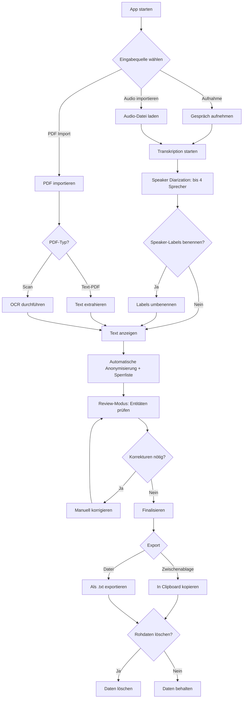

# Requirements: Therapie-Transkriptions- & Anonymisierungs-App (Therascript)

## 1. Kontextverständnis

**Problem:** Psychotherapeuten müssen Therapiegespräche dokumentieren und dabei die Vertraulichkeit der Patienten wahren. Aktuell gibt es keine integrierte Lösung, die Aufnahme, Transkription mit Sprechererkennung und umfassende Anonymisierung in einem lokalen, datenschutzkonformen Tool vereint.

**Lösung:** Eine Electron-basierte Desktop-Applikation für macOS, die:
- Gespräche aufnimmt und automatisch transkribiert (Hochdeutsch + Schweizerdeutsch allgemein)
- Sprecher automatisch unterscheidet (bis zu 4 Personen — Einzel- und Paartherapie)
- Personennamen, Orte, Kontaktdaten, medizinische Identifikatoren und Geburtsdaten automatisch erkennt und durch Platzhalter ersetzt
- Eine persönliche Sperrliste für wiederkehrende Begriffe unterstützt
- PDFs (inkl. Scans via OCR) importiert und anonymisiert
- Alles komplett lokal verarbeitet — keine Daten verlassen das Gerät

---

## 2. Stakeholders & Personas

### Primärer Nutzer: Psychotherapeut/in
- **Kontext:** Führt Therapiesitzungen durch (Einzel- und Paartherapie), muss Gespräche für Dokumentation und Supervision anonymisiert festhalten
- **Technisches Level:** Durchschnittlich — App muss einfach und intuitiv sein
- **Kritische Anforderung:** Absolute Vertraulichkeit der Patientendaten
- **Typische Nutzung:** Manchmal Live-Aufnahme während der Sitzung (App im Hintergrund), manchmal nachträglicher Audio-Import
- **Exportziele:** Supervision/Intervision, eigene Dokumentation, Praxissoftware — je nach Situation

---

## 3. Funktionale Anforderungen (User Stories)

### Epic 0: Sitzungsverwaltung

#### US-0: Sitzungen verwalten

**Als** Psychotherapeut/in
**möchte ich** eine Übersicht aller meiner Sitzungen haben,
**damit** ich mehrere Sitzungen parallel bearbeiten und den Überblick behalten kann.

**Vorbedingungen:**
1. Die App ist geöffnet

**Akzeptanzkriterien:**
1. Das SYSTEM zeigt eine Sitzungsliste (Dashboard) als zentrale Übersicht
2. Jede neue Sitzung (Aufnahme oder Import) erhält automatisch einen Titel basierend auf Datum und Uhrzeit (z.B. "Sitzung 07.02.2026 14:30")
3. Der USER kann den Titel einer Sitzung nachträglich umbenennen
4. Jede Sitzung zeigt ihren aktuellen Status (Aufnahme läuft, Transkription, Review, Exportiert)
5. Der USER kann eine Sitzung manuell löschen (mit Bestätigungsdialog)
6. Sitzungen bleiben in der Liste erhalten bis der USER sie aktiv löscht — auch nach Export
7. Das SYSTEM persistiert die Sitzungsliste zwischen App-Neustarts

**Nachbedingungen:**
1. Alle Sitzungen sind in der Liste sichtbar und nach Status/Datum navigierbar

**Offene Fragen:**
1. Soll die Sitzungsliste sortier- oder filterbar sein (z.B. nach Status)?
2. Gibt es eine maximale Anzahl Sitzungen, die praktikabel in der Liste bleiben?

---

### Epic 1: Audio-Aufnahme & Import

#### US-1: Gespräch aufnehmen

**Als** Psychotherapeut/in
**möchte ich** ein Therapiegespräch über das Mikrofon meines Macs aufnehmen können,
**damit** ich das Gespräch anschliessend transkribieren lassen kann.

**Vorbedingungen:**
1. Die App ist geöffnet und betriebsbereit
2. Ein Mikrofon ist verfügbar und die App hat Mikrofonzugriff (Standard-Eingabegerät des OS)

**Akzeptanzkriterien:**
1. Der USER kann eine Aufnahme mit einem Klick starten
2. Der USER kann eine laufende Aufnahme mit einem Klick stoppen
3. Der USER sieht während der Aufnahme eine visuelle Anzeige (Dauer, Audiopegel)
4. Das SYSTEM speichert die Aufnahme lokal auf dem Gerät
5. Der USER kann eine Aufnahme pausieren und fortsetzen
6. Die App funktioniert zuverlässig im Hintergrund (minimiert), da der USER während der Therapiesitzung nicht mit der App interagiert
7. Das SYSTEM zeigt ein Menu Bar Icon in der macOS-Menüleiste mit Aufnahmestatus (rot = läuft), Dauer und Stop/Pause-Steuerung — damit der USER die Aufnahme kontrollieren kann, ohne die App in den Vordergrund zu holen
8. Das SYSTEM verhindert aktiv den macOS-Ruhezustand während einer laufenden Aufnahme (analog zu Zoom/Spotify)
9. Das SYSTEM speichert die Aufnahme periodisch als Zwischensicherung (mindestens alle 60 Sekunden), sodass bei einem Absturz maximal 60 Sekunden Audio verloren gehen
10. Beim App-Start nach einem Absturz zeigt das SYSTEM wiederhergestellte Aufnahmen an und bietet deren Weiterverarbeitung an
11. Das SYSTEM stoppt die Aufnahme automatisch nach 3 Stunden und informiert den USER, um versehentliche Endlos-Aufnahmen zu vermeiden
12. Beim erstmaligen Starten einer Aufnahme zeigt das SYSTEM einen Hinweis zur Einholung der Patienteneinwilligung (StGB Art. 179bis) — ohne die Aufnahme zu blockieren

**Nachbedingungen:**
1. Die Audiodatei ist lokal gespeichert und bereit zur Transkription
2. Eine neue Sitzung wurde in der Sitzungsliste erstellt

**Out of Scope:**
- Mikrofon-Auswahlmenü — die App nutzt das vom macOS gewählte Standard-Eingabegerät
- Echtzeit-Transkription während der Aufnahme (inhaltlich unerwünscht: Therapeut soll während der Sitzung nicht auf ein Transkript schauen)

**Constraints & Randbedingungen:**
1. macOS bietet APIs zur Standby-Unterdrückung (IOPMAssertionCreateWithName / NSProcessInfo.beginActivity)
2. Audio-Streaming direkt auf Disk ist für Auto-Recovery nötig (kein reines In-Memory-Recording)

---

#### US-1b: Audio-Datei importieren

**Als** Psychotherapeut/in
**möchte ich** bestehende Audio-Dateien in die App importieren können,
**damit** ich auch extern aufgenommene Gespräche transkribieren und anonymisieren kann.

**Vorbedingungen:**
1. Die App ist geöffnet

**Akzeptanzkriterien:**
1. Der USER kann Audio-Dateien per Dateiauswahl-Dialog importieren
2. Der USER kann Audio-Dateien per Drag-and-Drop in die App importieren
3. Der USER kann mehrere Audio-Dateien gleichzeitig importieren (Batch-Import)
4. Das SYSTEM akzeptiert gängige Formate (mp3, wav, m4a, webm)
5. Das SYSTEM zeigt eine klare Fehlermeldung bei nicht unterstützten oder beschädigten Dateien, inkl. Liste der unterstützten Formate
6. Nach dem Import wird automatisch die Transkription gestartet
7. Bei Batch-Import werden die Dateien in einer Queue nacheinander transkribiert (FIFO)
8. Der USER sieht den Fortschritt der Queue (welche Datei wird gerade verarbeitet, wie viele verbleiben)

**Nachbedingungen:**
1. Für jede importierte Datei wurde eine neue Sitzung in der Sitzungsliste erstellt
2. Die Transkription läuft oder steht in der Queue

**Out of Scope:**
- Audio-Player/Vorschau vor der Transkription — der USER nutzt dafür seinen Standard-Player

---

### Epic 2: Transkription & Sprechererkennung

#### US-2: Gespräch transkribieren mit Sprechererkennung

**Als** Psychotherapeut/in
**möchte ich** eine Aufnahme automatisch transkribieren lassen, wobei das System die verschiedenen Sprecher unterscheidet,
**damit** ich ein lesbares Protokoll mit klarer Zuordnung erhalte.

**Vorbedingungen:**
1. Eine Audioaufnahme oder importierte Audiodatei ist vorhanden

**Akzeptanzkriterien:**
1. Das SYSTEM transkribiert die Aufnahme komplett lokal (keine Cloud-Verarbeitung)
2. Das SYSTEM erkennt die Anzahl Sprecher automatisch und weist ihnen Labels zu (Person A, Person B, Person C, Person D)
3. Bei nur 1 erkanntem Sprecher wird kein Speaker-Label vergeben (einfacher Fliesstext)
4. Bei 5+ erkannten Sprechern arbeitet das SYSTEM best-effort (Stimmen können zusammengefasst werden)
5. Das SYSTEM transkribiert Deutsch allgemein (Hochdeutsch und Schweizerdeutsche Dialekte) in lesbaren Hochdeutsch-Text
6. Das SYSTEM entfernt offensichtliche Verlegenheitslaute ("äh", "ähm") aus dem Transkript. Sonstige Füllwörter ("also", "halt"), Satzabbrüche und Wiederholungen bleiben erhalten
7. Das SYSTEM versieht den Text mit voller Interpunktion (Satzzeichen, Grossschreibung) und setzt Absatzumbrüche bei jedem Sprecherwechsel
8. Das SYSTEM fügt bei jedem Sprecherwechsel einen Zeitstempel ein (z.B. [00:23:40])
9. Das SYSTEM zeigt den transkribierten Text mit Sprecherzuordnung an
10. Der USER sieht den Fortschritt der Transkription (Prozent + geschätzte Restzeit)
11. Der USER kann die App während der Transkription für andere Sitzungen nutzen (nicht-blockierend)
12. Das SYSTEM zeigt eine macOS-Benachrichtigung, wenn die Transkription abgeschlossen ist
13. Nach Abschluss der Transkription startet das SYSTEM automatisch die Anonymisierung (kein manueller Zwischenschritt)

**Nachbedingungen:**
1. Ein strukturierter Text mit Sprecherzuordnung und Zeitstempeln liegt vor
2. Die Anonymisierung wurde automatisch gestartet

**Out of Scope:**
- Abbrechen oder Neustarten einer laufenden Transkription — sie läuft immer bis zum Ende durch
- Korrektur einzelner Sprecherzuordnungen (z.B. Segment von Person A → Person B umhängen) — nicht im MVP
- Originaler Dialekt-Text verfügbar machen — nur Hochdeutsch-Output, keine Originalversion
- Audio-Qualitätscheck vor der Transkription — kein Vorher-Check, das System liefert best-effort Ergebnis

**Constraints & Randbedingungen:**
1. NFR-3: Transkription max. 2x Echtzeit (10 Min Audio → max. 20 Min Verarbeitung)
2. Schweizerdeutsch → Hochdeutsch ist eine Übersetzungsleistung, nicht nur Transkription. Begriffe ohne Hochdeutsch-Äquivalent werden bestmöglich übersetzt
3. Transkription muss non-blocking sein, da der User parallel andere Sitzungen bearbeiten kann (Epic 0)

---

#### US-2b: Speaker-Labels benennen

**Als** Psychotherapeut/in
**möchte ich** die automatisch zugewiesenen Speaker-Labels (Person A, Person B) nachträglich benennen können,
**damit** das Transkript für Supervision und Dokumentation besser lesbar ist.

**Vorbedingungen:**
1. Eine Transkription mit Sprecherzuordnung liegt vor (mindestens 2 erkannte Sprecher)

**Akzeptanzkriterien:**
1. Der USER kann jedes Speaker-Label individuell umbenennen (z.B. "Person A" → "Therapeut", "Person B" → "Patient", "Person C" → "Partnerin")
2. Das SYSTEM ersetzt das Label konsistent im gesamten Transkript
3. Die Umbenennung ist optional — der USER kann Labels auch als Person A/B/C/D belassen
4. Die Umbenennung ist jederzeit möglich — auch nach der Anonymisierung, im Review-Modus (Epic 6)

**Nachbedingungen:**
1. Der Text zeigt die vom USER gewählten Sprecherbezeichnungen

**Out of Scope:**
- Korrektur einzelner Sprecherzuordnungen (Segment einem anderen Sprecher zuweisen) — nicht im MVP

---

### Epic 3: PDF-Import & OCR

#### US-3: PDF importieren und Text extrahieren
**Als** Psychotherapeut/in
**möchte ich** PDF-Dokumente in die App importieren können, auch gescannte Dokumente,
**damit** ich deren Textinhalt anonymisieren kann.

**Vorbedingungen:**
1. Die App ist geöffnet

**Akzeptanzkriterien:**
1. Der USER kann PDF-Dateien per Drag-and-Drop oder Dateiauswahl importieren
2. Das SYSTEM extrahiert Text aus Text-PDFs direkt
3. Das SYSTEM erkennt Text in gescannten PDFs mittels OCR (lokal)
4. Das SYSTEM zeigt den extrahierten Text dem USER an
5. Der USER kann mehrere PDFs nacheinander importieren

**Nachbedingungen:**
1. Der extrahierte Text ist bereit zur Anonymisierung

---

### Epic 4: Anonymisierung

#### US-4: Text automatisch anonymisieren
**Als** Psychotherapeut/in
**möchte ich** dass identifizierende Informationen automatisch durch Platzhalter ersetzt werden,
**damit** der Text keine Rückschlüsse auf Patienten oder deren Umfeld erlaubt.

**Vorbedingungen:**
1. Ein transkribierter Text oder ein importierter PDF-Text liegt vor

**Akzeptanzkriterien:**
1. Das SYSTEM erkennt **Personennamen** im Text und ersetzt sie durch konsistente Platzhalter ([PERSON A], [PERSON B] etc.)
2. Das SYSTEM erkennt **Ortsnamen** im Text und ersetzt sie durch konsistente Platzhalter ([ORT 1], [ORT 2] etc.)
3. Das SYSTEM erkennt **Kontaktdaten** (Telefonnummern, E-Mail-Adressen, Postadressen, Social-Media-Handles) und ersetzt sie durch typisierte Platzhalter ([TELEFON 1], [EMAIL 1], [ADRESSE 1] etc.)
4. Das SYSTEM erkennt **medizinische Identifikatoren** (AHV-Nummern, Versicherungsnummern, Fallnummern) und ersetzt sie durch typisierte Platzhalter ([AHV-NR 1], [VERS-NR 1] etc.)
5. Das SYSTEM erkennt **Geburtsdaten** (explizite Datumsangaben wie "15.03.1985", "geb. 1990") und ersetzt sie durch Platzhalter ([GEBURTSDATUM 1] etc.)
6. Gleiche Entitäten werden im gesamten Text konsistent durch denselben Platzhalter ersetzt
7. Die Anonymisierung erfolgt komplett lokal
8. Die Sprecherzuordnung bleibt nach der Anonymisierung erhalten
9. Das SYSTEM wendet zusätzlich die persönliche Sperrliste des USERs an (siehe Epic 5)
10. Das SYSTEM versucht **best-effort** auch gesprochene Kontaktdaten in Transkripten zu erkennen (z.B. "null sieben neun...") — ohne Garantie auf vollständige Erkennung

**Nachbedingungen:**
1. Der Text enthält keine identifizierenden Informationen mehr (im Rahmen der definierten Entitätstypen)

**Out of Scope:**
- ICD-Diagnose-Codes und ausgeschriebene Diagnosenamen werden NICHT anonymisiert (klinisch relevant, kein Identifikationsrisiko)
- Relative Zeitangaben ("letzte Woche", "vor drei Tagen") werden NICHT anonymisiert
- Institutionsnamen (Spitäler, Schulen, Arbeitgeber) werden NICHT anonymisiert
- Sonstige Datumsangaben ausser Geburtsdaten werden NICHT anonymisiert

---

### Epic 5: Sperrliste / Benutzerwörterbuch

#### US-5: Persönliche Sperrliste pflegen
**Als** Psychotherapeut/in
**möchte ich** eine persönliche Liste von Begriffen pflegen, die immer anonymisiert werden,
**damit** wiederkehrende Namen und Begriffe zuverlässig erkannt werden — auch wenn die automatische Erkennung sie nicht findet.

**Vorbedingungen:**
1. Die App ist geöffnet

**Akzeptanzkriterien:**
1. Der USER kann eigene Begriffe (Namen, Orte, andere Ausdrücke) zur Sperrliste hinzufügen
2. Der USER kann jedem Eintrag einen Platzhalter-Typ zuweisen (Person, Ort, Kontaktdaten etc.)
3. Das SYSTEM speichert die Sperrliste lokal und **persistiert sie zwischen App-Neustarts**
4. Die Sperrliste wird bei jeder Anonymisierung zusätzlich zur automatischen NER angewendet
5. Der USER kann Einträge aus der Sperrliste entfernen oder bearbeiten
6. Es gibt EINE globale Sperrliste pro Therapeut/in (nicht pro Fall)
7. Das SYSTEM verwendet **exaktes String-Matching** für Sperrlisten-Einträge (keine Varianten-Erkennung)

**Nachbedingungen:**
1. Die Sperrliste ist gespeichert und wird bei der nächsten Anonymisierung berücksichtigt

---

### Epic 6: Review & Korrektur

#### US-6: Anonymisierung überprüfen und korrigieren (Review-Modus)
**Als** Psychotherapeut/in
**möchte ich** die automatisch erkannten Entitäten überprüfen und bei Bedarf korrigieren können,
**damit** ich sicherstellen kann, dass alle sensiblen Informationen korrekt anonymisiert wurden.

**Vorbedingungen:**
1. Die automatische Anonymisierung wurde durchgeführt

**Akzeptanzkriterien:**
1. Das SYSTEM hebt alle erkannten und ersetzten Entitäten visuell hervor (farbliche Markierung nach Entitätstyp)
2. Der USER kann eine falsch erkannte Entität rückgängig machen (False Positive korrigieren)
3. Der USER kann eine nicht erkannte Entität manuell als zu anonymisieren markieren (False Negative ergänzen)
4. Der USER kann die Zuordnung eines Platzhalters ändern (z.B. Typ oder Nummer)
5. Der USER kann die Anonymisierung mit einem Klick finalisieren/bestätigen

**Nachbedingungen:**
1. Der überprüfte und korrigierte Text ist finalisiert und bereit zum Export

**Hinweis:** Der USER kann im Review-Modus AUCH den transkribierten Text editieren (z.B. Transkriptionsfehler korrigieren), nicht nur Anonymisierungsentscheidungen treffen. Details werden bei der Verfeinerung von Epic 6 definiert.

---

### Epic 7: Export & Datenverwaltung

#### US-7: Anonymisierten Text exportieren
**Als** Psychotherapeut/in
**möchte ich** den anonymisierten Text in die Zwischenablage kopieren oder als Textdatei exportieren können,
**damit** ich ihn in anderen Anwendungen weiterverwenden kann.

**Vorbedingungen:**
1. Ein anonymisierter und finalisierter Text liegt vor

**Akzeptanzkriterien:**
1. Der USER kann den gesamten anonymisierten Text mit einem Klick in die Zwischenablage kopieren
2. Der USER kann den Text als .txt-Datei exportieren
3. Der exportierte Text behält die Formatierung mit Sprecherzuordnung bei (z.B. "[Therapeut]: ..." oder "[PERSON A]: ...")
4. Das SYSTEM zeigt eine Bestätigung nach erfolgreichem Kopieren/Export

**Nachbedingungen:**
1. Der anonymisierte Text befindet sich in der Zwischenablage oder als Datei auf dem Dateisystem

---

#### US-7b: Rohdaten nach Export löschen
**Als** Psychotherapeut/in
**möchte ich** nach dem Export entscheiden können, ob die Rohdaten (Audio, Originaltext) gelöscht werden,
**damit** ich die Kontrolle über sensible Daten behalte.

**Vorbedingungen:**
1. Ein Export (Zwischenablage oder Datei) wurde durchgeführt

**Akzeptanzkriterien:**
1. Das SYSTEM fragt den USER nach dem Export, ob die Rohdaten (Audiodatei, Originaltext) gelöscht werden sollen
2. Der USER kann wählen: Daten löschen ODER behalten
3. Das SYSTEM löscht die Daten endgültig WENN der USER die Löschaktion bestätigt
4. Das SYSTEM zeigt einen Bestätigungsdialog vor der endgültigen Löschung

**Nachbedingungen:**
1. Die Rohdaten sind gelöscht ODER der USER hat sich bewusst entschieden, sie zu behalten

---

## 4. Nicht-funktionale Anforderungen

| ID | Kategorie | Anforderung | Ziel | Priorität |
|----|-----------|-------------|------|-----------|
| NFR-1 | Datenschutz | Alle Verarbeitung komplett lokal | 0 Netzwerk-Requests für Datenverarbeitung | Kritisch |
| NFR-2 | Datenschutz | Löschung von Rohdaten nach Export | USER entscheidet nach Export über Löschung von Audio und Originaltexten | Hoch |
| NFR-3 | Performance | Transkription in akzeptabler Zeit | Max. 2x Echtzeit (10 Min Audio → max. 20 Min Verarbeitung) | Hoch |
| NFR-4 | Usability | Einfache, intuitive Bedienung | Ohne technische Vorkenntnisse bedienbar | Hoch |
| NFR-5 | Sprache | Deutsch allgemein (Hochdeutsch + CH-Dialekte) | Verständlicher Hochdeutsch-Output aus allen gängigen Schweizerdeutschen Dialekten | Hoch |
| NFR-6 | Plattform | macOS Desktop-Applikation | Electron-basiert, macOS 13+ | Hoch |
| NFR-7 | Qualität | NER-Genauigkeit für Anonymisierung | >90% Recall für Namen und Orte; Best-effort für Kontaktdaten in gesprochener Sprache | Hoch |
| NFR-8 | Persistenz | Sperrliste überlebt App-Neustart | Lokale Speicherung der Benutzerdaten (Sperrliste) | Hoch |
| NFR-9 | Flexibilität | Alle ML-Modelle austauschbar (Transkription, Diarization, NER, OCR) | Globale Einstellung in Settings; User wählt aus verfügbaren Modellen (technische Modellnamen) | Hoch |
| NFR-10 | Erweiterbarkeit | User kann eigene/neue lokale Modelle hinzufügen und aktivieren | Plugin-artige Architektur; neue Modelle ohne App-Update einsetzbar | Hoch |

---

## 5. Prozessfluss

---

## 6. Zusätzliche Anforderungen (aus Klärung)

- **Nutzungskontext:** App wird sowohl während der Sitzung (Hintergrund-Aufnahme) als auch nachträglich (Audio-Import) genutzt
- **Aufnahmedauer:** Typisch 45-60 Minuten (Standard-Therapiesitzung), Max. 3 Stunden (Auto-Stop)
- **Sitzungsverwaltung:** Mehrere Sitzungen parallel möglich, Dashboard mit Auto-Titel, persistiert bis manuell gelöscht
- **Hintergrund-Modus:** Menu Bar Icon mit Status, Standby-Unterdrückung, Auto-Recovery (max. 60s Verlust)
- **Import:** Dateiauswahl + Drag-and-Drop + Batch, Queue-basierte Verarbeitung
- **Einwilligung:** Hinweis beim ersten Aufnahmestart, kein Zwang
- **Therapieformen:** Einzeltherapie (2 Sprecher) UND Paartherapie/Angehörigengespräche (bis 4 Sprecher)
- **Exportziele:** Supervision/Intervision, eigene Dokumentation, Praxissoftware — je nach Situation
- **Sperrliste:** Global pro Therapeut/in, exaktes Matching, persistiert lokal
- **Transkription:** Bereinigt (nur Äh/Ähm entfernt), volle Interpunktion, Zeitstempel bei Sprecherwechsel
- **Sprecheranzahl:** Auto-Erkennung; 1 Sprecher = kein Label; 5+ = best-effort
- **Workflow:** Transkription → Anonymisierung automatisch, kein Zwischenschritt; Transkription non-blocking
- **Review:** Text UND Anonymisierung editierbar im gleichen Review-Modus (Epic 6)
- **Modellauswahl:** Alle ML-Modelle (Transkription, Diarization, NER, OCR) austauschbar in globalen Settings; technische Modellnamen; User kann eigene Modelle hinzufügen (Plugin-Architektur)

---

## 7. Out of Scope
1. Cloud-basierte Verarbeitung oder Synchronisation
2. Automatische Pseudonymisierung (fiktive Namen statt Platzhalter)
3. Anonymisierung von Bildinhalten in PDFs (z.B. Gesichtserkennung)
4. Echtzeit-Transkription während des Gesprächs (inhaltlich unerwünscht — therapeutische Beziehung)
5. Nutzerverwaltung / Multi-User-Betrieb
6. Mobile Version (iOS/Android)
7. ~~Archivierung/Verwaltung vergangener Transkripte~~ → Ersetzt durch Epic 0: Sitzungsverwaltung
8. ICD-Diagnose-Codes und ausgeschriebene Diagnosenamen (kein Identifikationsrisiko)
9. Institutionsnamen (Spitäler, Schulen, Arbeitgeber, Behörden)
10. Relative Zeitangaben ("letzte Woche", "vor drei Tagen")
11. Sonstige Datumsangaben ausser expliziten Geburtsdaten
12. Varianten-/Fuzzy-Matching in der Sperrliste
13. Fallbasierte Sperrlisten (nur eine globale Liste)
14. Word-/PDF-Export (nur Plaintext und Zwischenablage)

---

## 8. Entscheidungsprotokoll

| # | Frage | Entscheidung | Datum |
|---|-------|-------------|-------|
| 1 | Wann wird die App genutzt? | Beides: Live-Aufnahme (Hintergrund) + nachträglicher Import | 2026-02-07 |
| 2 | Anonymisierungsumfang? | Umfassend: Namen, Orte, Kontaktdaten, Med. Identifikatoren, Geburtsdaten | 2026-02-07 |
| 3 | Exportziele? | Mehrere: Supervision, Dokumentation, Praxissoftware | 2026-02-07 |
| 4 | MVP-Scope? | Alles inkl. PDF — beide Eingabepfade von Anfang an | 2026-02-07 |
| 5 | Welche Entitätstypen genau? | Kontaktdaten, Med. Identifikatoren, Geburtsdaten (NICHT Institutionen) | 2026-02-07 |
| 6 | Live-Modus Interaktion? | Nur Hintergrund — keine Interaktion während Therapie | 2026-02-07 |
| 7 | Exportformate? | Nur Plaintext (.txt) + Zwischenablage | 2026-02-07 |
| 8 | Sperrliste? | Ja, MVP-Feature — globale Liste pro Therapeut/in | 2026-02-07 |
| 9 | Nur Geburtsdaten oder alle Daten? | Nur explizite Geburtsdaten | 2026-02-07 |
| 10 | Welche Dialekte? | Deutsch allgemein — Hochdeutsch + Schweizerdeutsch breit | 2026-02-07 |
| 11 | Datenlöschung nach Export? | User entscheidet — wird gefragt | 2026-02-07 |
| 12 | Teilnehmerzahl? | Bis 3-4 Personen (Paartherapie, Angehörige) | 2026-02-07 |
| 13 | Speaker-Labels benennbar? | Ja — Therapeut/in kann Labels umbenennen | 2026-02-07 |
| 14 | Gesprochene Kontaktdaten? | Best-effort — System versucht es, keine Garantie | 2026-02-07 |
| 15 | ICD-Codes anonymisieren? | Nein — Diagnosen bleiben im Text | 2026-02-07 |
| 16 | Sperrliste pro Therapeut oder pro Fall? | Eine globale Liste pro Therapeut/in | 2026-02-07 |
| 17 | Varianten-Matching in Sperrliste? | Exakte Treffer — keine Fuzzy-Erkennung | 2026-02-07 |
| 18 | Mikrofon-Auswahl nötig? | Nein — Standard-Mikrofon (OS-Default) reicht | 2026-02-07 |
| 19 | Auto-Recovery bei Absturz? | Pflicht — max. 60 Sekunden Datenverlust, Wiederherstellung beim Start | 2026-02-07 |
| 20 | Auto-Transkription nach Import? | Immer automatisch, Queue bei Batch-Import | 2026-02-07 |
| 21 | Parallele Sitzungen? | Ja — mehrere Sitzungen gleichzeitig in verschiedenen Stadien | 2026-02-07 |
| 22 | Sitzungsliste/Dashboard? | Ja — mit Auto-Titel (Datum+Uhrzeit), User kann umbenennen | 2026-02-07 |
| 23 | Hintergrund-Feedback? | Menu Bar Icon mit Status (rot=läuft), Dauer, Stop/Pause | 2026-02-07 |
| 24 | Standby während Aufnahme? | App verhindert aktiv den Ruhezustand | 2026-02-07 |
| 25 | Batch-Verarbeitung? | Queue — nacheinander, FIFO | 2026-02-07 |
| 26 | Warum keine Echtzeit-Transkription? | Inhaltlich unerwünscht — stört therapeutische Beziehung | 2026-02-07 |
| 27 | Einwilligungs-Dialog? | Hinweis beim ersten Mal, kein Zwang (Therapeut verantwortlich) | 2026-02-07 |
| 28 | Maximale Aufnahmedauer? | 3 Stunden, dann Auto-Stop mit Benachrichtigung | 2026-02-07 |
| 29 | Import-Fehler & Preview? | Klare Fehlermeldung, kein Audio-Player (User nutzt Standard-Player) | 2026-02-07 |
| 30 | Sitzungsverwaltung als Epic? | Ja — neues Epic 0 (Grundlage für alle Workflows) | 2026-02-07 |
| 31 | Lebenszyklus Sitzungen? | Bleiben bis manuell gelöscht — auch nach Export | 2026-02-07 |
| 32 | Audio-Import UX? | Dateiauswahl + Drag-and-Drop + Batch | 2026-02-07 |
| 33 | Bereinigung — was genau? | Nur Äh/Ähm entfernen; Füllwörter, Satzabbrüche, Wiederholungen bleiben | 2026-02-07 |
| 34 | Schweizerdeutsch-Begriffe? | Nur Hochdeutsch-Output, bestmöglich übersetzt, kein Original verfügbar | 2026-02-07 |
| 35 | Sprecherzuordnung korrigierbar? | Out of Scope für MVP — nur Label-Umbenennung | 2026-02-07 |
| 36 | Transkript editierbar? | Ja, im Review-Modus (Epic 6), kein separater Schritt | 2026-02-07 |
| 37 | Zeitstempel im Transkript? | Ja — bei jedem Sprecherwechsel (z.B. [00:23:40]) | 2026-02-07 |
| 38 | Sprecheranzahl-Handling? | Auto-Erkennung; 1 Sprecher = kein Label; 5+ = best-effort | 2026-02-07 |
| 39 | Transkription abbrechen/neustarten? | Nein — läuft immer durch, Korrektur im Review | 2026-02-07 |
| 40 | Wartezeit-UX? | Fortschrittsbalken (% + Restzeit) + App nutzbar + macOS-Benachrichtigung | 2026-02-07 |
| 41 | Anonymisierung nach Transkription? | Automatisch, kein manueller Zwischenschritt | 2026-02-07 |
| 42 | Formatierung Transkript? | Volle Interpunktion + Grossschreibung + Absätze bei Sprecherwechsel | 2026-02-07 |
| 43 | Audio-Qualitätscheck? | Kein Vorher-Check — best-effort Ergebnis | 2026-02-07 |
| 44 | Warum Modellauswahl? | Zukunftssicherheit — neue/bessere Modelle ohne App-Update einsetzbar | 2026-02-07 |
| 45 | Welche Modelle wählbar? | Alle: Transkription, Diarization, NER, OCR | 2026-02-07 |
| 46 | Wo konfiguriert? | Globale Einstellung in Settings (gilt für alle Sitzungen) | 2026-02-07 |
| 47 | Zielgruppe Modellauswahl? | Auch Therapeut/in, nicht nur Power-User | 2026-02-07 |
| 48 | Darstellung Modellnamen? | Technische Modellnamen direkt anzeigen | 2026-02-07 |
| 49 | Eigene Modelle hinzufügen? | Ja — User kann neue lokale Modelle installieren/aktivieren (Plugin-Architektur) | 2026-02-07 |

---

## 9. Requirements-Readiness

| Kriterium | Bewertung |
|-----------|-----------|
| Geschäftswert | Klar — Vertraulichkeit in der Psychotherapie |
| Vollständigkeit | Alle offenen Fragen geklärt |
| NFRs | Definiert — lokale Verarbeitung als Kernprinzip |
| Testbarkeit | Akzeptanzkriterien sind messbar |
| Konflikte | Schweizerdeutsch lokal transkribieren ist technisch anspruchsvoll; Best-effort für gesprochene Kontaktdaten akzeptiert |

**Status:** READY — Alle Kernanforderungen sind klar definiert. Offene Fragen wurden im Requirements-Engineering geklärt (siehe Entscheidungsprotokoll).
